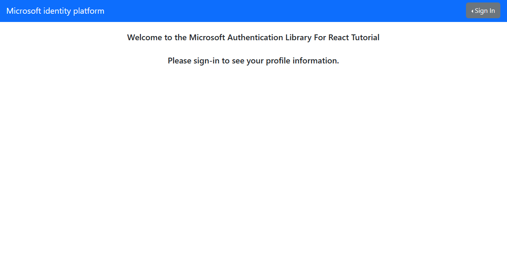

# React single-page application using MSAL React to authenticate users against Azure AD for Customers

* [Overview](#overview)
* [Scenario](#scenario)
* [Contents](#contents)
* [Prerequisites](#prerequisites)
* [Setup the sample](#setup-the-sample)
* [Explore the sample](#explore-the-sample)
* [Troubleshooting](#troubleshooting)
* [About the code](#about-the-code)
* [Contributing](#contributing)
* [Learn More](#learn-more)

## Overview

This sample demonstrates a React SPA that authenticates users against [Customer Identity Access Management](https://github.com/microsoft/entra-previews/tree/PP2/docs) (CIAM), using the [Microsoft Authentication Library for React](https://github.com/AzureAD/microsoft-authentication-library-for-js/tree/dev/lib/msal-react) (MSAL React).

MSAL React is a wrapper around the [Microsoft Authentication Library for JavaScript](https://github.com/AzureAD/microsoft-authentication-library-for-js/tree/dev/lib/msal-browser) (MSAL.js). As such, it exposes the same public APIs that MSAL.js offers, while adding many new features customized for modern React applications.

Here you'll learn how to [sign-in](https://docs.microsoft.com/azure/active-directory/develop/scenario-spa-sign-in) users and acquire [ID tokens](https://docs.microsoft.com/azure/active-directory/develop/id-tokens).

## Scenario

1. The client React SPA uses the  to sign-in a user and obtain a JWT [ID Token](https://aka.ms/id-tokens) from **Azure AD for Customers**.
1. The **ID Token** proves that the user has successfully authenticated against **Azure AD for Customers**.


## Contents

| File/folder                | Description                                      |
|----------------------------|--------------------------------------------------|
| `App.jsx`                  | Main application logic resides here.             |
| `NavigationBar.jsx`        | Contains buttons for login and logout.           |
| `authConfig.js`            | Contains authentication parameters.              |

## Prerequisites

* [Node.js](https://nodejs.org/en/download/) must be installed to run this sample.
* [Visual Studio Code](https://code.visualstudio.com/download) is recommended for running and editing this sample.
* [VS Code Azure Tools](https://marketplace.visualstudio.com/items?itemName=ms-vscode.vscode-node-azure-pack) extension is recommended for interacting with Azure through VS Code Interface.
* An **Azure AD for Customers** tenant. For more information, see: [How to get an Azure AD for Customers tenant](https://github.com/microsoft/entra-previews/blob/PP2/docs/1-Create-a-CIAM-tenant.md)
* A user account in your **Azure AD for Customers** tenant.

>This sample will not work with a **personal Microsoft account**. If you're signed in to the [Azure portal](https://portal.azure.com) with a personal Microsoft account and have not created a user account in your directory before, you will need to create one before proceeding.

## Setup the sample

### Step 1: Clone or download this repository

From your shell or command line:

```console
git clone https://github.com/Azure-Samples/ms-identity-ciam-javascript-tutorial.git
```

or download and extract the repository *.zip* file.

> :warning: To avoid path length limitations on Windows, we recommend cloning into a directory near the root of your drive.

### Step 2: Install project dependencies

```console
    cd 1-Authentication\1-sign-in-react\SPA
    npm install
```

### Step 3: Register the sample application(s) in your tenant

There is one project in this sample. To register it, you can:

* follow the steps below for manually register your apps
* or use PowerShell scripts that:
  * **automatically** creates the Azure AD applications and related objects (passwords, permissions, dependencies) for you.
  * modify the projects' configuration files.

<details>
   <summary>Expand this section if you want to use this automation:</summary>

> :warning: If you have never used **Microsoft Graph PowerShell** before, we recommend you go through the [App Creation Scripts Guide](./AppCreationScripts/AppCreationScripts.md) once to ensure that your environment is prepared correctly for this step.
  
1. On Windows, run PowerShell as **Administrator** and navigate to the root of the cloned directory
1. In PowerShell run:

    ```PowerShell
    Set-ExecutionPolicy -ExecutionPolicy RemoteSigned -Scope Process -Force
    ```

1. Run the script to create your Azure AD application and configure the code of the sample application accordingly.
1. For interactive process -in PowerShell, run:

    ```PowerShell
    cd .\AppCreationScripts\
    .\Configure.ps1 -TenantId "[Optional] - your tenant id" -AzureEnvironmentName "[Optional] - Azure environment, defaults to 'Global'"
    ```

> Other ways of running the scripts are described in [App Creation Scripts guide](./AppCreationScripts/AppCreationScripts.md). The scripts also provide a guide to automated application registration, configuration and removal which can help in your CI/CD scenarios.
</details>

#### Choose the CIAM tenant where you want to create your applications

To manually register the apps, as a first step you'll need to:

1. Sign in to the [Azure portal](https://portal.azure.com).
1. If your account is present in more than one CIAM tenant, select your profile at the top right corner in the menu on top of the page, and then **switch directory** to change your portal session to the desired CIAM tenant.

#### Create User Flows

Please refer to: [Tutorial: Create user flow in Azure Active Directory CIAM](https://github.com/microsoft/entra-previews/blob/PP2/docs/3-Create-sign-up-and-sign-in-user-flow.md)

> :information_source: To enable password reset in Customer Identity Access Management (CIAM) in Azure Active Directory (Azure AD), please refer to: [Tutorial: Enable self-service password reset](https://github.com/microsoft/entra-previews/blob/PP2/docs/4-Enable-password-reset.md)

#### Add External Identity Providers

Please refer to:

* [Tutorial: Add Google as an identity provider](https://github.com/microsoft/entra-previews/blob/PP2/docs/6-Add-Google-identity-provider.md)
* [Tutorial: Add Facebook as an identity provider](https://github.com/microsoft/entra-previews/blob/PP2/docs/7-Add-Facebook-identity-provider.md)

#### Register the client app (msal-react-spa)

1. Navigate to the [Azure portal](https://portal.azure.com) and select the **Azure AD for Customers** service.
1. Select the **App Registrations** blade on the left, then select **New registration**.
1. In the **Register an application page** that appears, enter your application's registration information:
    1. In the **Name** section, enter a meaningful application name that will be displayed to users of the app, for example `msal-react-spa`.
    1. Under **Supported account types**, select **Accounts in this organizational directory only**
    1. Select **Register** to create the application.
1. In the **Overview** blade, find and note the **Application (client) ID**. You use this value in your app's configuration file(s) later in your code.
1. In the app's registration screen, select the **Authentication** blade to the left.
1. If you don't have a platform added, select **Add a platform** and select the **Single-page application** option.
    1. In the **Redirect URI** section enter the following redirect URIs:
        1. `http://localhost:3000/`
        1. `http://localhost:3000/redirect`
    1. Click **Save** to save your changes.
1. Since this app signs-in users, we will now proceed to select **delegated permissions**, which is is required by apps signing-in users.
    1. In the app's registration screen, select the **API permissions** blade in the left to open the page where we add access to the APIs that your application needs:
    1. Select the **Add a permission** button and then:
    1. Ensure that the **Microsoft APIs** tab is selected.
    1. In the *Commonly used Microsoft APIs* section, select **Microsoft Graph**
    1. In the **Delegated permissions** section, select **openid**, **offline_access** in the list. Use the search box if necessary.
    1. Select the **Add permissions** button at the bottom.
1. At this stage, the permissions are assigned correctly, but since it's a CIAM tenant, the users themselves cannot consent to these permissions. To get around this problem, we'd let the [tenant administrator consent on behalf of all users in the tenant](https://docs.microsoft.com/azure/active-directory/develop/v2-admin-consent). Select the **Grant admin consent for {tenant}** button, and then select **Yes** when you are asked if you want to grant consent for the requested permissions for all accounts in the tenant. You need to be a tenant admin to be able to carry out this operation.

##### Configure the client app (msal-react-spa) to use your app registration

Open the project in your IDE (like Visual Studio or Visual Studio Code) to configure the code.

> In the steps below, "ClientID" is the same as "Application ID" or "AppId".

1. Open the `SPA\src\authConfig.js` file.
1. Find the key `Enter_the_Application_Id_Here` and replace the existing value with the application ID (clientId) of `msal-react-spa` app copied from the Azure portal.
1. Find the placeholder `Enter_the_Tenant_Subdomain_Here` and replace it with the Directory (tenant) subdomain. For instance, if your tenant primary domain is `contoso.onmicrosoft.com`, use `contoso`. If you don't have your tenant domain name, learn how to [read your tenant details](https://review.learn.microsoft.com/azure/active-directory/external-identities/customers/how-to-create-customer-tenant-portal#get-the-customer-tenant-details).

### Step 4: Running the sample

```console
    cd 1-Authentication\1-sign-in-react\SPA
    npm start
```

## Explore the sample

1. Open your browser and navigate to `http://localhost:3000`.
1. Select the **Sign In** button on the top right corner. Choose either **Popup** or **Redirect** flows (see: [MSAL.js interaction types](https://github.com/AzureAD/microsoft-authentication-library-for-js/blob/dev/lib/msal-browser/docs/initialization.md#choosing-an-interaction-type)).



> :information_source: Did the sample not work for you as expected? Then please reach out to us using the [GitHub Issues](../../../../issues) page.

## We'd love your feedback!

Were we successful in addressing your learning objective? Consider taking a moment to [share your experience with us](https://forms.office.com/Pages/ResponsePage.aspx?id=v4j5cvGGr0GRqy180BHbR_ivMYEeUKlEq8CxnMPgdNZUNDlUTTk2NVNYQkZSSjdaTk5KT1o4V1VVNS4u).

## Troubleshooting

<details>
	<summary>Expand for troubleshooting info</summary>

> * Use [Stack Overflow](http://stackoverflow.com/questions/tagged/msal) to get support from the community. Ask your questions on Stack Overflow first and browse existing issues to see if someone has asked your question before.
Ask your questions on Stack Overflow first and browse existing issues to see if someone has asked your question before.
Make sure that your questions or comments are tagged with [`azure-active-directory` `node` `ms-identity` `adal` `msal-js` `msal`].

To provide feedback on or suggest features for Azure Active Directory, visit [User Voice page](https://feedback.azure.com/d365community/forum/79b1327d-d925-ec11-b6e6-000d3a4f06a4).
</details>

## About the code

MSAL React should be instantiated outside of the component tree to prevent it from being re-instantiated on re-renders. After instantiation, pass it as props to your application.

```javascript
const msalInstance = new PublicClientApplication(msalConfig);

ReactDOM.render(
    <React.StrictMode>
        <App msalInstance={msalInstance}/>
    </React.StrictMode>,
    document.getElementById("root")
);

export default function App({msalInstance}) {

    return (
        <MsalProvider instance={msalInstance}>
            <PageLayout>
                <MainContent />
            </PageLayout>
        </MsalProvider>
    );
}
```

At the top of your component tree, wrap everything between **MsalProvider** component. All components underneath **MsalProvider** will have access to the *PublicClientApplication* instance via context as well as all hooks and components provided by msal-react.

```javascript
export default function App({msalInstance}) {

    return (
        <MsalProvider instance={msalInstance}>
            <PageLayout>
                <MainContent />
            </PageLayout>
        </MsalProvider>
    );
}
```

### Sign-in

MSAL.js exposes 3 login APIs: `loginPopup()`, `loginRedirect()` and `ssoSilent()`. These APIs are usable in MSAL React as well:

```javascript
    export function App() {
        const { instance, accounts, inProgress } = useMsal();
    
        if (accounts.length > 0) {
            return <span>There are currently {accounts.length} users signed in!</span>
        } else if (inProgress === "login") {
            return <span>Login is currently in progress!</span>
        } else {
            return (
                <>
                    <span>There are currently no users signed in!</span>
                    <button onClick={() => instance.loginPopup()}>Login</button>
                </>
            );
        }
    }
```

You may also use MSAL React's [useMsalAuthentication](https://github.com/AzureAD/microsoft-authentication-library-for-js/blob/dev/lib/msal-react/docs/hooks.md#usemsalauthentication-hook) hook. Below is an example in which the `ssoSilent()` API is used. When using `ssoSilent()`, the recommended pattern is that you fallback to an **interactive method** should the silent SSO attempt fails:

```javascript
function App() {
    const request = {
        loginHint: "name@example.com",
        scopes: ["User.Read"]
    }

    const { login, result, error } = useMsalAuthentication(InteractionType.Silent, request);

    useEffect(() => {
        if (error) {
            login(InteractionType.Popup, request);
        }
    }, [error]);

    const { accounts } = useMsal();

    return (
        <React.Fragment>
            <p>Anyone can see this paragraph.</p>
            <AuthenticatedTemplate>
                <p>Signed in as: {accounts[0]?.username}</p>
            </AuthenticatedTemplate>
            <UnauthenticatedTemplate>
                <p>No users are signed in!</p>
            </UnauthenticatedTemplate>
        </React.Fragment>
    );
}
```

As shown above, the components that depend on whether the user is authenticated should be wrapped inside React's `AuthenticatedTemplate` and `UnauthenticatedTemplate` components. Alternatively, you may use the [useIsAuthenticated](https://github.com/AzureAD/microsoft-authentication-library-for-js/blob/dev/lib/msal-react/docs/getting-started.md#useisauthenticated-hook) hook to conditionally render components.

### ID token validation

When you receive an [ID token](https://docs.microsoft.com/azure/active-directory/develop/id-tokens) directly from the IdP on a secure channel (e.g. HTTPS), such is the case with SPAs, there’s no need to validate it. If you were to do it, you would validate it by asking the same server that gave you the ID token to give you the keys needed to validate it, which renders it pointless, as if one is compromised so is the other.

## Contributing

If you'd like to contribute to this sample, see [CONTRIBUTING.MD](/CONTRIBUTING.md).

This project has adopted the [Microsoft Open Source Code of Conduct](https://opensource.microsoft.com/codeofconduct/). For more information, see the [Code of Conduct FAQ](https://opensource.microsoft.com/codeofconduct/faq/) or contact [opencode@microsoft.com](mailto:opencode@microsoft.com) with any additional questions or comments.

## Learn More

* [Customize the default branding](https://github.com/microsoft/entra-previews/blob/PP2/docs/5-Customize-default-branding.md)
* [OAuth 2.0 device authorization grant flow](https://github.com/microsoft/entra-previews/blob/PP2/docs/9-OAuth2-device-code.md)
* [Customize sign-in strings](https://github.com/microsoft/entra-previews/blob/PP2/docs/8-Customize-sign-in-strings.md)
* [Building Zero Trust ready apps](https://aka.ms/ztdevsession)
* [Initialize client applications using MSAL.js](https://docs.microsoft.com/azure/active-directory/develop/msal-js-initializing-client-applications)
* [Single sign-on with MSAL.js](https://docs.microsoft.com/azure/active-directory/develop/msal-js-sso)
* [Handle MSAL.js exceptions and errors](https://docs.microsoft.com/azure/active-directory/develop/msal-handling-exceptions?tabs=javascript)
* [Logging in MSAL.js applications](https://docs.microsoft.com/azure/active-directory/develop/msal-logging?tabs=javascript)
* [Pass custom state in authentication requests using MSAL.js](https://docs.microsoft.com/azure/active-directory/develop/msal-js-pass-custom-state-authentication-request)
* [Prompt behavior in MSAL.js interactive requests](https://docs.microsoft.com/azure/active-directory/develop/msal-js-prompt-behavior)
