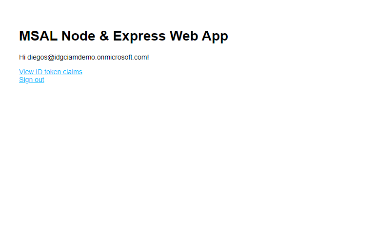

# A Node.js & Express web app authenticating users against Azure AD CIAM with MSAL Node

* [Overview](#overview)
* [Scenario](#scenario)
* [Contents](#contents)
* [Prerequisites](#prerequisites)
* [Setup the sample](#setup-the-sample)
* [Explore the sample](#explore-the-sample)
* [Troubleshooting](#troubleshooting)
* [About the code](#about-the-code)
* [Contributing](#contributing)
* [Learn More](#learn-more)

## Overview

This sample demonstrates a Node.js & Express web app that lets users sign-in with Azure Active Directory Consumers Identity and Access Management (Azure AD CIAM) using the [Microsoft Authentication Library for Node](https://github.com/AzureAD/microsoft-authentication-library-for-js/tree/dev/lib/msal-node) (MSAL Node).

Here you'll learn about [ID Tokens](https://docs.microsoft.com/azure/active-directory/develop/id-tokens), [OIDC scopes](https://docs.microsoft.com/azure/active-directory/develop/v2-permissions-and-consent#openid-connect-scopes), [single-sign on](https://docs.microsoft.com/azure/active-directory/develop/msal-js-sso), **silent requests** and more.

## Scenario

1. The client Node.js & Express web app uses the  to sign-in a user and obtain a JWT [ID Token](https://aka.ms/id-tokens) from **Azure AD CIAM**.
1. The **ID Token** proves that the user has successfully authenticated against **Azure AD CIAM**.


## Contents

| File/folder           | Description                                |
|-----------------------|--------------------------------------------|
| `App/app.js`          | Application entry point.                   |
| `App/authConfig.js`   | Contains authentication parameters.        |
| `App/routes/auth.js`  | Main authentication logic resides here.    |

## Prerequisites

* [Node.js](https://nodejs.org/en/download/) must be installed to run this sample.
* [Visual Studio Code](https://code.visualstudio.com/download) is recommended for running and editing this sample.
* [VS Code Azure Tools](https://marketplace.visualstudio.com/items?itemName=ms-vscode.vscode-node-azure-pack) extension is recommended for interacting with Azure through VS Code Interface.
* An **Azure AD CIAM** tenant. For more information, see: [How to get an Azure AD CIAM tenant](https://github.com/microsoft/entra-previews/blob/PP2/docs/1-Create-a-CIAM-tenant.md)
* A user account with permissions to create applications in your **Azure AD CIAM** tenant.

## Setup the sample

### Step 1: Clone or download this repository

From your shell or command line:

```console
git clone https://github.com/Azure-Samples/ms-identity-ciam-javascript-tutorial.git
```

or download and extract the repository *.zip* file.

> :warning: To avoid path length limitations on Windows, we recommend cloning into a directory near the root of your drive.

### Step 2: Install project dependencies

```console
    cd 1-Authentication\5-sign-in-express\App
    npm install
```

### Step 3: Register the sample application(s) in your tenant

There is one project in this sample. To register it, you can:

- follow the steps below for manually register your apps
- or use PowerShell scripts that:
  - **automatically** creates the Azure AD applications and related objects (passwords, permissions, dependencies) for you.
  - modify the projects' configuration files.

<details>
   <summary>Expand this section if you want to use this automation:</summary>

> :warning: If you have never used **Microsoft Graph PowerShell** before, we recommend you go through the [App Creation Scripts Guide](./AppCreationScripts/AppCreationScripts.md) once to ensure that your environment is prepared correctly for this step.

1. Ensure that you have PowerShell 7 or later installed.
1. Run the script to create your Azure AD application and configure the code of the sample application accordingly.
1. For interactive process -in PowerShell, run:

    ```PowerShell
    cd .\AppCreationScripts\
    .\Configure.ps1 -TenantId "[Optional] - your tenant id" -AzureEnvironmentName "[Optional] - Azure environment, defaults to 'Global'"
    ```

> Other ways of running the scripts are described in [App Creation Scripts guide](./AppCreationScripts/AppCreationScripts.md). The scripts also provide a guide to automated application registration, configuration and removal which can help in your CI/CD scenarios.

> :information_source: This sample can make use of client certificates. You can use **AppCreationScripts** to register an Azure AD application with certificates. See: [How to use certificates instead of client secrets](./README-use-certificate.md)

</details>

#### Choose the Azure AD CIAM tenant where you want to create your applications

To manually register the apps, as a first step you'll need to:

1. Sign in to the [Azure portal](https://portal.azure.com).
1. If your account is present in more than one Azure AD CIAM tenant, select your profile at the top right corner in the menu on top of the page, and then **switch directory** to change your portal session to the desired Azure AD CIAM tenant.

#### Create User Flows

Please refer to: [Tutorial: Create user flow in Azure Active Directory CIAM](https://github.com/microsoft/entra-previews/blob/PP2/docs/3-Create-sign-up-and-sign-in-user-flow.md)

> :information_source: To enable password reset in Customer Identity Access Management (CIAM) in Azure Active Directory (Azure AD), please refer to: [Tutorial: Enable self-service password reset](https://github.com/microsoft/entra-previews/blob/PP2/docs/4-Enable-password-reset.md)

#### Add External Identity Providers

Please refer to:

* [Tutorial: Add Google as an identity provider](https://github.com/microsoft/entra-previews/blob/PP2/docs/6-Add-Google-identity-provider.md)
* [Tutorial: Add Facebook as an identity provider](https://github.com/microsoft/entra-previews/blob/PP2/docs/7-Add-Facebook-identity-provider.md)

#### Register the client app (ciam-msal-node-webapp)

1. Navigate to the [Azure portal](https://portal.azure.com) and select the **Azure AD CIAM** service.
1. Select the **App Registrations** blade on the left, then select **New registration**.
1. In the **Register an application page** that appears, enter your application's registration information:
    1. In the **Name** section, enter a meaningful application name that will be displayed to users of the app, for example `ciam-msal-node-webapp`.
    1. Under **Supported account types**, select **Accounts in this organizational directory only**
    1. Select **Register** to create the application.
1. In the **Overview** blade, find and note the **Application (client) ID** and *Directory (tenant) ID**. You use these values in your app's configuration file(s) later in your code.
1. In the app's registration screen, select the **Authentication** blade to the left.
1. If you don't have a platform added, select **Add a platform** and select the **Web** option.
    1. In the **Redirect URI** section enter the following redirect URI:
        1. `http://localhost:3000/`
        1. `http://localhost:3000/auth/redirect`
    1. Click **Save** to save your changes.
1. In the app's registration screen, select the **Certificates & secrets** blade in the left to open the page where you can generate secrets and upload certificates.
1. In the **Client secrets** section, select **New client secret**:
    1. Type a key description (for instance `app secret`).
    1. Select one of the available key durations (**6 months**, **12 months** or **Custom**) as per your security posture.
    1. The generated key value will be displayed when you select the **Add** button. Copy and save the generated value for use in later steps.
    1. You'll need this key later in your code's configuration files. This key value will not be displayed again, and is not retrievable by any other means, so make sure to note it from the Azure portal before navigating to any other screen or blade.
    > :warning: For enhanced security, consider using **certificates** instead of client secrets. See: [How to use certificates instead of secrets](./README-use-certificate.md).
1. Since this app signs-in users, we will now proceed to select **delegated permissions**, which is is required by apps signing-in users.
    1. In the app's registration screen, select the **API permissions** blade in the left to open the page where we add access to the APIs that your application needs:
    1. Select the **Add a permission** button and then:
    1. Ensure that the **Microsoft APIs** tab is selected.
    1. In the *Commonly used Microsoft APIs* section, select **Microsoft Graph**
    1. In the **Delegated permissions** section, select **openid**, **offline_access** in the list. Use the search box if necessary.
    1. Select the **Add permissions** button at the bottom.
1. At this stage, the permissions are assigned correctly, but since it's a CIAM tenant, the users themselves cannot consent to these permissions. To get around this problem, we'd let the [tenant administrator consent on behalf of all users in the tenant](https://docs.microsoft.com/azure/active-directory/develop/v2-admin-consent). Select the **Grant admin consent for {tenant}** button, and then select **Yes** when you are asked if you want to grant consent for the requested permissions for all accounts in the tenant. You need to be a tenant admin to be able to carry out this operation.

##### Configure the client app (ciam-msal-node-webapp) to use your app registration

Open the project in your IDE (like Visual Studio or Visual Studio Code) to configure the code.

> In the steps below, "ClientID" is the same as "Application ID" or "AppId".

1. Open the `App\authConfig.js` file.
1. Find the key `Enter_the_Application_Id_Here` and replace the existing value with the application ID (clientId) of `ciam-msal-node-webapp` app copied from the Azure portal.
1. Find the key `Enter_the_Tenant_Info_Here` and replace the existing value with your Azure AD tenant/directory ID.
1. Find the key `Enter_the_Client_Secret_Here` and replace the existing value with the generated secret that you saved during the creation of `ciam-msal-node-webapp` copied from the Azure portal.

### Step 4: Running the sample

```console
    cd 1-Authentication\5-sign-in-express\App
    npm start
```

## Explore the sample

1. Open your browser and navigate to `http://localhost:3000`.
1. Select the **Sign In** link.
1. Select the **View ID token claims** link to see the claims in your ID token.



> :information_source: Did the sample not work for you as expected? Then please reach out to us using the [GitHub Issues](../../../../issues) page.

## We'd love your feedback!

Were we successful in addressing your learning objective? Consider taking a moment to [share your experience with us](https://forms.office.com/Pages/ResponsePage.aspx?id=v4j5cvGGr0GRqy180BHbR_ivMYEeUKlEq8CxnMPgdNZUNDlUTTk2NVNYQkZSSjdaTk5KT1o4V1VVNS4u).

## Troubleshooting

<details>
	<summary>Expand for troubleshooting info</summary>

> * Use [Stack Overflow](http://stackoverflow.com/questions/tagged/msal) to get support from the community. Ask your questions on Stack Overflow first and browse existing issues to see if someone has asked your question before.
Ask your questions on Stack Overflow first and browse existing issues to see if someone has asked your question before.
Make sure that your questions or comments are tagged with [`azure-active-directory-b2c` `node` `ms-identity` `adal` `msal-js` `msal`].

To provide feedback on or suggest features for Azure Active Directory, visit [User Voice page](https://feedback.azure.com/d365community/forum/79b1327d-d925-ec11-b6e6-000d3a4f06a4).
</details>

## About the code

### Initialization

// Explain how the app is configured

### Sign-in

// Explain how the app signs in users

### Sign-out

To sing-out the current user, the app destroys the session that holds user data and navigates the browser to the Azure AD logout endpoint to end the session with Azure AD. This is shown in [auth.js](./App/routes/auth.js):

```javascript
```

### Deploying Web app to Azure App Service

There is one web app in this sample. To deploy it to **Azure App Services**, you'll need to:

- create an **Azure App Service**
- publish the projects to the **App Services**, and
- update its client(s) to call the website instead of the local environment.

> :information_source: If you would like to use **VS Code Azure Tools** extension for deployment, [watch the tutorial](https://docs.microsoft.com/azure/developer/javascript/tutorial-vscode-azure-app-service-node-01) offered by Microsoft Docs.

#### Deploy your files (ciam-msal-node-webapp)

1. In the **VS Code** activity bar, select the **Azure** logo to show the **Azure App Service** explorer. Select **Sign in to Azure...** and follow the instructions. Once signed in, the explorer should show the name of your **Azure** subscription(s).
2. On the **App Service** explorer section you will see an upward-facing arrow icon. Click on it publish your local files in the project folder to **Azure App Services** (use "Browse" option if needed, and locate the right folder).
3. Choose a creation option based on the operating system to which you want to deploy. in this sample, we choose **Linux**.
4. Select a **Node.js** version when prompted. An **LTS** version is recommended.
5. Type a globally unique name for your web app and press Enter. The name must be unique across all of **Azure**. (e.g. `ciam-msal-node-webapp`)
6. After you respond to all the prompts, **VS Code** shows the **Azure** resources that are being created for your app in its notification popup.
7. Select **Yes** when prompted to update your configuration to run `npm install` on the target **Linux** server.

#### Update the CIAM app registration (ciam-msal-node-webapp)

1. Navigate back to to the [Azure portal](https://portal.azure.com).
In the left-hand navigation pane, select the **Azure Active Directory** service, and then select **App registrations (Preview)**.
1. In the resulting screen, select the `ciam-msal-node-webapp` application.
1. In the app's registration screen, select **Authentication** in the menu.
    1. In the **Redirect URIs** section, update the reply URLs to match the site URL of your Azure deployment. For example:
        1. `https://ciam-msal-node-webapp.azurewebsites.net`
        1. `https://ciam-msal-node-webapp.azurewebsites.net/auth/redirect`

> :warning: If your app is using an *in-memory* storage, **Azure App Services** will spin down your web site if it is inactive, and any records that your app was keeping will be empty. In addition, if you increase the instance count of your website, requests will be distributed among the instances. Your app's records, therefore, will not be the same on each instance.
</details>

## Contributing

If you'd like to contribute to this sample, see [CONTRIBUTING.MD](/CONTRIBUTING.md).

This project has adopted the [Microsoft Open Source Code of Conduct](https://opensource.microsoft.com/codeofconduct/). For more information, see the [Code of Conduct FAQ](https://opensource.microsoft.com/codeofconduct/faq/) or contact [opencode@microsoft.com](mailto:opencode@microsoft.com) with any additional questions or comments.

## Learn More

* [Customize the default branding](https://github.com/microsoft/entra-previews/blob/PP2/docs/5-Customize-default-branding.md)
* [OAuth 2.0 device authorization grant flow](https://github.com/microsoft/entra-previews/blob/PP2/docs/9-OAuth2-device-code.md)
* [Customize sign-in strings](https://github.com/microsoft/entra-previews/blob/PP2/docs/8-Customize-sign-in-strings.md)
* [Building Zero Trust ready apps](https://aka.ms/ztdevsession)
* [Initialize client applications using MSAL.js](https://docs.microsoft.com/azure/active-directory/develop/msal-js-initializing-client-applications)
* [Single sign-on with MSAL.js](https://docs.microsoft.com/azure/active-directory/develop/msal-js-sso)
* [Handle MSAL.js exceptions and errors](https://docs.microsoft.com/azure/active-directory/develop/msal-handling-exceptions?tabs=javascript)
* [Logging in MSAL.js applications](https://docs.microsoft.com/azure/active-directory/develop/msal-logging?tabs=javascript)
* [Pass custom state in authentication requests using MSAL.js](https://docs.microsoft.com/azure/active-directory/develop/msal-js-pass-custom-state-authentication-request)
* [Prompt behavior in MSAL.js interactive requests](https://docs.microsoft.com/azure/active-directory/develop/msal-js-prompt-behavior)
* [Use MSAL.js to work with Azure AD B2C](https://docs.microsoft.com/azure/active-directory/develop/msal-b2c-overview)
