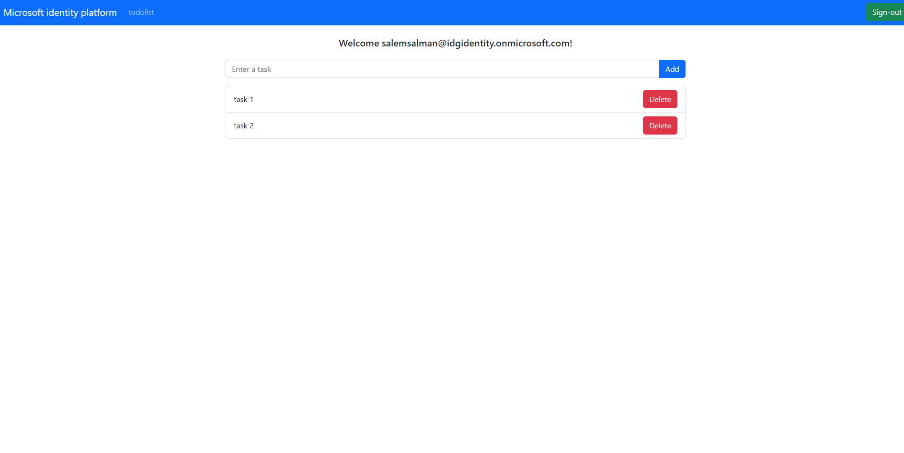

# Vanilla JavaScript single-page application using MSAL.js to authentication users against Customer Identity Access Management (CIAM) and call a protected ASP.NET Core web API

* [Overview](#overview)
* [Scenario](#scenario)
* [Contents](#contents)
* [Prerequisites](#prerequisites)
* [Setup the sample](#setup-the-sample)
* [Explore the sample](#explore-the-sample)
* [Troubleshooting](#troubleshooting)
* [About the code](#about-the-code)
* [How to deploy this sample to Azure](#how-to-deploy-this-sample-to-azure)
* [Contributing](#contributing)
* [Learn More](#learn-more)

## Overview

This sample demonstrates a vanilla JavaScript single-page application (SPA) that lets users sign-in with Azure Active Directory (Azure AD) Consumers Identity and Access Management (CIAM) using the [Microsoft Authentication Library for JavaScript](https://github.com/AzureAD/microsoft-authentication-library-for-js/tree/dev/lib/msal-browser) (MSAL Browser).

Here you'll learn about [access tokens](https://docs.microsoft.com/azure/active-directory/develop/access-tokens), [token validation](https://docs.microsoft.com/azure/active-directory/develop/access-tokens#validating-tokens), [CORS configuration](https://docs.microsoft.com/rest/api/storageservices/cross-origin-resource-sharing--cors--support-for-the-azure-storage-services#understanding-cors-requests), **silent requests** and more.

## Scenario

1. The client Vanilla JavaScript SPA uses the  to sign-in a user and obtain a JWT [ID Token](https://aka.ms/id-tokens) and an [Access Token](https://aka.ms/access-tokens) from **Azure AD for Customers**..
1. The **access token** is used as a *bearer* token to authorize the user to call the ASP.NET Core web API protected by **Azure AD for Customers**.
1. ASP.NET Core web API uses the [Microsoft.Identity.Web](https://aka.ms/microsoft-identity-web) to protect the Web api, check permissions and validate tokens.


## Contents

| File/folder         | Description                                         |
|---------------------|-----------------------------------------------------|
| `SPA/public/authPopup.js`    | Main authentication and authorization logic resides here (using Popup flow).  |
| `SPA/public/authRedirect.js` | Use this instead of `authPopup.js` for authentication and authorization with redirect flow. |
| `SPA/public/authConfig.js` | Contains authentication parameters for SPA project. |
| `API/ToDoListAPI/appsettings.json` | Authentication parameters for the API reside here.     |
| `API/ToDoListAPI/Startup.cs` | Microsoft.Identity.Web is initialized here.                  |

## Prerequisites

* [Node.js](https://nodejs.org/en/download/) must be installed to run this sample.
* [Visual Studio Code](https://code.visualstudio.com/download) is recommended for running and editing this sample.
* [VS Code Azure Tools](https://marketplace.visualstudio.com/items?itemName=ms-vscode.vscode-node-azure-pack) extension is recommended for interacting with Azure through VS Code Interface.
* A modern web browser.
* An **Azure AD for Customers** tenant. For more information, see: [How to get an Azure AD for Customers tenant](https://github.com/microsoft/entra-previews/blob/PP2/docs/1-Create-a-CIAM-tenant.md)
* A user account in your **Azure AD for Customers** tenant.

## Setup the sample

### Step 1: Clone or download this repository

From your shell or command line:

```console
git clone https://github.com/Azure-Samples/ms-identity-ciam-javascript-tutorial.git
```

or download and extract the repository *.zip* file.

> :warning: To avoid path length limitations on Windows, we recommend cloning into a directory near the root of your drive.

### Step 2: Install project dependencies

```console
    cd 2-Authorization\0-call-api-vanillajs\SPA
    npm install
```

### Step 3: Register the sample application(s) in your tenant

There are two projects in this sample. Each needs to be separately registered in your Azure AD tenant. To register these projects, you can:

- follow the steps below for manually register your apps
- or use PowerShell scripts that:
  - **automatically** creates the Azure AD applications and related objects (passwords, permissions, dependencies) for you.
  - modify the projects' configuration files.

<details>
   <summary>Expand this section if you want to use this automation:</summary>

> :warning: If you have never used **Microsoft Graph PowerShell** before, we recommend you go through the [App Creation Scripts Guide](./AppCreationScripts/AppCreationScripts.md) once to ensure that your environment is prepared correctly for this step.

1. Ensure that you have PowerShell 7 or later which can be installed at [this link](https://learn.microsoft.com/powershell/scripting/install/installing-powershell-on-windows?view=powershell-7.3).
1. Run the script to create your Azure AD application and configure the code of the sample application accordingly.
1. For interactive process -in PowerShell, run:

    ```PowerShell
    cd .\AppCreationScripts\
    .\Configure.ps1 -TenantId "[Optional] - your tenant id" -AzureEnvironmentName "[Optional] - Azure environment, defaults to 'Global'"
    ```

> Other ways of running the scripts are described in [App Creation Scripts guide](./AppCreationScripts/AppCreationScripts.md). The scripts also provide a guide to automated application registration, configuration and removal which can help in your CI/CD scenarios.

</details>

#### Choose the Azure AD for Customers tenant where you want to create your applications

To manually register the apps, as a first step you'll need to:

1. Sign in to the [Azure portal](https://portal.azure.com).
1. If your account is present in more than one Azure AD for Customers tenant, select your profile at the top right corner in the menu on top of the page, and then **switch directory** to change your portal session to the desired Azure AD for Customers tenant.

#### Create User Flows

Please refer to: [Tutorial: Create user flow in Azure Active Directory CIAM](https://github.com/microsoft/entra-previews/blob/PP2/docs/3-Create-sign-up-and-sign-in-user-flow.md)

> :information_source: To enable password reset in Customer Identity Access Management (CIAM) in Azure Active Directory (Azure AD), please refer to: [Tutorial: Enable self-service password reset](https://github.com/microsoft/entra-previews/blob/PP2/docs/4-Enable-password-reset.md)

#### Add External Identity Providers

Please refer to:

* [Tutorial: Add Google as an identity provider](https://github.com/microsoft/entra-previews/blob/PP2/docs/6-Add-Google-identity-provider.md)
* [Tutorial: Add Facebook as an identity provider](https://github.com/microsoft/entra-previews/blob/PP2/docs/7-Add-Facebook-identity-provider.md)

#### Register the service app (ciam-msal-dotnet-api)

1. Navigate to the [Azure portal](https://portal.azure.com) and select the **Azure AD for Customers** service.
1. Select the **App Registrations** blade on the left, then select **New registration**.
1. In the **Register an application page** that appears, enter your application's registration information:
    1. In the **Name** section, enter a meaningful application name that will be displayed to users of the app, for example `ciam-msal-dotnet-api`.
    1. Under **Supported account types**, select **Accounts in this organizational directory only**
    1. Select **Register** to create the application.
1. In the app's registration screen, select the **Expose an API** blade to the left to open the page where you can publish the permission as an API for which client applications can obtain [access tokens](https://aka.ms/access-tokens) for. The first thing that we need to do is to declare the unique [resource](https://docs.microsoft.com/azure/active-directory/develop/v2-oauth2-auth-code-flow) URI that the clients will be using to obtain access tokens for this API. To declare an resource URI(Application ID URI), follow the following steps:
    1. Select **Set** next to the **Application ID URI** to generate a URI that is unique for this app.
    1. For this sample, accept the proposed Application ID URI (`api://{clientId}`) by selecting **Save**.
        > :information_source: Read more about Application ID URI at [Validation differences by supported account types (signInAudience)](https://docs.microsoft.com/azure/active-directory/develop/supported-accounts-validation).

##### Publish Delegated Permissions

1. All APIs must publish a minimum of one [scope](https://docs.microsoft.com/azure/active-directory/develop/v2-oauth2-auth-code-flow#request-an-authorization-code), also called [Delegated Permission](https://docs.microsoft.com/azure/active-directory/develop/v2-permissions-and-consent#permission-types), for the client apps to obtain an access token for a *user* successfully. To publish a scope, follow these steps:
1. Select **Add a scope** button open the **Add a scope** screen and Enter the values as indicated below:
    1. For **Scope name**, use `ToDoList.Read`.
    1. For **Admin consent display name** type in *ToDoList.Read*.
    1. For **Admin consent description** type in *e.g. Allows the app to read the signed-in user's files.*.
    1. Keep **State** as **Enabled**.
    1. Select the **Add scope** button on the bottom to save this scope.
    > :warning: Repeat the steps above for another scope named **ToDoList.ReadWrite**
1. Select the **Manifest** blade on the left.
    1. Set `accessTokenAcceptedVersion` property to **2**.
    1. Select on **Save**.

> :information_source:  Follow [the principle of least privilege when publishing permissions](https://learn.microsoft.com/security/zero-trust/develop/protected-api-example) for a web API.

##### Publish Application Permissions

1. All APIs should publish a minimum of one [App role for applications](https://docs.microsoft.com/azure/active-directory/develop/howto-add-app-roles-in-azure-ad-apps#assign-app-roles-to-applications), also called [Application Permission](https://docs.microsoft.com/azure/active-directory/develop/v2-permissions-and-consent#permission-types), for the client apps to obtain an access token as *themselves*, i.e. when they are not signing-in a user. **Application permissions** are the type of permissions that APIs should publish when they want to enable client applications to successfully authenticate as themselves and not need to sign-in users. To publish an application permission, follow these steps:
1. Still on the same app registration, select the **App roles** blade to the left.
1. Select **Create app role**:
    1. For **Display name**, enter a suitable name for your application permission, for instance **ToDoList.Read.All**.
    1. For **Allowed member types**, choose **Application** to ensure other applications can be granted this permission.
    1. For **Value**, enter **ToDoList.Read.All**.
    1. For **Description**, enter *e.g. Allows the app to read the signed-in user's files.*.
    1. Select **Apply** to save your changes.
    1. Repeat the steps above for another app permission named **ToDoList.ReadWrite.All**

##### Configure Optional Claims

1. Still on the same app registration, select the **Token configuration** blade to the left.
1. Select **Add optional claim**:
    1. Select **optional claim type**, then choose **Access**.
    1. Select the optional claim **idtyp**.
    > Indicates token type. This claim is the most accurate way for an API to determine if a token is an app token or an app+user token. This is not issued in tokens issued to users.
    1. Select **Add** to save your changes.

##### Configure the service app (ciam-msal-dotnet-api) to use your app registration

Open the project in your IDE (like Visual Studio or Visual Studio Code) to configure the code.

> In the steps below, "ClientID" is the same as "Application ID" or "AppId".

1. Open the `API\ToDoListAPI\appsettings.json` file.
1. Find the key `Enter_the_Application_Id_Here` and replace the existing value with the application ID (clientId) of `ciam-msal-dotnet-api` app copied from the Azure portal.
1. Find the key `Enter_the_Tenant_Id_Here` and replace the existing value with your Azure AD tenant/directory ID.
1. Find the placeholder `Enter_the_Tenant_Subdomain_Here` and replace it with the Directory (tenant) subdomain. For instance, if your tenant primary domain is `contoso.onmicrosoft.com`, use `contoso`. If you don't have your tenant domain name, learn how to [read your tenant details](https://review.learn.microsoft.com/azure/active-directory/external-identities/customers/how-to-create-customer-tenant-portal#get-the-customer-tenant-details).

#### Register the client app (ciam-msal-javascript-spa)

1. Navigate to the [Azure portal](https://portal.azure.com) and select the **Azure AD for Customers** service.
1. Select the **App Registrations** blade on the left, then select **New registration**.
1. In the **Register an application page** that appears, enter your application's registration information:
    1. In the **Name** section, enter a meaningful application name that will be displayed to users of the app, for example `ciam-msal-javascript-spa`.
    1. Under **Supported account types**, select **Accounts in this organizational directory only**
    1. Select **Register** to create the application.
1. In the **Overview** blade, find and note the **Application (client) ID**. You use this value in your app's configuration file(s) later in your code.
1. In the app's registration screen, select the **Authentication** blade to the left.
1. If you don't have a platform added, select **Add a platform** and select the **Single-page application** option.
    1. In the **Redirect URI** section enter the following redirect URIs:
        1. `http://localhost:3000`
        1. `http://localhost:3000/redirect`
    1. Select **Configure**
    1. Select **Save** to save your changes.
1. Since this app signs-in users, we will now proceed to select **delegated permissions**, which is is required by apps signing-in users.
    1. In the app's registration screen, select the **API permissions** blade in the left to open the page where we add access to the APIs that your application needs:
    1. Select the **Add a permission** button and then:
    1. Ensure that the **Microsoft APIs** tab is selected.
    1. In the *Commonly used Microsoft APIs* section, select **Microsoft Graph**
    1. In the **Delegated permissions** section, select **openid**, **offline_access** in the list. Use the search box if necessary.
    1. Select the **Add permissions** button at the bottom.
    1. Select the **Add a permission** button and then:
    1. Ensure that the **My APIs** tab is selected.
    1. In the list of APIs, select the API `ciam-msal-dotnet-api`.
    1. In the **Delegated permissions** section, select **ToDoList.Read**, **ToDoList.ReadWrite** in the list. Use the search box if necessary.
    1. Select the **Add permissions** button at the bottom.
1. At this stage, the permissions are assigned correctly, but since it's a CIAM tenant, the users themselves cannot consent to these permissions. To get around this problem, we'd let the [tenant administrator consent on behalf of all users in the tenant](https://docs.microsoft.com/azure/active-directory/develop/v2-admin-consent). Select the **Grant admin consent for {tenant}** button, and then select **Yes** when you are asked if you want to grant consent for the requested permissions for all accounts in the tenant. You need to be a tenant admin to be able to carry out this operation.

##### Configure the client app (ciam-msal-javascript-spa) to use your app registration

Open the project in your IDE (like Visual Studio or Visual Studio Code) to configure the code.

> In the steps below, "ClientID" is the same as "Application ID" or "AppId".

1. Open the `SPA\public\authConfig.js` file.
1. Find the key `Enter_the_Application_Id_Here` and replace the existing value with the application ID (clientId) of `ciam-msal-javascript-spa` app copied from the Azure portal.
1. Find the placeholder `Enter_the_Tenant_Subdomain_Here` and replace it with the Directory (tenant) subdomain. For instance, if your tenant primary domain is `contoso.onmicrosoft.com`, use `contoso`. If you don't have your tenant domain name, learn how to [read your tenant details](https://review.learn.microsoft.com/azure/active-directory/external-identities/customers/how-to-create-customer-tenant-portal#get-the-customer-tenant-details).`Enter_the_Web_Api_Application_Id_Here` and replace the existing value with the application ID (clientId) of `ciam-msal-dotnet-api` app copied from the Azure portal.

### Step 4: Running the sample

```console
    cd 2-Authorization\0-call-api-vanillajs\API\ToDoListAPI
    dotnet run
```

```console
    cd 2-Authorization\0-call-api-vanillajs\SPA
    npm start
```

## Explore the sample

1. Open your browser and navigate to `http://localhost:3000`.
1. Select the **Sign In** button on the top right corner.
1. Select the **TodoList** button on the navigation bar. This will make a call to the TodoList web API.



> :information_source: Did the sample not work for you as expected? Then please reach out to us using the [GitHub Issues](../../../../issues) page.

## We'd love your feedback!

Were we successful in addressing your learning objective? Consider taking a moment to [share your experience with us](https://forms.office.com/Pages/ResponsePage.aspx?id=v4j5cvGGr0GRqy180BHbR_ivMYEeUKlEq8CxnMPgdNZUNDlUTTk2NVNYQkZSSjdaTk5KT1o4V1VVNS4u).

## Troubleshooting

Use [Stack Overflow](http://stackoverflow.com/questions/tagged/msal) to get support from the community. Ask your questions on Stack Overflow first and browse existing issues to see if someone has asked your question before.
Ask your questions on Stack Overflow first and browse existing issues to see if someone has asked your question before.
Make sure that your questions or comments are tagged with [`azure-active-directory` `ms-identity` `adal` `msal-js` `msal`].

If you find a bug in the sample, raise the issue on [GitHub Issues](../../../../issues).

## About the code

### CORS settings

You need to set **cross-origin resource sharing** (CORS) policy to be able to call the **ToDoListAPI** in [Startup.cs](./API/ToDoListAPI/Program.cs). For the purpose of the sample, **CORS** is enabled for **all** domains and methods. This is insecure and only used for demonstration purposes here. In production, you should modify this as to allow only the domains that you designate. If your web API is going to be hosted on **Azure App Service**, we recommend configuring CORS on the App Service itself.

```csharp
builder.Services.AddCors(o => o.AddPolicy("default", builder =>
{
    builder.AllowAnyOrigin()
           .AllowAnyMethod()
           .AllowAnyHeader();
}));
```

### Acquire a token

**Access Token** requests in **MSAL.js** are meant to be *per-resource-per-scope(s)*. This means that an **Access Token** requested for resource **A** with scope `scp1`:

* cannot be used for accessing resource **A** with scope `scp2`, and,
* cannot be used for accessing resource **B** of any scope.

The intended recipient of an **Access Token** is represented by the `aud` claim; in case the value for the `aud` claim does not mach the resource APP ID URI, the token should be considered invalid. Likewise, the permissions that an Access Token grants is represented by the `scp` claim. See [Access Token claims](https://docs.microsoft.com/azure/active-directory/develop/access-tokens#payload-claims) for more information.

**MSAL.js** exposes 3 APIs for acquiring a token: `acquireTokenPopup()`, `acquireTokenRedirect()` and `acquireTokenSilent()`:

```javascript
    myMSALObj.acquireTokenPopup(request)
        .then(response => {
            // do something with response
        })
        .catch(error => {
            console.log(error)
        });
```

For `acquireTokenRedirect()`, you must register a redirect promise handler:

```javascript
    myMSALObj.handleRedirectPromise()
        .then(response => {
            // do something with response
        })
        .catch(error => {
            console.log(error);
        });

    myMSALObj.acquireTokenRedirect(request);
```

The **MSAL.js** exposes the `acquireTokenSilent()` API which is meant to retrieve non-expired token silently.

```javascript
    myMSALObj.acquireTokenSilent(request)
        .then(tokenResponse => {
        // Do something with the tokenResponse
        }).catch(async (error) => {
            if (error instanceof InteractionRequiredAuthError) {
                // fallback to interaction when silent call fails
                return myMSALObj.acquireTokenPopup(request);
            }
        }).catch(error => {
            handleError(error);
        });
```

### Access token validation

On the web API side, the `AddMicrosoftIdentityWebApi` method in [Program.cs](./API/ToDoListAPI/Program.cs) protects the web API by [validating access tokens](https://docs.microsoft.com/azure/active-directory/develop/access-tokens#validating-tokens) sent tho this API. Check out [Protected web API: Code configuration](https://docs.microsoft.com/azure/active-directory/develop/scenario-protected-web-api-app-configuration) which explains the inner workings of this method in more detail.

```csharp
builder.Services.AddAuthentication(JwtBearerDefaults.AuthenticationScheme)
            .AddMicrosoftIdentityWebApi(options =>
            {
                builder.Configuration.Bind("AzureAd", options);
                options.Events = new JwtBearerEvents();
            }, options => { builder.Configuration.Bind("AzureAd", options); });
```

For validation and debugging purposes, developers can decode **JWT**s (*JSON Web Tokens*) using [jwt.ms](https://jwt.ms).

### Verifying permissions

Access tokens that have neither the **scp** (for delegated permissions) nor **roles** (for application permissions) claim with the required scopes/permissions should not be accepted. In the sample, this is illustrated via the `RequiredScopeOrAppPermission` attribute in [ToDoListController.cs](./API/ToDoListAPI/Controllers/ToDoListController.cs):

```csharp
[HttpGet]
    [RequiredScopeOrAppPermission(
        RequiredScopesConfigurationKey = "AzureAD:Scopes:Read",
        RequiredAppPermissionsConfigurationKey = "AzureAD:AppPermissions:Read"
    )]
    public async Task<IActionResult> GetAsync()
    {
        var toDos = await _toDoContext.ToDos!
            .Where(td => RequestCanAccessToDo(td.Owner))
            .ToListAsync();

        return Ok(toDos);
    }
```

### Access to data

Web API endpoints should be prepared to accept calls from both users and applications, and should have control structures in place to respond to each accordingly. For instance, a call from a user via delegated permissions should be responded with user's data, while a call from an application via application permissions might be responded with the entire todolist. This is illustrated in the [ToDoListController](./API/ToDoListAPI/Controllers/ToDoListController.cs) controller:

```csharp
private bool RequestCanAccessToDo(Guid userId)
    {
        return IsAppMakingRequest() || (userId == GetUserId());
    }

[HttpGet]
    [RequiredScopeOrAppPermission(
        RequiredScopesConfigurationKey = "AzureAD:Scopes:Read",
        RequiredAppPermissionsConfigurationKey = "AzureAD:AppPermissions:Read"
    )]
    public async Task<IActionResult> GetAsync()
    {
        var toDos = await _toDoContext.ToDos!
            .Where(td => RequestCanAccessToDo(td.Owner))
            .ToListAsync();

        return Ok(toDos);
    }
```

When granting access to data based on scopes, be sure to follow [the principle of least privilege](https://docs.microsoft.com/azure/active-directory/develop/secure-least-privileged-access).

### Debugging the sample

To debug the .NET Core web API that comes with this sample, install the [C# extension](https://marketplace.visualstudio.com/items?itemName=ms-dotnettools.csharp) for Visual Studio Code.

Learn more about using [.NET Core with Visual Studio Code](https://docs.microsoft.com/dotnet/core/tutorials/with-visual-studio-code).

## How to deploy this sample to Azure

<details>
<summary>Expand the section</summary>

### Deploying web API to Azure App Services

There is one web API in this sample. To deploy it to **Azure App Services**, you'll need to:

* create an **Azure App Service**
* publish the projects to the **App Services**

> :warning: Please make sure that you have not switched on the *[Automatic authentication provided by App Service](https://docs.microsoft.com/azure/app-service/scenario-secure-app-authentication-app-service)*. It interferes the authentication code used in this code example.


> :information_source: If you would like to use **VS Code Azure Tools** extension for deployment, [watch the tutorial](https://docs.microsoft.com/azure/developer/javascript/tutorial-vscode-azure-app-service-node-01) offered by Microsoft Docs.

#### Deploy your files (ciam-msal-dotnet-api)

1. In the **VS Code** activity bar, select the **Azure** logo to show the **Azure App Service** explorer. Select **Sign in to Azure...** and follow the instructions. Once signed in, the explorer should show the name of your **Azure** subscription(s).
2. On the **App Service** explorer section you will see an upward-facing arrow icon. Click on it publish your local files in the project folder to **Azure App Services** (use "Browse" option if needed, and locate the right folder).
3. Choose a creation option based on the operating system to which you want to deploy. in this sample, we choose **Linux**.
4. Select a **Node.js** version when prompted. An **LTS** version is recommended.
5. Type a globally unique name for your web app and press Enter. The name must be unique across all of **Azure**. (e.g. `ciam-msal-dotnet-api`)
6. After you respond to all the prompts, **VS Code** shows the **Azure** resources that are being created for your app in its notification popup.
7. Select **Yes** when prompted to update your configuration to run npm install on the target Linux server.

### Deploying SPA to Azure Storage

There is one single-page application in this sample. To deploy it to **Azure Storage**, you'll need to:

- create an Azure Storage blob and obtain website coordinates
- build your project and upload it to Azure Storage blob
- update config files with website coordinates

> :information_source: If you would like to use **VS Code Azure Tools** extension for deployment, [watch the tutorial](https://docs.microsoft.com/azure/developer/javascript/tutorial-vscode-static-website-node-01) offered by Microsoft Docs.

#### Build and upload (ciam-msal-javascript-spa) to an Azure Storage blob

Build your project to get a distributable files folder, where your built `html`, `css` and `javascript` files will be generated. Then follow the steps below:

> :warning: When uploading, make sure you upload the contents of your distributable files folder and **not** the entire folder itself.

> :information_source: If you don't have an account already, see: [How to create a storage account](https://docs.microsoft.com/azure/storage/common/storage-account-create).

1. Sign in to the [Azure portal](https://portal.azure.com).
1. Locate your storage account and display the account overview.
1. Select **Static website** to display the configuration page for static websites.
1. Select **Enabled** to enable static website hosting for the storage account.
1. In the **Index document name** field, specify a default index page (For example: `index.html`).
1. The default **index page** is displayed when a user navigates to the root of your static website.
1. Select **Save**. The Azure portal now displays your static website endpoint. Make a note of the **Primary endpoint field**.
1. In the `ciam-msal-javascript-spa` project source code, update your configuration file with the **Primary endpoint field** as your new **Redirect URI** (you will register this URI later).
1. Next, select **Storage Explorer**.
1. Expand the **BLOB CONTAINERS** node, and then select the `$web` container.
1. Choose the **Upload** button to upload files.
1. If you intend for the browser to display the contents of file, make sure that the content type of that file is set to `text/html`.
1. In the pane that appears beside the **account overview page** of your storage account, select **Static Website**. The URL of your site appears in the **Primary endpoint field**. In the next section, you will register this URI.

#### Update the CIAM app registration for ciam-msal-javascript-spa

1. Navigate back to to the [Azure portal](https://portal.azure.com).
1. In the left-hand navigation pane, select the **Azure Active Directory** service, and then select **App registrations**.
1. In the resulting screen, select `ciam-msal-javascript-spa`.
1. In the app's registration screen, select **Authentication** in the menu.
   1. In the **Redirect URIs** section, update the reply URLs to match the site URL of your Azure deployment. For example:
        1. `https://ciam-msal-javascript-spa.azurewebsites.net/`
        1. `https://ciam-msal-javascript-spa.azurewebsites.net/redirect`

#### Update authentication configuration parameters (ciam-msal-javascript-spa)

1. In your IDE, locate the `ciam-msal-javascript-spa` project. Then, open `SPA\public\authConfig.js`.
1. Find the key for **redirect URI** and replace its value with the address of the web app you published, for example, [https://ciam-msal-javascript-spa.azurewebsites.net/redirect](https://ciam-msal-javascript-spa.azurewebsites.net/redirect).
1. Find the key for **web API endpoint** and replace its value with the address of the web API you published, for example, [https://ciam-msal-dotnet-api.azurewebsites.net/api](https://ciam-msal-dotnet-api.azurewebsites.net/api).

</details>

## Contributing

If you'd like to contribute to this sample, see [CONTRIBUTING.MD](/CONTRIBUTING.md).

This project has adopted the [Microsoft Open Source Code of Conduct](https://opensource.microsoft.com/codeofconduct/). For more information, see the [Code of Conduct FAQ](https://opensource.microsoft.com/codeofconduct/faq/) or contact [opencode@microsoft.com](mailto:opencode@microsoft.com) with any additional questions or comments.

## Learn More

* [Customize the default branding](https://github.com/microsoft/entra-previews/blob/PP2/docs/5-Customize-default-branding.md)
* [OAuth 2.0 device authorization grant flow](https://github.com/microsoft/entra-previews/blob/PP2/docs/9-OAuth2-device-code.md)
* [Customize sign-in strings](https://github.com/microsoft/entra-previews/blob/PP2/docs/8-Customize-sign-in-strings.md)
* [Building Zero Trust ready apps](https://aka.ms/ztdevsession)
* [Initialize client applications using MSAL.js](https://docs.microsoft.com/azure/active-directory/develop/msal-js-initializing-client-applications)
* [Single sign-on with MSAL.js](https://docs.microsoft.com/azure/active-directory/develop/msal-js-sso)
* [Handle MSAL.js exceptions and errors](https://docs.microsoft.com/azure/active-directory/develop/msal-handling-exceptions?tabs=javascript)
* [Logging in MSAL.js applications](https://docs.microsoft.com/azure/active-directory/develop/msal-logging?tabs=javascript)
* [Pass custom state in authentication requests using MSAL.js](https://docs.microsoft.com/azure/active-directory/develop/msal-js-pass-custom-state-authentication-request)
* [Prompt behavior in MSAL.js interactive requests](https://docs.microsoft.com/azure/active-directory/develop/msal-js-prompt-behavior)
* [Use MSAL.js to work with Azure AD B2C](https://docs.microsoft.com/azure/active-directory/develop/msal-b2c-overview)
* [Validating Access Tokens](https://docs.microsoft.com/azure/active-directory/develop/access-tokens#validating-tokens)
* [User and application tokens](https://docs.microsoft.com/azure/active-directory/develop/access-tokens#user-and-application-tokens)
* [Validation differences by supported account types](https://docs.microsoft.com/azure/active-directory/develop/supported-accounts-validation)
* [How to manually validate a JWT access token using the Microsoft identity platform](https://github.com/Azure-Samples/active-directory-dotnet-webapi-manual-jwt-validation/blob/master/README.md)
