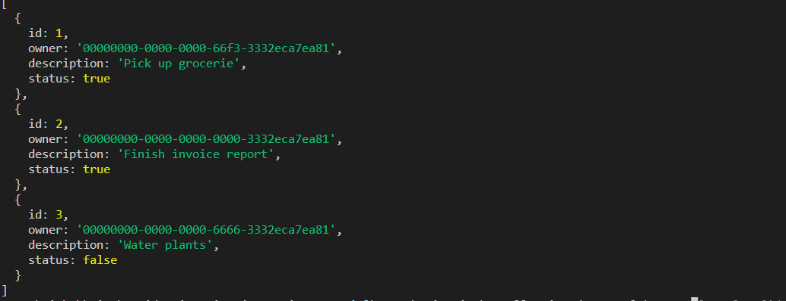

# A Node.js daemon application secured by MSAL Node on Microsoft identity platform

* [Overview](#overview)
* [Scenario](#scenario)
* [Contents](#contents)
* [Prerequisites](#prerequisites)
* [Setup the sample](#setup-the-sample)
* [Explore the sample](#explore-the-sample)
* [Troubleshooting](#troubleshooting)
* [About the code](#about-the-code)
* [How to deploy this sample to Azure](#how-to-deploy-this-sample-to-azure)
* [Contributing](#contributing)
* [Learn More](#learn-more)

## Overview

This sample demonstrates how to use [MSAL Node](https://github.com/AzureAD/microsoft-authentication-library-for-js/tree/dev/lib/msal-node) to acquire an access token for a protected resource in a daemon application using the application's own identity with the ([client credentials flow](https://learn.microsoft.com/azure/active-directory/develop/v2-oauth2-client-creds-grant-flow)).

Here you'll learn about [access tokens](https://docs.microsoft.com/azure/active-directory/develop/access-tokens), [token validation](https://docs.microsoft.com/azure/active-directory/develop/access-tokens#validating-tokens), [application permissions](https://docs.microsoft.com/azure/active-directory/develop/v2-permissions-and-consent#permission-types), and more.

## Scenario

1. The Node.js daemon app obtains a JWT [Access Token](https://aka.ms/access-tokens) from **Azure AD for Customers**.
1. The **access token** is used as a *bearer* token to authorize the user to call the ASP.NET Core web API protected by **Azure AD for Customers**.
1. The service uses the [Microsoft.Identity.Web](https://aka.ms/microsoft-identity-web) to protect the Web api, check permissions and validate tokens.

.

## Contents

| File/folder                     | Description                                               |
|---------------------------------|-----------------------------------------------------------|
| `App/.env`                      | Authentication parameters for the daemon app reside here.|
| `App/auth.js`                   | MSAL Node is initialized here.                            |
| `App/fetch.js`                  | logic to call the API reside here.                        |
| `API/ToDoListAPI/appsettings.json` | Authentication parameters for the API reside here.     |
| `API/ToDoListAPI/Startup.cs` | Microsoft.Identity.Web is initialized here.                  |

## Prerequisites

* Either [Visual Studio](https://visualstudio.microsoft.com/downloads/) or [Visual Studio Code](https://code.visualstudio.com/download) and [.NET Core SDK](https://www.microsoft.com/net/learn/get-started)
* An **Azure AD for Customers** tenant. For more information, see: [How to get an Azure AD for Customers tenant](https://github.com/microsoft/entra-previews/blob/PP2/docs/1-Create-a-CIAM-tenant.md)
* A user account in your **Azure AD for Customers** tenant.

## Setup the sample

### Step 1: Clone or download this repository

From your shell or command line:

```console
git clone https://github.com/Azure-Samples/ms-identity-ciam-javascript-tutorial.git
```

or download and extract the repository *.zip* file.

> :warning: To avoid path length limitations on Windows, we recommend cloning into a directory near the root of your drive.

### Step 2: Install project dependencies

```console
    cd 2-Authorization\3-call-api-node-daemon\App
    npm install
```

### Step 3: Register the sample application(s) in your tenant

There are two projects in this sample. Each needs to be separately registered in your Azure AD tenant. To register these projects, you can:

- follow the steps below for manually register your apps
- or use PowerShell scripts that:
  - **automatically** creates the Azure AD applications and related objects (passwords, permissions, dependencies) for you.
  - modify the projects' configuration files.

<details>
   <summary>Expand this section if you want to use this automation:</summary>

> :warning: If you have never used **Microsoft Graph PowerShell** before, we recommend you go through the [App Creation Scripts Guide](./AppCreationScripts/AppCreationScripts.md) once to ensure that your environment is prepared correctly for this step.

1. Ensure that you have [PowerShell 7](https://learn.microsoft.com/powershell/scripting/install/installing-powershell-on-windows?view=powershell-7.3) or later.
1. Run the script to create your Azure AD application and configure the code of the sample application accordingly.
1. For interactive process -in PowerShell, run:

    ```PowerShell
    cd .\AppCreationScripts\
    .\Configure.ps1 -TenantId "[Optional] - your tenant id" -AzureEnvironmentName "[Optional] - Azure environment, defaults to 'Global'"
    ```

> Other ways of running the scripts are described in [App Creation Scripts guide](./AppCreationScripts/AppCreationScripts.md). The scripts also provide a guide to automated application registration, configuration and removal which can help in your CI/CD scenarios.

> :information_source: This sample can make use of client certificates. You can use **AppCreationScripts** to register an Azure AD application with certificates. See: [How to use certificates instead of client secrets](./README-use-certificate.md)

</details>

#### Choose the Azure AD for Customers tenant where you want to create your applications

To manually register the apps, as a first step you'll need to:

1. Sign in to the [Azure portal](https://portal.azure.com).
1. If your account is present in more than one Azure AD for Customers tenant, select your profile at the top right corner in the menu on top of the page, and then **switch directory** to change your portal session to the desired Azure AD for Customers tenant.

#### Register the service app (ciam-msal-dotnet-api)

1. Navigate to the [Azure portal](https://portal.azure.com) and select the **Azure AD for Customers** service.
1. Select the **App Registrations** blade on the left, then select **New registration**.
1. In the **Register an application page** that appears, enter your application's registration information:
    1. In the **Name** section, enter a meaningful application name that will be displayed to users of the app, for example `ciam-msal-dotnet-api`.
    1. Under **Supported account types**, select **Accounts in this organizational directory only**
    1. Select **Register** to create the application.
1. In the **Overview** blade, find and note the **Application (client) ID** and **Directory (tenant) ID**. You use this value in your app's configuration file(s) later in your code.
1. In the app's registration screen, select the **Expose an API** blade to the left to open the page where you can publish the permission as an API for which client applications can obtain [access tokens](https://aka.ms/access-tokens) for. The first thing that we need to do is to declare the unique [resource](https://docs.microsoft.com/azure/active-directory/develop/v2-oauth2-auth-code-flow) URI that the clients will be using to obtain access tokens for this API. To declare an resource URI(Application ID URI), follow the following steps:
    1. Select **Set** next to the **Application ID URI** to generate a URI that is unique for this app.
    1. For this sample, accept the proposed Application ID URI (`api://{clientId}`) by selecting **Save**.
        > :information_source: Read more about Application ID URI at [Validation differences by supported account types (signInAudience)](https://docs.microsoft.com/azure/active-directory/develop/supported-accounts-validation).

##### Publish Delegated Permissions

1. All APIs must publish a minimum of one [scope](https://docs.microsoft.com/azure/active-directory/develop/v2-oauth2-auth-code-flow#request-an-authorization-code), also called [Delegated Permission](https://docs.microsoft.com/azure/active-directory/develop/v2-permissions-and-consent#permission-types), for the client apps to obtain an access token for a *user* successfully. To publish a scope, follow these steps:
1. Select **Add a scope** button open the **Add a scope** screen and Enter the values as indicated below:
    1. For **Scope name**, use `ToDoList.Read`.
    1. For **Admin consent display name** type in *ToDoList.Read*.
    1. For **Admin consent description** type in *e.g. Allows the app to read the signed-in user's files.*.
    1. Keep **State** as **Enabled**.
    1. Select the **Add scope** button on the bottom to save this scope.
    1. Repeat the steps above for another scope named **ToDoList.ReadWrite**
1. Select the **Manifest** blade on the left.
    1. Set `accessTokenAcceptedVersion` property to **2**.
    1. Select on **Save**.

> :information_source:  Follow [the principle of least privilege when publishing permissions](https://learn.microsoft.com/security/zero-trust/develop/protected-api-example) for a web API.

##### Publish Application Permissions

1. All APIs should publish a minimum of one [App role for applications](https://docs.microsoft.com/azure/active-directory/develop/howto-add-app-roles-in-azure-ad-apps#assign-app-roles-to-applications), also called [Application Permission](https://docs.microsoft.com/azure/active-directory/develop/v2-permissions-and-consent#permission-types), for the client apps to obtain an access token as *themselves*, i.e. when they are not signing-in a user. **Application permissions** are the type of permissions that APIs should publish when they want to enable client applications to successfully authenticate as themselves and not need to sign-in users. To publish an application permission, follow these steps:
1. Still on the same app registration, select the **App roles** blade to the left.
1. Select **Create app role**:
    1. For **Display name**, enter a suitable name for your application permission, for instance **ToDoList.Read.All**.
    1. For **Allowed member types**, choose **Application** to ensure other applications can be granted this permission.
    1. For **Value**, enter **ToDoList.Read.All**.
    1. For **Description**, enter *e.g. Allows the app to read the signed-in user's files.*.
    1. Select **Apply** to save your changes.
    1. Repeat the steps above for another app permission named **ToDoList.ReadWrite.All**

##### Configure Optional Claims

1. Still on the same app registration, select the **Token configuration** blade to the left.
1. Select **Add optional claim**:
    1. Select **optional claim type**, then choose **Access**.
    1. Select the optional claim **idtyp**.
    > Indicates token type. This claim is the most accurate way for an API to determine if a token is an app token or an app+user token. This is not issued in tokens issued to users.
    1. Select **Add** to save your changes.

##### Configure the service app (ciam-msal-dotnet-api) to use your app registration

Open the project in your IDE (like Visual Studio or Visual Studio Code) to configure the code.

> In the steps below, "ClientID" is the same as "Application ID" or "AppId".

1. Open the `API\ToDoListAPI\appsettings.json` file.
1. Find the key `Enter_the_Application_Id_Here` and replace the existing value with the application ID (clientId) of `ciam-msal-dotnet-api` app copied from the Azure portal.
1. Find the key `Enter_the_Tenant_Id_Here` and replace the existing value with your Azure AD tenant/directory ID.
1. Find the placeholder `Enter_the_Tenant_Subdomain_Here` and replace it with the Directory (tenant) subdomain. For instance, if your tenant primary domain is `contoso.onmicrosoft.com`, use `contoso`. If you don't have your tenant domain name, learn how to [read your tenant details](https://review.learn.microsoft.com/azure/active-directory/external-identities/customers/how-to-create-customer-tenant-portal#get-the-customer-tenant-details).

#### Register the client app (ciam-msal-node-daemon)

1. Navigate to the [Azure portal](https://portal.azure.com) and select the **Azure AD for Customers** service.
1. Select the **App Registrations** blade on the left, then select **New registration**.
1. In the **Register an application page** that appears, enter your application's registration information:
    1. In the **Name** section, enter a meaningful application name that will be displayed to users of the app, for example `ciam-msal-node-daemon`.
    1. Under **Supported account types**, select **Accounts in this organizational directory only**
    1. Select **Register** to create the application.
1. In the **Overview** blade, find and note the **Application (client) ID**. You use this value in your app's configuration file(s) later in your code.
1. In the app's registration screen, select the **Certificates & secrets** blade in the left to open the page where you can generate secrets and upload certificates.
1. In the **Client secrets** section, select **New client secret**:
    1. Type a key description (for instance `app secret`).
    1. Select one of the available key durations (**6 months**, **12 months** or **Custom**) as per your security posture.
    1. The generated key value will be displayed when you select the **Add** button. Copy and save the generated value for use in later steps.
    1. You'll need this key later in your code's configuration files. This key value will not be displayed again, and is not retrievable by any other means, so make sure to note it from the Azure portal before navigating to any other screen or blade.
    > :warning: For enhanced security, consider using **certificates** instead of client secrets. See: [How to use certificates instead of secrets](./README-use-certificate.md).
1. Since this app signs-in as itself using the [OAuth 2\.0 client credentials flow](https://docs.microsoft.com/azure/active-directory/develop/v2-oauth2-client-creds-grant-flow), we will now proceed to select **application permissions**, which is required by apps authenticating as themselves.
    1. In the app's registration screen, select the **API permissions** blade in the left to open the page where we add access to the APIs that your application needs:
    1. Select the **Add a permission** button and then:
    1. Ensure that the **My APIs** tab is selected.
    1. In the list of APIs, select the API `ciam-msal-dotnet-api`.
        1. We will select “Application permissions”, which should be the type of permissions that apps should use when they are authenticating just as themselves and not signing-in users.
    1. In the **Application permissions** section, select the **ToDoList.Read.All**, **ToDoList.ReadWrite.All** in the list. Use the search box if necessary.
    1. Select the **Add permissions** button at the bottom.
1. At this stage, the permissions are assigned correctly but since the client app does not allow users to interact, the users' themselves cannot consent to these permissions. To get around this problem, we'd let the [tenant administrator consent on behalf of all users in the tenant](https://docs.microsoft.com/azure/active-directory/develop/v2-admin-consent). Select the **Grant admin consent for {tenant}** button, and then select **Yes** when you are asked if you want to grant consent for the requested permissions for all accounts in the tenant. You need to be a tenant admin to be able to carry out this operation.

##### Configure the client app (ciam-msal-node-daemon) to use your app registration

Open the project in your IDE (like Visual Studio or Visual Studio Code) to configure the code.

> In the steps below, "ClientID" is the same as "Application ID" or "AppId".

1. Open the `APP\.env` file.
1. Find the key `Enter_the_Application_Id_Here` and replace the existing value with the application ID (clientId) of `ciam-msal-node-daemon` app copied from the Azure portal.
1. Find the placeholder `Enter_the_Tenant_Subdomain_Here` and replace it with the Directory (tenant) subdomain. For instance, if your tenant primary domain is `contoso.onmicrosoft.com`, use `contoso`. If you don't have your tenant domain name, learn how to [read your tenant details](https://review.learn.microsoft.com/azure/active-directory/external-identities/customers/how-to-create-customer-tenant-portal#get-the-customer-tenant-details).
1. Find the key `Enter_the_Client_Secret_Here` and replace the existing value with the generated secret that you saved during the creation of `ciam-msal-node-daemon` copied from the Azure portal.
1. Find the key `Enter_the_Web_Api_Application_Id_Here` and replace the existing value with the application ID (clientId) of `ciam-msal-dotnet-api` app copied from the Azure portal.

### Step 4: Running the sample

From your shell or command line, execute the following commands:

```console
    cd 2-Authorization\3-call-api-node-daemon\API\ToDoListAPI
    dotnet run
```

Then, open a separate command terminal and run:

```console
    2-Authorization\3-call-api-node-daemon\App
    node . --op getToDos
```

## Explore the sample

1. Navigate to the [app](./App/) root directory in the terminal.
1. Enter the following command `node . --op getToDos`.



> :information_source: Did the sample not work for you as expected? Then please reach out to us using the [GitHub Issues](../../../../issues) page.

## We'd love your feedback!

Were we successful in addressing your learning objective? Consider taking a moment to [share your experience with us](https://forms.office.com/Pages/ResponsePage.aspx?id=v4j5cvGGr0GRqy180BHbR_ivMYEeUKlEq8CxnMPgdNZUNDlUTTk2NVNYQkZSSjdaTk5KT1o4V1VVNS4u).

## Troubleshooting

Use [Stack Overflow](http://stackoverflow.com/questions/tagged/msal) to get support from the community. Ask your questions on Stack Overflow first and browse existing issues to see if someone has asked your question before. Make sure that your questions or comments are tagged with [`azure-active-directory` `node` `ms-identity` `adal` `msal`].

If you find a bug in the sample, raise the issue on [GitHub Issues](../../../../issues).

## About the code

You need to instantiate **MSAL Node** as a [ConfidentialClientApplication](https://github.com/AzureAD/microsoft-authentication-library-for-js/blob/dev/lib/msal-node/docs/initialize-confidential-client-application.md) to support the ([client credentials flow](https://learn.microsoft.com/azure/active-directory/develop/v2-oauth2-client-creds-grant-flow)).

```javascript
const msal = require('@azure/msal-node');
const cca = new msal.ConfidentialClientApplication(msalConfig);
```

### Acquire a token

**Access Token** requests in **MSAL.js** are meant to be *per-resource-per-scope(s)*. This means that an **Access Token** requested for resource **A** with scope `scp1`:

* cannot be used for accessing resource **A** with scope `scp2`, and,
* cannot be used for accessing resource **B** of any scope.

The intended recipient of an **Access Token** is represented by the `aud` claim; in case the value for the `aud` claim does not mach the resource APP ID URI, the token should be considered invalid. Likewise, the permissions that an Access Token grants is represented by the `roles` claim. See [Access Token claims](https://docs.microsoft.com/azure/active-directory/develop/access-tokens#payload-claims) for more information.

To get the **access token** for a protected resource using the client credentials grant flow, **MSAL Node** exposes `acquireTokenByClientCredential` API to grant permission to the application to get an **access token**.

```javascript
const cca = new msal.ConfidentialClientApplication(msalConfig);

async function getToken(tokenRequest) {
    return await cca.acquireTokenByClientCredential(tokenRequest);
}
```

### Access token validation

On the web API side, the `AddMicrosoftIdentityWebApi` method in [Program.cs](./API/ToDoListAPI/Program.cs) protects the web API by [validating access tokens](https://docs.microsoft.com/azure/active-directory/develop/access-tokens#validating-tokens) sent tho this API. Check out [Protected web API: Code configuration](https://docs.microsoft.com/azure/active-directory/develop/scenario-protected-web-api-app-configuration) which explains the inner workings of this method in more detail.

```csharp
builder.Services.AddAuthentication(JwtBearerDefaults.AuthenticationScheme)
            .AddMicrosoftIdentityWebApi(options =>
            {
                builder.Configuration.Bind("AzureAd", options);
                options.Events = new JwtBearerEvents();
            }, options => { builder.Configuration.Bind("AzureAd", options); });
```

For validation and debugging purposes, developers can decode **JWT**s (*JSON Web Tokens*) using [jwt.ms](https://jwt.ms).

### Verifying permissions

Access tokens that have neither the **scp** (for delegated permissions) nor **roles** (for application permissions) claim with the required scopes/permissions should not be accepted. In the sample, this is illustrated via the `RequiredScopeOrAppPermission` attribute in [ToDoListController.cs](./API/ToDoListAPI/Controllers/ToDoListController.cs):

```csharp
[HttpGet]
    [RequiredScopeOrAppPermission(
        RequiredScopesConfigurationKey = "AzureAD:Scopes:Read",
        RequiredAppPermissionsConfigurationKey = "AzureAD:AppPermissions:Read"
    )]
    public async Task<IActionResult> GetAsync()
    {
        var toDos = await _toDoContext.ToDos!
            .Where(td => RequestCanAccessToDo(td.Owner))
            .ToListAsync();
        return Ok(toDos);
    }
```

### Access to data

Web API endpoints should be prepared to accept calls from both users and applications, and should have control structures in place to respond to each accordingly. For instance, a call from a user via delegated permissions should be responded with user's data, while a call from an application via application permissions might be responded with the entire todolist. This is illustrated in the [ToDoListController](./API/ToDoListAPI/Controllers/ToDoListController.cs) controller:

```csharp
private bool RequestCanAccessToDo(Guid userId)
    {
        return IsAppMakingRequest() || (userId == GetUserId());
    }
[HttpGet]
    [RequiredScopeOrAppPermission(
        RequiredScopesConfigurationKey = "AzureAD:Scopes:Read",
        RequiredAppPermissionsConfigurationKey = "AzureAD:AppPermissions:Read"
    )]
    public async Task<IActionResult> GetAsync()
    {
        var toDos = await _toDoContext.ToDos!
            .Where(td => RequestCanAccessToDo(td.Owner))
            .ToListAsync();
        return Ok(toDos);
    }
```

When granting access to data based on scopes, be sure to follow [the principle of least privilege](https://docs.microsoft.com/azure/active-directory/develop/secure-least-privileged-access).

### Debugging the sample

To debug the .NET Core web API that comes with this sample, install the [C# extension](https://marketplace.visualstudio.com/items?itemName=ms-dotnettools.csharp) for Visual Studio Code.

Learn more about using [.NET Core with Visual Studio Code](https://docs.microsoft.com/dotnet/core/tutorials/with-visual-studio-code).

## How to deploy this sample to Azure

<details>
<summary>Expand the section</summary>

### Deploying web API to Azure App Services

There is one web API in this sample. To deploy it to **Azure App Services**, you'll need to:

* create an **Azure App Service**
* publish the projects to the **App Services**

> :warning: Please make sure that you have not switched on the *[Automatic authentication provided by App Service](https://docs.microsoft.com/azure/app-service/scenario-secure-app-authentication-app-service)*. It interferes the authentication code used in this code example.

#### Publish your files (ciam-msal-dotnet-api)

##### Publish using Visual Studio

Follow the link to [Publish with Visual Studio](https://docs.microsoft.com/visualstudio/deployment/quickstart-deploy-to-azure).

##### Publish using Visual Studio Code

1. Install the Visual Studio Code extension [Azure App Service](https://marketplace.visualstudio.com/items?itemName=ms-azuretools.vscode-azureappservice).
1. Follow the link to [Publish with Visual Studio Code](https://docs.microsoft.com/aspnet/core/tutorials/publish-to-azure-webapp-using-vscode)

> :information_source: When calling the web API, your app may receive an error similar to the following:
>
> *Cross-Origin Request Blocked: The Same Origin Policy disallows reading the remote resource at https://some-url-here. (Reason: additional information here).*
>
> If that's the case, you'll need enable [cross-origin resource sharing (CORS)](https://developer.mozilla.org/docs/Web/HTTP/CORS) for you web API. Follow the steps below to do this:
>
> * Go to [Azure portal](https://portal.azure.com), and locate the web API project that you've deployed to App Service.
> * On the API blade, select **CORS**. Check the box **Enable Access-Control-Allow-Credentials**.
> * Under **Allowed origins**, add the URL of your published web app **that will call this web API**.

</details>

## Contributing

If you'd like to contribute to this sample, see [CONTRIBUTING.MD](/CONTRIBUTING.md).

This project has adopted the [Microsoft Open Source Code of Conduct](https://opensource.microsoft.com/codeofconduct/). For more information, see the [Code of Conduct FAQ](https://opensource.microsoft.com/codeofconduct/faq/) or contact [opencode@microsoft.com](mailto:opencode@microsoft.com) with any additional questions or comments.

## Learn More

* [Customize the default branding](https://github.com/microsoft/entra-previews/blob/PP2/docs/5-Customize-default-branding.md)
* [OAuth 2.0 device authorization grant flow](https://github.com/microsoft/entra-previews/blob/PP2/docs/9-OAuth2-device-code.md)
* [Customize sign-in strings](https://github.com/microsoft/entra-previews/blob/PP2/docs/8-Customize-sign-in-strings.md)
* [Building Zero Trust ready apps](https://aka.ms/ztdevsession)
* [Microsoft.Identity.Web](https://aka.ms/microsoft-identity-web)
* [Validating Access Tokens](https://docs.microsoft.com/azure/active-directory/develop/access-tokens#validating-tokens)
* [User and application tokens](https://docs.microsoft.com/azure/active-directory/develop/access-tokens#user-and-application-tokens)
* [Validation differences by supported account types](https://docs.microsoft.com/azure/active-directory/develop/supported-accounts-validation)
* [How to manually validate a JWT access token using the Microsoft identity platform](https://github.com/Azure-Samples/active-directory-dotnet-webapi-manual-jwt-validation/blob/master/README.md)
