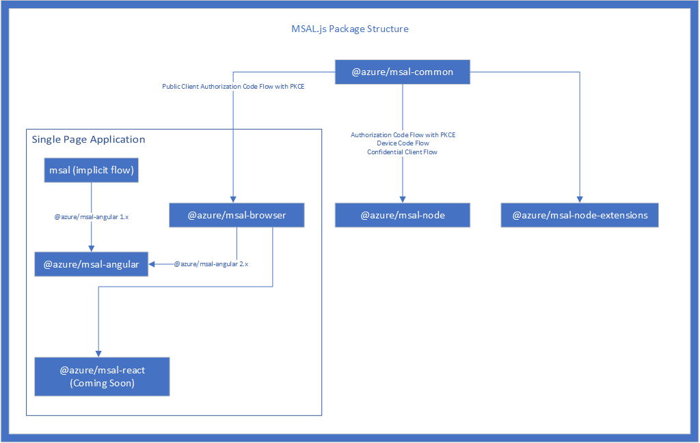

# Microsoft Authentication Library for JavaScript (MSAL.js)

The Microsoft Authentication Library for JavaScript adds Auth to Javascript applications, and access to resource APIs in the [Microsoft Cloud](https://www.microsoft.com/enterprise) such as [Microsoft Graph](https://graph.microsoft.io).

MSAL.js now supports Node.js and Electron! 

MSAL.js supports both consumer and enterprise Microsoft accounts.  This can be restricted if desired.  Only applications that use special consumer or enterprise data will need to differentiate.

MSAL.js supports social identity providers like Facebook, Google, and LinkedIn through the [Azure AD B2C](https://docs.microsoft.com/en-us/azure/active-directory-b2c/active-directory-b2c-overview#identity-providers) service. 

## How do I get Started?

Follow the link that matches your app:
- [Traditional web app](lib/msal-browser/)
- [Node.js app](lib/msal-node/)
- Or explore our [samples](/tree/dev/samples)

## Learn more

MSAL.js is a collection of Javascript related libraries providing common AuthN methods across several frameworks and application types. The [`lib`](https://github.com/AzureAD/microsoft-authentication-library-for-js/tree/dev/lib) folder contains the source code for all of our libraries. You will also find all the details about **installing the libraries**, in their respective README.md.

- [Microsoft Authentication Library for Node.js v1.x (Alpha)](lib/msal-node/): A [Node.js](https://nodejs.org/en/) library that enables authentication and token acquisition with the Microsoft Identity platform in JavaScript applications. Implements the following OAuth 2.0 protocols and is [OpenID-compliant](https://docs.microsoft.com/en-us/azure/active-directory/develop/v2-protocols-oidc):
    - [Authorization Code Grant](https://oauth.net/2/grant-types/authorization-code/) with [PKCE](https://oauth.net/2/pkce/)
    - [Device Code Grant](https://oauth.net/2/grant-types/device-code/)
    - [Refresh Token Grant](https://oauth.net/2/grant-types/refresh-token/)
    - [Client Credential Grant](https://oauth.net/2/grant-types/client-credentials/) (Coming soon)

- [Microsoft Authentication Library for JavaScript v2.x](lib/msal-browser/): A browser-based, framework-agnostic browser library that enables authentication and token acquisition with the Microsoft Identity platform in JavaScript applications. Implements the OAuth 2.0 [Authorization Code Flow with PKCE](https://docs.microsoft.com/en-us/azure/active-directory/develop/v2-oauth2-auth-code-flow), and is [OpenID-compliant](https://docs.microsoft.com/en-us/azure/active-directory/develop/v2-protocols-oidc).

- [Microsoft Authentication Library for JavaScript v1.x](lib/msal-core/): A browser-based, framework-agnostic core library that enables authentication and token acquisition with the Microsoft Identity platform in JavaScript applications. Implements the OAuth 2.0 [Implicit Grant Flow](https://docs.microsoft.com/en-us/azure/active-directory/develop/v2-oauth2-implicit-grant-flow), and is [OpenID-compliant](https://docs.microsoft.com/en-us/azure/active-directory/develop/v2-protocols-oidc).

- [Microsoft Authentication Library for Angular](lib/msal-angular/) :
A wrapper of the MSAL.js 1.x library for apps using Angular framework.

- [Microsoft Authentication Library for AngularJS](lib/msal-angularjs/) :
A wrapper of the MSAL.js 1.x library for apps using AngularJS framework.

### Package Structure

We ship a number of different packages which are meant for different platforms. You can see the relationship between packages and different authentication flows they implement below.

### Samples

The [`samples`](https://github.com/AzureAD/microsoft-authentication-library-for-js/tree/dev/samples) folder contains sample applications for our libaries. A complete list of samples can be found in the respective package folders or [on our wiki](https://github.com/AzureAD/microsoft-authentication-library-for-js/wiki/Samples).

## Package versioning

All of our libraries follow [semantic versioning](https://semver.org). We recommend using the latest version of each libary to ensure you have the latest security patches and bug fixes.

## Roadmap

Please check the [roadmap](https://github.com/AzureAD/microsoft-authentication-library-for-js/wiki#roadmap) to see what we are working on and what we have planned for future releases.

## Community Help and Support

- [GitHub Issues](../../issues) is the best place to ask questions, report bugs, and new request features.

- [FAQs](https://github.com/AzureAD/microsoft-authentication-library-for-js/wiki/FAQs) for access to our frequently asked questions.

- [Stack Overflow](http://stackoverflow.com/questions/tagged/msal) using "msal" and "msal.js" tag.

- [User Voice page](https://feedback.azure.com/forums/169401-azure-active-directory) to provide recommendations and/or feedback.

## Contribute

We enthusiastically welcome contributions and feedback. Please read the [contributing guide](contributing.md) before you begin.

## Security Reporting

If you find a security issue with our libraries or services [please report it to the Microsoft Security Response Center (MSRC)](https://aka.ms/report-security-issue) with as much detail as possible. Your submission may be eligible for a bounty through the [Microsoft Bounty](http://aka.ms/bugbounty) program. Please do not post security issues to GitHub Issues or any other public site. We will contact you shortly upon receiving the information. We encourage you to get notifications of when security incidents occur by visiting [this page](https://www.microsoft.com/msrc/technical-security-notifications) and subscribing to Security Advisory Alerts.

## License

Copyright (c) Microsoft Corporation.  All rights reserved. Licensed under the MIT License (the "License").

## We Value and Adhere to the Microsoft Open Source Code of Conduct

This project has adopted the [Microsoft Open Source Code of Conduct](https://opensource.microsoft.com/codeofconduct/). For more information see the [Code of Conduct FAQ](https://opensource.microsoft.com/codeofconduct/faq/) or contact [opencode@microsoft.com](mailto:opencode@microsoft.com) with any additional questions or comments.
