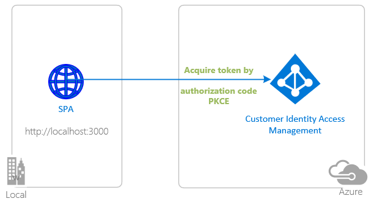
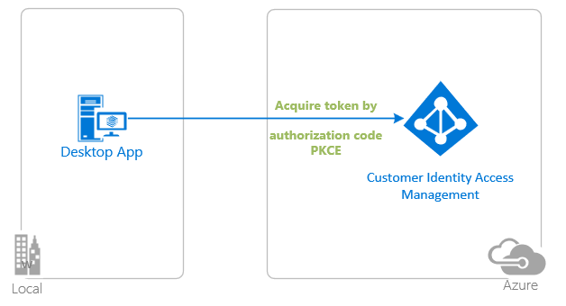
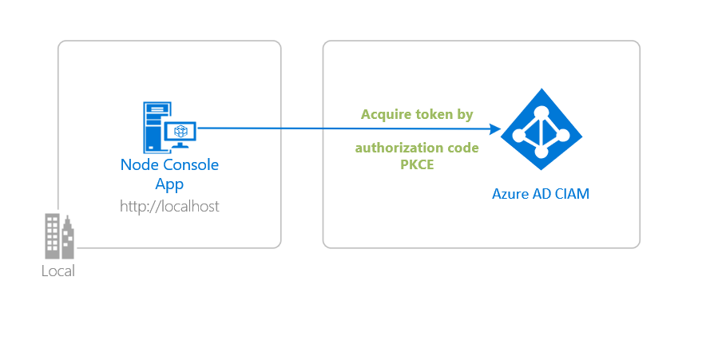
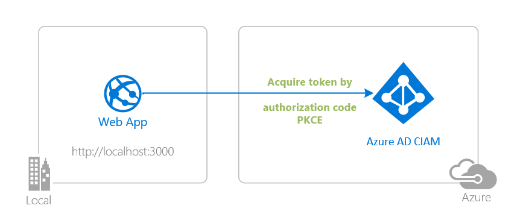
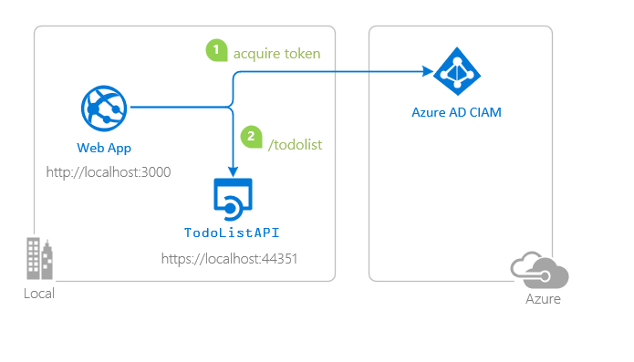
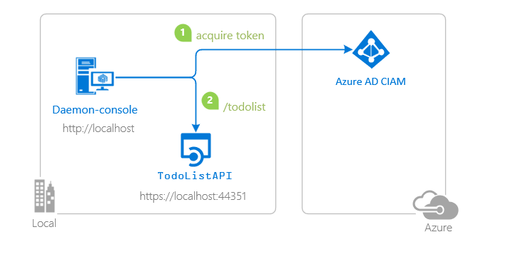
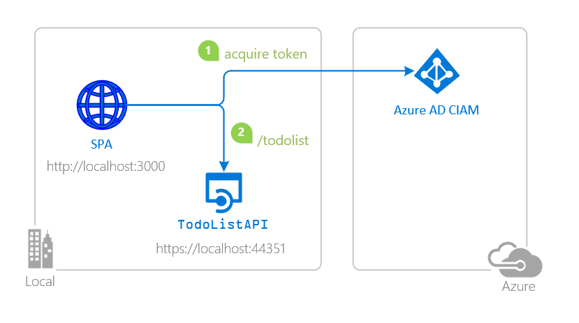
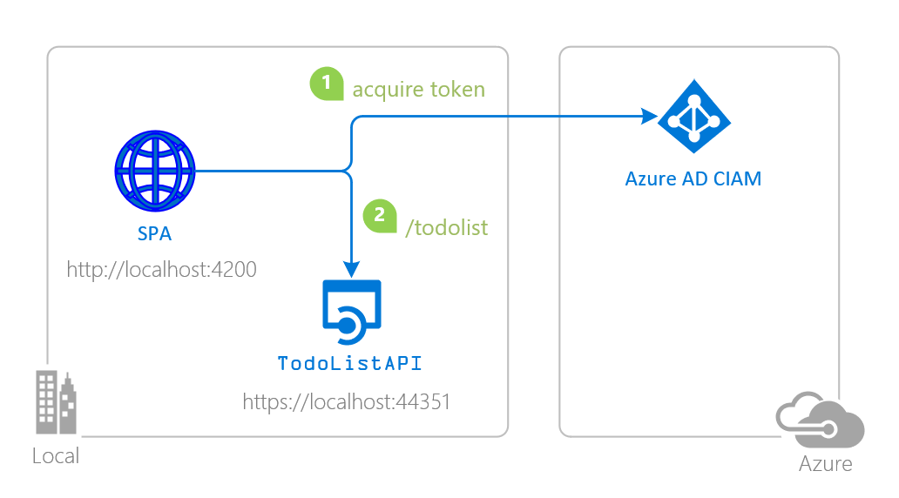

# Tutorial: Enable your JavaScript application to sign-in users and call APIs with Azure AD for Customers

This tutorial aims to take you through the fundamentals of modern authentication with Azure AD Consumer Identity and Access Management (CIAM), using the [Microsoft Authentication Library for JavaScript](https://github.com/AzureAD/microsoft-authentication-library-for-js).

## Prerequisites

- [Node.js v14 LTS or later](https://nodejs.org/en/download/)
- [Visual Studio Code](https://code.visualstudio.com/download)
- A modern web browser (to use the [popup experience](https://github.com/AzureAD/microsoft-authentication-library-for-js/blob/dev/lib/msal-browser/docs/initialization.md#choosing-an-interaction-type) during sign-in and token acquisition, your browser should allow popups)

Please refer to each sample's README for sample-specific prerequisites. 

The following tables are a summary of code samples alongside links to tutorials on how to integrate various app types with Azure AD for customers:

- The **Explore and run code sample guide** uses a sample app to show you how to add identity and access management (IAM) capabilities to your applications using Microsoft Entra External ID for customers.

- The **Build and integrate tutorial** offers detailed guidance on how to build an app from the ground up, walking you through the packages and code needed to add IAM support to both new or existing applications.

### Chapter 1: Sign-in a user to your application with Azure AD for customers

Language/platform + app type |Scenario| GitHub code sample | Explore and run code sample | Build and integrate tutorial |
| ------- | -------- | ------------- |-------------|---------------|
VanillaJS SPA|  | [**Sign in using a Vanilla JavaScript SPA**](./1-Authentication/0-sign-in-vanillajs/README.md) | [Sign in users](https://learn.microsoft.com/azure/active-directory/external-identities/customers/how-to-single-page-app-vanillajs-sample-sign-in) | [Sign in users](https://learn.microsoft.com/azure/active-directory/external-identities/customers/how-to-single-page-app-vanillajs-prepare-tenant) |
|React SPA| | [**Sign in using a React SPA**](./1-Authentication/1-sign-in-react/README.md) | [Sign in users](https://learn.microsoft.com/azure/active-directory/external-identities/customers/how-to-single-page-application-react-sample) | [Sign in users](https://learn.microsoft.com/azure/active-directory/external-identities/customers/how-to-single-page-application-react-prepare-tenant) |
Angular SPA| | [**Sign in using an Angular SPA**](./1-Authentication/2-sign-in-angular/README.md) | [Sign in users](https://learn.microsoft.com/azure/active-directory/external-identities/customers/how-to-single-page-application-angular-sample) | --- |
Electron desktop app| | [**Sign in using an Electron desktop app**](./1-Authentication/3-sign-in-electron/README.md) | [Sign in users](https://learn.microsoft.com/azure/active-directory/external-identities/customers/how-to-desktop-app-electron-sample-sign-in) | --- |
Node.js browserless app| | [**Sign in using a Node.js browserless app**](./1-Authentication/4-sign-in-device-code/README.md) | [Sign in users](https://learn.microsoft.com/azure/active-directory/external-identities/customers/how-to-browserless-app-node-sample-sign-in) | [Sign in users](https://learn.microsoft.com/azure/active-directory/external-identities/customers/how-to-browserless-app-node-sign-in-overview) |
Node.js & Express web app| | [**Sign in using a Node.js & Express web app**](./1-Authentication/5-sign-in-express/README.md) | [Sign in users](https://learn.microsoft.com/azure/active-directory/external-identities/customers/how-to-web-app-node-sample-sign-in) | [Sign in users](https://learn.microsoft.com/azure/active-directory/external-identities/customers/how-to-web-app-node-sign-in-overview) |

### Chapter 2: Protect an API and call the API from your client app

The following table summarizes resources with guidance on how to protect your web API with the **Azure AD for Customers**.  You then use a client application to sign-in a user, acquire an **Access Token** for your app to call the protected web API.

Language/platform + app type |Scenario| GitHub code sample | Explore and run code sample | Build and integrate tutorial |
| ------- | -------- | ------------- |-------------|---------------|
Node.js & Express web app| | [**Sign in users and call an API using a Node.js & Express web app**](./2-Authorization/4-call-api-express/README.md) | [Sign in users and call an API](https://learn.microsoft.com/azure/active-directory/external-identities/customers/how-to-web-app-node-sample-sign-in-call-api) | [Sign in users and call an API](https://learn.microsoft.com/azure/active-directory/external-identities/customers/how-to-web-app-node-sign-in-call-api-overview) |
Node.js daemon application|| [**Call an API using a Node.js daemon application**](/2-Authorization/3-call-api-node-daemon/README.md) | [Call an API](https://learn.microsoft.com/azure/active-directory/external-identities/customers/how-to-daemon-node-sample-call-api) |[Call an API](https://learn.microsoft.com/azure/active-directory/external-identities/customers/how-to-daemon-node-call-api-overview) |
Vanilla JavaScript SPA| | [**Sign in users and call an API using a Vanilla JavaScript SPA**](./2-Authorization//0-call-api-vanillajs/README.md) | --- |--- |
React SPA| | [**Sign in users and call an API using a React SPA**](./2-Authorization/1-call-api-react/README.md) | --- |--- |
Angular SPA| | [**Sign in users and call an API using an Angular SPA**](./2-Authorization/2-call-api-angular/README.md) | --- |--- |

If you're looking for more samples on different authentication and authorization scenarios, see [Samples and guides for customer identity and access management (CIAM) in Azure Active Directory](https://learn.microsoft.com/azure/active-directory/external-identities/customers/samples-ciam-all?tabs=apptype)

## More information

Learn more about the **Microsoft Entra External ID for customers**:

- [Identity Platform Developer Center](https://developer.microsoft.com/identity/customers)
- [Microsoft Entra External ID for customers](https://learn.microsoft.com/azure/active-directory/external-identities/customers/overview-customers-ciam)
- [Overview of Microsoft Authentication Library (MSAL)](https://docs.microsoft.com/azure/active-directory/develop/msal-overview)
- [Supported features in Microsoft Entra External ID for customers](https://learn.microsoft.com/azure/active-directory/external-identities/customers/concept-supported-features-customers)
- [Authentication methods and identity providers for customers](https://learn.microsoft.com/azure/active-directory/external-identities/customers/concept-authentication-methods-customers)
- [Microsoft Entra External ID for customers frequently asked questions](https://learn.microsoft.com/azure/active-directory/external-identities/customers/faq-customers)

## We'd love your feedback

Were we successful in addressing your learning objective? Consider taking a moment to [share your experience with us](https://forms.office.com/Pages/ResponsePage.aspx?id=v4j5cvGGr0GRqy180BHbR_ivMYEeUKlEq8CxnMPgdNZUNDlUTTk2NVNYQkZSSjdaTk5KT1o4V1VVNS4u).

## Community help and support

- Post a question to [Microsoft Q&A](https://learn.microsoft.com/answers/) to get answers to your identity app development questions directly from Microsoft engineers, Azure Most Valuable Professionals (MVPs), and members of our expert community.

- Use [Stack Overflow](https://stackoverflow.com/questions/tagged/microsoft-entra-external-id) to get support from the community.
Ask your questions on Stack Overflow first and browse existing issues to see if someone has asked your question before. Make sure that your questions or comments are tagged with [`ms-identity` `microsoft-entra-external-id` `msal`].

- If you find a bug in the sample, please raise the issue on [GitHub Issues](../../issues).

## Contributing

This project welcomes contributions and suggestions.  Most contributions require you to agree to a
Contributor License Agreement (CLA) declaring that you have the right to, and actually do, grant us
the rights to use your contribution. For details, visit [cla.opensource.microsoft.com](https://cla.opensource.microsoft.com).

## Code of conduct

This project has adopted the [Microsoft Open Source Code of Conduct](https://opensource.microsoft.com/codeofconduct/).
For more information see the [Code of Conduct FAQ](https://opensource.microsoft.com/codeofconduct/faq/) or
contact [opencode@microsoft.com](mailto:opencode@microsoft.com) with any additional questions or comments.
