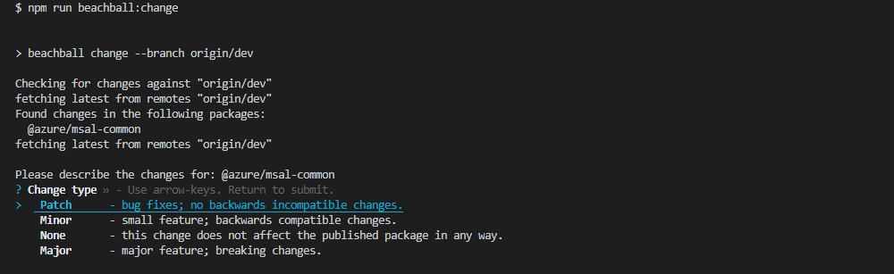
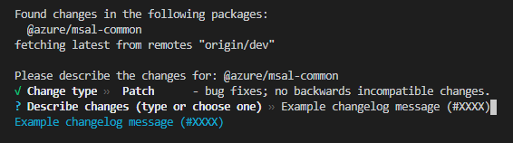

# Contributing to MSAL.js

Azure Active Directory SDK projects welcome new contributors. This document will guide you through the process.

## Contributor License Agreement

Please visit [https://cla.microsoft.com/](https://cla.microsoft.com/) and sign the Contributor License Agreement. You only need to do that once. We can not look at your code until you've submitted this request.

## Forking/Cloning the Repository

Fork/Clone the project [on GitHub](https://github.com/AzureAD/microsoft-authentication-library-for-js) and check out your copy. Be aware that unless you have the correct permissions, you will not be able to create new branches on a cloned version of the repository. For all external contributions, please fork this repository.

Example for JS:

```
$ git clone git@github.com:username/microsoft-authentication-library-for-js.git
$ cd microsoft-authentication-library-for-js
$ git remote add upstream git@github.com:AzureAD/microsoft-authentication-library-for-js.git
```

Now decide if you want your feature or bug fix to go into the dev branch or the master branch. **All bug fixes and new features should go into the dev branch.**

The master branch is effectively frozen; patches that change the SDKs protocols or API surface area or affect the run-time behavior of the SDK will be rejected.

Some of our SDKs have bundled dependencies that are not part of the project proper. Any changes to files in those directories or its subdirectories should be sent to their respective projects. Do not send your patch to us, we cannot accept it.

In case of doubt, open an [issue](https://github.com/AzureAD/microsoft-authentication-library-for-js/issues).

Especially do so if you plan to work on a major change in functionality. Nothing is more frustrating than seeing your hard work go to waste because your vision does not align with our goals for the SDK.

### Create a branch for your feature/patch

Okay, so you have decided on the proper branch. Create a feature branch and start hacking:

```
$ git checkout -b my-feature-branch
```

## Installation and Bootstrapping

This repository is a monorepo for all packages maintained by the MSAL.js team. It contains public `npm` packages in the [`lib`](https://github.com/AzureAD/microsoft-authentication-library-for-js/tree/dev/lib) folder as well as some additional libraries in the [`extensions`](https://github.com/AzureAD/microsoft-authentication-library-for-js/tree/dev/extensions) folder.

If you would like to build a specific package, you can visit the `README.md` for that specific folder to review the build process. The instructions here are specific to the monorepo.

## Build and Test

### Build Library

```bash
// Change to the root of the msal repo
cd microsoft-authentication-library-for-js/
// Install npm dependencies and bootstrap packages
npm install
// Navigate to package you would like to build
cd lib/<package-name>
// Build library
npm run build:all
// To run build only for a single package (not its dependencies)
npm run build
```

### Test and Test Coverage

Bug fixes and features should come with automated tests. Add your tests in the
test directory. This varies by repository but often follows the same convention of /src/test. Look at other tests to see how they should be
structured (license boilerplate, common includes, etc.).

Make sure that all previously passing and new tests pass before submitting your change. You can run the tests as described below.

#### Unit tests without coverage:

```bash
// Change to the root of the msal repo
cd microsoft-authentication-library-for-js/
// Install npm dependencies and bootstrap packages
npm install
// Navigate to package you would like to build
cd lib/<package-name>
// Run test command
npm test
```

#### Unit tests with coverage (no reporting):

```bash
// Change to the root of the msal repo
cd microsoft-authentication-library-for-js/
// Install npm dependencies and bootstrap packages
npm install
// Navigate to package you would like to build
cd lib/<package-name>
// Run test command
npm run test:coverage
```

### VS Code Setup

If you are looking to use VS code as an IDE and want to take advantage of a Test/Debugger Ui, you can install the following Jest package from the marketplace: [Jest](https://marketplace.visualstudio.com/items?itemName=Orta.vscode-jest). If you have not done so already, VSCode will recommend that you install this package from the UI.

Once installed, you have the option to configure the jest environment for further customization. The following config has already been placed in the local settings file in the repository:

`.vscode\settings.json`

```json
    "jest.autoRun": "off",
    "jest.jestCommandLine": "npm test --",
    "jest.virtualFolders": [
        {
            "name": "msal-common",
            "rootPath": "lib/msal-common"
        },
        {
            "name": "msal-browser",
            "rootPath": "lib/msal-browser"
        },
        {
            "name": "msal-node",
            "rootPath": "lib/msal-node"
        },
        {
            "name": "msal-react",
            "rootPath": "lib/msal-react"
        },
        {
            "name": "msal-node-extensions",
            "rootPath": "extensions/msal-node-extensions"
        }
    ]
```

Once the extension is installed, you will be able to simply right click a test and run it from the UI.


## Before committing

We will automatically run lint as our pre-commit command. Failing to pass linting will prevent you from pushing up code which will break the build.

```
$ npm run lint
```

This will ensure any changes are consistent with the current code style. We uses eslint and you can find a list of linting rules in the .eslintrc.json.

If for some reason you still want to push without fixing the linting errors. You can add the follow option to your commit command to [bypass the pre-commit][]:

```
--no-verify
```

## Commit

Make sure git knows your name and email address:

```
$ git config --global user.name "J. Random User"
$ git config --global user.email "j.random.user@example.com"
```

Writing good commit logs is important. A commit log should describe what changed and why. A good commit log looks like this:

```
fix: explaining the commit in one line
```

The header line should be meaningful; it is what other people see when they run `git shortlog` or `git log --oneline`.

Check the output of `git log --oneline files_that_you_changed` to find out what directories your changes touch.

## Rebasing/Update from 'Dev'

Use `git rebase` (not `git merge`) to sync your work from time to time.

```
$ git fetch upstream
$ git rebase upstream/dev
```

## Pushing your commit

```
$ git push origin my-feature-branch
```

## Creating a PR

Once your changes have all been pushed to your branch and you are confident that the code is ready to be reviewed, you can [open a new pull request](https://github.com/AzureAD/microsoft-authentication-library-for-js/compare). This will create a form and notify the code owners that you are ready to merge a change. This will also run some pipeline build and test tasks to make sure that there are no errors in the build.

Pull requests are usually reviewed within a few days. If there are comments to address, apply your changes in a separate commit and push that to your feature branch. Post a comment in the pull request afterwards; GitHub does not send out notifications when you add commits.

[on GitHub]: https://github.com/AzureAD/microsoft-authentication-library-for-js
[issue tracker]: https://github.com/AzureAD/microsoft-authentication-library-for-js/issues
[bypass the pre-commit]: https://git-scm.com/docs/git-commit#Documentation/git-commit.txt---no-verify

Once your PR is created, you will need to make sure all of the checks for the PR are passing, including the `beachball` commands below.

### Beachball check

The [beachball](https://microsoft.github.io/beachball/) package is used to compile changelogs and perform releases of the packages. It does this by collecting changefiles for each affected package before a PR is merged. Ensure you have the correct email set in your local git config before continuing. See [above](#commit).

You will need to add the changefiles to your branch before it can be merged. There are a few scripts added to the `package.json` to support this:

-   `npm run beachball:change`

Generates a changefile based on the `master` branch. This should be run on your PR before merging to `dev`, **AFTER** you have created your PR. When this command is run, the type of change needs to be selected:



Here are the criteria for each type of change:

-   `None`: Used for changes to documentation, build files, test files or samples.
-   `Patch`: Used for bug fixes and minor convenience features.
-   `Minor`: Used for new features and major bug fixes.
-   `Major`: Used for new major library changes. Should almost never be used.

`beachball` will then ask for the changelog message. Please enter a short description of the change as well as the PR number in parentheses at the end of the message. This does not need to be a verbose message.



-   `npm run beachball:check`

Checks that changefiles have been generated for relevant changed packages. Used by the CI tool on PRs, can also be used locally.

-   `npm run beachball:bump`

Bumps versions for packages with relevant changefiles. Run on `master` branch to check which packages are slated for release.

**IMPORTANT NOTE**: This should **NOT** be done when merging a PR. You should ONLY do this on your local branch to ensure there are no unexpected changes.

### API Extractor Report

In order to detect Public API Surface changes, MSAL JavaScript libraries use [API Extractor](https://api-extractor.com/). Once your PR is code-complete, follow these steps to make sure your PR does not contain any unintended public API surface changes:

1. In your console/terminal, change into the directory of any library where you have made changes:

```bash
    $ cd lib/msal-browser
```

2. Build the library:

```bash
    $ npm run build
```

3. Run the API extractor npm script:

```bash
    $ npm run apiExtractor
```

If API extractor reports no API changes, you don't need to do anything else. API Extractor runs as part of the MSAL JS Build CI pipeline in order to validate there are no further API issues.

4. If API extractor reports changes to the public API surface, please review them to make sure they are intended. Once you have reviewed and determined the API changes are intentional and required/acceptable, you can run the `npm run apiExtractor` command again, passing in the --local flag in order to update the API Extractor report in Git:

```bash
    $ npm run apiExtractor -- --local
```

5. Commit the `lib/<package>/apiReview/<packageName>.api.md` file and push it as part of your PR.

```bash
    $ git add apiReview/<packageName>.api.md
    $ git commit -m "Update API Extractor report"
```

## Drafting a release

Releases are managed using the [beachball](https://microsoft.github.io/beachball/) package. In short, `beachball` will enforce that every PR to a release branch includes a changefile that will describe the feature as a changelog item. During publish, the package will compile changes for all relevant packages and perform a release to `npm`.

Releases are generally performed on a regular cadence, and if there is an urgent need can be performed immediately. Please reach out to the [codeowners](./CODEOWNERS) for any questions.
