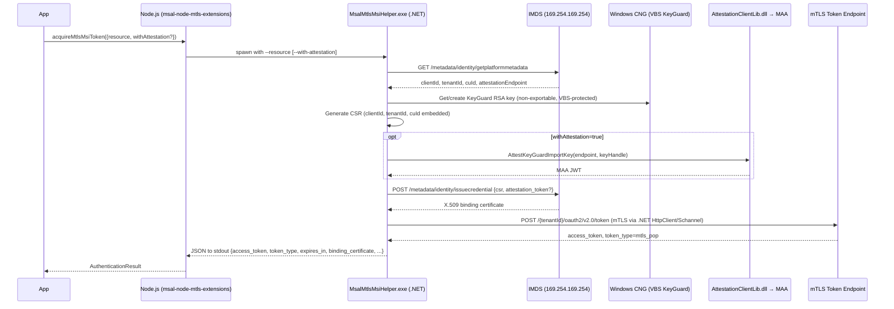

# @azure/msal-node-mtls-extensions

Managed Identity mTLS Proof-of-Possession (mTLS PoP) token acquisition for `@azure/msal-node`.

## Overview

This is the **core package** for the mTLS PoP Managed Identity flow. It contains all the
TypeScript logic (subprocess spawning, token caching, IMDS client) but does **not** include
the `MsalMtlsMsiHelper.exe` binary.

To use this package on a Windows VM you need the pre-built binary. The recommended way to get
it is to install the companion package:

```bash
npm install @azure/msal-node-key-attestation
```

`@azure/msal-node-key-attestation` ships `MsalMtlsMsiHelper.exe` and `AttestationClientLib.dll`,
and re-exports all functions from this package with the binary path pre-configured. Most users
should **import from `@azure/msal-node-key-attestation`** rather than this package directly.

This split mirrors the pattern used by msal-dotnet (`Microsoft.Identity.Client.KeyAttestation`)
and msal-python (`msal-key-attestation`):

| SDK | Core package | Binary / attestation package |
|-----|--------------|-------------------------------|
| msal-node | `@azure/msal-node-mtls-extensions` (this package) | `@azure/msal-node-key-attestation` |
| msal-dotnet | `Microsoft.Identity.Client` | `Microsoft.Identity.Client.KeyAttestation` |
| msal-python | `msal` | `msal-key-attestation` |

### When to import from this package directly

- You are providing your own `MsalMtlsMsiHelper.exe` binary (pass `helperPath` in the request options)
- You have set the `MSAL_MTLS_HELPER_PATH` environment variable
- You only need `ImdsClient.ts` / `getPlatformMetadata()` (no binary required)

## Installation

```bash
# Recommended: includes the pre-built binary
npm install @azure/msal-node-key-attestation

# Core only (no binary): use when providing helperPath manually
npm install @azure/msal-node-mtls-extensions
```

## Usage

### Using the companion binary package (recommended)

```typescript
import { acquireMtlsMsiToken, makeMtlsMsiRequest } from "@azure/msal-node-key-attestation";

const tokenResult = await acquireMtlsMsiToken({
    resource: "https://graph.microsoft.com/",
});

console.log(tokenResult.accessToken);       // mTLS PoP access token
console.log(tokenResult.tokenType);         // "mtls_pop"
console.log(tokenResult.bindingCertificate); // PEM cert bound to the token
```

### Providing a custom helper path

```typescript
import { acquireMtlsMsiToken, makeMtlsMsiRequest } from "@azure/msal-node-mtls-extensions";

const tokenResult = await acquireMtlsMsiToken({
    resource: "https://graph.microsoft.com/",
    helperPath: "/path/to/your/MsalMtlsMsiHelper.exe",
});
```

### Via environment variable

```bash
# Set once at process startup; all calls resolve the binary automatically
MSAL_MTLS_HELPER_PATH=/path/to/MsalMtlsMsiHelper.exe node your-app.js
```

### User-Assigned Managed Identity

```typescript
const tokenResult = await acquireMtlsMsiToken({
    resource: "https://graph.microsoft.com/",
    identityType: "UserAssigned",
    identityId: "your-client-id-or-resource-id",
});

const response = await makeMtlsMsiRequest({
    url: "https://graph.microsoft.com/v1.0/me",
    token: tokenResult.accessToken,
    identityType: "UserAssigned",
    identityId: "your-client-id-or-resource-id",
});
```

### POST request with a body

```typescript
const response = await makeMtlsMsiRequest({
    url: "https://graph.microsoft.com/v1.0/me/sendMail",
    token: tokenResult.accessToken,
    method: "POST",
    body: JSON.stringify({ message: { subject: "Hello", ... } }),
    contentType: "application/json",
});
```

### With KeyGuard Attestation (VBS attestation via MAA)

```typescript
const tokenResult = await acquireMtlsMsiToken({
    resource: "https://graph.microsoft.com/",
    withAttestation: true,
});
```

Some VM configurations require VBS attestation — pass `withAttestation: true` when the IMDS call fails with `"Attestation Token is missing / empty in the issue credential request"`. See [Attestation](#attestation) for details.

## API

### `acquireMtlsMsiToken(request: MtlsMsiTokenRequest): Promise<AuthenticationResult>`

Acquires an mTLS PoP access token for a Managed Identity.

| Parameter | Type | Default | Description |
|---|---|---|---|
| `resource` | `string` | required | Azure resource URI |
| `identityType` | `"SystemAssigned" \| "UserAssigned"` | `"SystemAssigned"` | Identity type |
| `identityId` | `string` | — | Client/resource ID for UserAssigned |
| `withAttestation` | `boolean` | `false` | Include MAA attestation (required on some VMs) |
| `correlationId` | `string` | — | Optional GUID for telemetry |
| `forceRefresh` | `boolean` | `false` | Bypass in-memory token cache |
| `helperPath` | `string` | — | Explicit path to `MsalMtlsMsiHelper.exe`; auto-resolved if omitted (see [Installation](#installation)) |

### `makeMtlsMsiRequest(options: MtlsMsiRequestOptions): Promise<MtlsMsiResponse>`

Makes a downstream HTTP call over mTLS using the KeyGuard-bound certificate.
Routes the request through `MsalMtlsMsiHelper.exe` so the non-exportable private
key can be used for the TLS client handshake.

| Parameter | Type | Default | Description |
|---|---|---|---|
| `url` | `string` | required | Full URL to call |
| `token` | `string` | required | `mtls_pop` access token from `acquireMtlsMsiToken` |
| `method` | `string` | `"GET"` | HTTP method |
| `headers` | `string[]` | — | Extra headers as `"Name: Value"` strings |
| `body` | `string` | — | Request body |
| `contentType` | `string` | `"application/json"` | Content-Type header |
| `resource` | `string` | — | Azure resource URI for cert lookup (defaults to URL origin) |
| `identityType` | `"SystemAssigned" \| "UserAssigned"` | `"SystemAssigned"` | Identity type |
| `identityId` | `string` | — | Client/resource ID for UserAssigned |
| `withAttestation` | `boolean` | `false` | Use attestation when retrieving the binding cert |
| `correlationId` | `string` | — | Optional GUID for telemetry |
| `allowInsecureTls` | `boolean` | `false` | Skip server TLS certificate validation — **testing only** (e.g. self-signed local server cert) |
| `helperPath` | `string` | — | Explicit path to `MsalMtlsMsiHelper.exe`; auto-resolved if omitted |

**Returns** `MtlsMsiResponse`:

| Field | Type | Description |
|---|---|---|
| `status` | `number` | HTTP status code |
| `headers` | `Record<string, string>` | Response headers |
| `body` | `string` | Response body as a string |

### `getPlatformMetadata(): Promise<PlatformMetadata>`

Calls the IMDS `/metadata/identity/getplatformmetadata` endpoint. Use this to inspect the
VM's managed identity metadata independently.

## How it works



## Requirements (full list)

| Requirement | Notes |
|---|---|
| **Windows only** | KeyGuard RSA keys require Windows VBS |
| `x64` | Only x64 is supported. arm64 is not yet validated (`AttestationClientLib.dll` does not ship for arm64 in the current NuGet package). |
| **Azure VM with Managed Identity** | System-assigned or user-assigned |
| **.NET 8 runtime** | `MsalMtlsMsiHelper.exe` is a framework-dependent binary. .NET 8 is pre-installed on most Azure VM images. Check with `dotnet --version`. |

> If .NET 8 is not available on your VM, it can be installed via the [Azure VM .NET extension](https://learn.microsoft.com/en-us/dotnet/core/install/linux-scripted-manual).

## Attestation

Some Azure VM configurations require VBS attestation to be included in the
`issuecredential` request to IMDS. This is indicated when the call fails with:

```
"Attestation Token is missing / empty in the issue credential request"
```

Pass `withAttestation: true` to resolve this. When attestation is enabled, the
subprocess calls `AttestationClientLib.dll` (a native component from the
`Microsoft.Azure.Security.KeyGuardAttestation` NuGet package) to obtain a
hardware-backed attestation JWT from the VM's regional MAA endpoint, then
includes that JWT in the `issuecredential` call.

`AttestationClientLib.dll` is bundled in `@azure/msal-node-key-attestation` under `bin/win-x64/`.
It is **not committed to git** and is built via `npm run build:binaries` in that package.

> **Note:** VBS attestation requires a VM with Virtualization-Based Security enabled.
> Standard Azure VM SKUs support KeyGuard key creation. Attestation requires a
> VBS-capable SKU.

## The `MsalMtlsMsiHelper.exe` binary

`MsalMtlsMsiHelper.exe` is a **framework-dependent** .NET 8 application. For `x64`,
`AttestationClientLib.dll` (from `Microsoft.Azure.Security.KeyGuardAttestation`) is also
bundled alongside it. Neither file is committed to git.

> **These files are shipped by `@azure/msal-node-key-attestation`**, not this package.
> Run `npm run build:binaries` in that package (or `npm pack`/`npm publish` via its `prepack` script)
> to build and bundle them.

The helper wraps [`Microsoft.Identity.Client`](https://learn.microsoft.com/en-us/azure/active-directory/develop/msal-net-migration)
with [`Microsoft.Identity.Client.KeyAttestation`](https://www.nuget.org/packages/Microsoft.Identity.Client.KeyAttestation),
which provides hardware-backed KeyGuard key management and MAA attestation support.

### Building the binary

```bash
cd extensions/msal-node-key-attestation
# Requires .NET 8 SDK on PATH
npm run build:binaries
```

### CI / release

The `.github/workflows/msal-node-mtls-extensions.yml` workflow:
- Triggers on push/PR to `dev` touching these packages
- Builds the .NET helper for win-x64
- Runs all TypeScript tests
- Uploads `MsalMtlsMsiHelper.exe` as a GitHub Actions artifact

For npm publish, the release CI must run `npm run build:binaries` in `@azure/msal-node-key-attestation`
on a `windows-latest` runner before `npm publish`. The `prepack` script enforces this.

## Why a subprocess instead of a native Node.js addon?

The root cause is a single hardware-enforced constraint:

> **The KeyGuard RSA private key is flagged `NCRYPT_ALLOW_EXPORT_NONE` by Windows VBS. The raw key bytes can never leave the hardware.**

**Why .NET can work with this key but Node.js cannot** comes down to their TLS stacks:

- **.NET on Windows uses Schannel** — a Windows-native TLS provider that understands CNG key handles natively. `HttpClient` + `SslClientCertificates` can perform a full mTLS handshake using a key that never leaves CNG, because Schannel delegates signing to CNG directly.
- **Node.js uses OpenSSL** everywhere, including on Windows. OpenSSL is a cross-platform library that manages its own key material as raw in-process bytes. It has no concept of a CNG key handle and no built-in path to delegate signing to Windows CNG.

This cascades into every other limitation:

1. **Node.js TLS (OpenSSL) requires in-process exportable key bytes.** Even if you called CNG from a NAPI addon, you'd need a custom OpenSSL ENGINE to hook the signing operation into the TLS handshake — a substantial undertaking with ongoing maintenance.

2. **No built-in CNG API in Node.js.** Creating and using a KeyGuard key requires `NCryptCreatePersistedKey` / `NCryptSignHash` — Windows CNG APIs that Node.js does not expose natively.

3. **The subprocess is the intended architecture.** The .NET subprocess gives us the full msal-dotnet MSI mTLS stack (KeyGuard, IMDS, MAA, mTLS token request) with minimal code. .NET's `HttpClient` natively supports CNG key handles via `SslClientCertificates`. This is not a temporary bootstrap.

## Limitations

### Downstream mTLS resource calls

The `bindingCertificate` returned in `AuthenticationResult` is the public X.509 certificate (PEM) that Entra STS bound to the access token.

**Node.js cannot directly use this certificate to make downstream mTLS resource calls.**
The corresponding KeyGuard private key is non-exportable from Windows CNG — `https.Agent({ cert, key })` cannot be constructed from Node.js.

Use `makeMtlsMsiRequest()` instead, which routes the downstream HTTP call through `MsalMtlsMsiHelper.exe` so .NET's `HttpClient` can use the non-exportable key for the TLS client handshake.

> **Important:** `makeMtlsMsiRequest()` only works with servers that **require** mutual TLS at the TLS layer (i.e., send a TLS `CertificateRequest` during the handshake). Public Azure services (Graph API, Key Vault) use *optional* mTLS and will not transmit a client certificate, resulting in `MtlsMissingClientCertificate`. For local end-to-end testing with actual certificate binding validation, use the included `test-server/mtls-test-server.mjs` (see `mtls-pop-manual-testing.md` Step 7b).

## Support and servicing

`MsalMtlsMsiHelper.exe` is versioned and published as part of `@azure/msal-node-key-attestation`,
following the same semver cadence as the rest of msal-js:

- **NuGet version pinning:** The exact versions of `Microsoft.Identity.Client` and `Microsoft.Identity.Client.KeyAttestation` used are pinned in `native/MsalMtlsMsiHelper/MsalMtlsMsiHelper.csproj`.
- **Security updates:** When msal-dotnet releases a security fix affecting the MSI mTLS flow, the helper source must be updated, the binary rebuilt (`npm run build:binaries` in `@azure/msal-node-key-attestation`), and the npm package republished. This typically results in a **patch version bump** of both packages.
- **Breaking API changes:** If msal-dotnet makes breaking changes to `AcquireTokenForManagedIdentity().WithMtlsProofOfPossession()`, the helper must be updated. This would result at minimum in a **minor version bump**.
- **Runtime dependency:** Consumers need the `.NET 8 runtime` installed on the VM (not the SDK). The runtime version requirement will only change if msal-dotnet requires a newer runtime in a future update.


- [`lib/msal-node/docs/mtls-pop.md`](../../lib/msal-node/docs/mtls-pop.md) — full design docs
  for mTLS PoP in msal-node (covers both the CCA/SNI cert path and this Managed Identity path)
- [msal-dotnet mTLS PoP architecture](https://github.com/AzureAD/microsoft-authentication-library-for-dotnet/blob/main/docs/mtlspop_architecture.md)

## License

MIT
