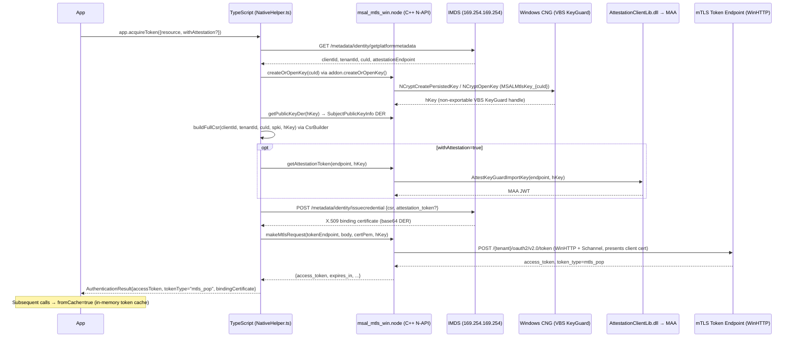

# @azure/msal-node-mtls-extensions

Managed Identity mTLS Proof-of-Possession (mTLS PoP) token acquisition for Node.js on Windows Azure VMs.

## Overview

This package implements the Managed Identity mTLS PoP flow entirely in-process using a C++ N-API native addon (`msal_mtls_win.node`). No .NET runtime or external helper binary is required.

The native addon handles all Windows-specific operations:
- **CNG KeyGuard key management** — creates/opens a VBS-protected RSA-2048 key via `ncrypt.dll`
- **WinHTTP mTLS transport** — makes HTTPS requests presenting the client certificate (WinHTTP uses Schannel, which supports CNG non-exportable key handles natively)
- **MAA attestation** — calls `AttestationClientLib.dll` when `withAttestation: true`

All other logic (IMDS metadata calls, PKCS#10 CSR construction, token caching) runs as TypeScript in the Node.js process.

## Installation

```bash
npm install @azure/msal-node-mtls-extensions
```

> **Windows x64 only.** The native addon (`bin/win-x64/msal_mtls_win.node`) is pre-compiled for Windows x64. The package will not function on Linux, macOS, or Windows arm64.

## Usage

### Basic — System-Assigned Managed Identity

```typescript
import { MtlsManagedIdentityApplication } from "@azure/msal-node-mtls-extensions";

const app = new MtlsManagedIdentityApplication();

// Acquire an mTLS PoP access token
const tokenResult = await app.acquireToken({
    resource: "https://graph.microsoft.com/",
});

console.log(tokenResult.tokenType);          // "mtls_pop"
console.log(tokenResult.accessToken);        // JWT with cnf.x5t#S256 claim
console.log(tokenResult.bindingCertificate); // PEM cert bound to the token
```

### Downstream mTLS call

```typescript
// Call a downstream service over mTLS using the binding certificate
// The non-exportable KeyGuard private key is used inside the native addon via WinHTTP
const response = await app.sendGetRequestAsync(
    "https://mtlstb.graph.microsoft.com/v1.0/applications?$top=5",
    {
        headers: {
            Authorization: `mtls_pop ${tokenResult.accessToken}`,
        },
    }
);

console.log(response.status);  // 200 (or 403 if MI lacks permissions)
console.log(response.body);
```

> **Note:** Downstream servers must use **required mutual TLS** — they must send a TLS `CertificateRequest` during the handshake. `mtlstb.graph.microsoft.com` is the dedicated mTLS test endpoint for Microsoft Graph. Most standard Azure services (`graph.microsoft.com`, Key Vault) use optional mTLS and will not trigger client certificate presentation.

### POST request

```typescript
const response = await app.sendPostRequestAsync(
    "https://your-mtls-service.example.com/api/data",
    {
        headers: {
            Authorization: `mtls_pop ${tokenResult.accessToken}`,
            "Content-Type": "application/json",
        },
        body: JSON.stringify({ key: "value" }),
    }
);
```

### With KeyGuard Attestation

```typescript
const app = new MtlsManagedIdentityApplication({ withAttestation: true });

const tokenResult = await app.acquireToken({
    resource: "https://graph.microsoft.com/",
});
```

Pass `withAttestation: true` when the VM requires VBS attestation — indicated by an IMDS error: `"Attestation Token is missing / empty in the issue credential request"`. Requires `AttestationClientLib.dll` in the same directory as the native addon. See [Attestation](#attestation) for details.

### User-Assigned Managed Identity

```typescript
const app = new MtlsManagedIdentityApplication({
    managedIdentityIdParams: {
        userAssignedClientId: "your-client-id",
    },
});

const tokenResult = await app.acquireToken({
    resource: "https://graph.microsoft.com/",
});
```

### Token cache management

```typescript
// Force a fresh token (bypass the 5-minute expiry buffer)
const fresh = await app.acquireToken({ resource: "...", forceRefresh: true });

// Clear the entire in-memory token cache
app.clearTokenCache();
```

## API

### `new MtlsManagedIdentityApplication(config?)`

| Field | Type | Default | Description |
|---|---|---|---|
| `managedIdentityIdParams` | `ManagedIdentityIdParams` | — | User-assigned identity params; omit for system-assigned |
| `withAttestation` | `boolean` | `false` | Include MAA attestation in IMDS credential requests |
| `system.loggerOptions` | `LoggerOptions` | — | MSAL logger configuration |
| `system.disableInternalRetries` | `boolean` | `false` | Disable automatic HTTP retry behaviour |

### `acquireToken(request): Promise<AuthenticationResult>`

| Parameter | Type | Default | Description |
|---|---|---|---|
| `resource` | `string` | required | Azure resource URI (e.g. `https://graph.microsoft.com/`) |
| `forceRefresh` | `boolean` | `false` | Bypass in-memory token cache |

Returns a standard MSAL `AuthenticationResult` with `tokenType: "mtls_pop"` and `bindingCertificate` (PEM).

Results are cached in memory and reused until 5 minutes before expiry.

### `sendGetRequestAsync<T>(url, options?): Promise<NetworkResponse<T>>`

Makes a GET request over mTLS using the KeyGuard-bound certificate.

| Parameter | Type | Description |
|---|---|---|
| `url` | `string` | Full URL (must use required mTLS — server must send `CertificateRequest`) |
| `options.headers` | `Record<string, string>` | Include `Authorization: mtls_pop <token>` |
| `options.body` | `string` | Request body (not typical for GET) |

### `sendPostRequestAsync<T>(url, options?): Promise<NetworkResponse<T>>`

Same as `sendGetRequestAsync` but with HTTP POST.

### `clearTokenCache(): void`

Clears the in-memory token cache. Call this if the binding certificate has been rotated or you receive an unexpected 401.

### `getPlatformMetadata(): Promise<PlatformMetadata>`

Calls the IMDS `/metadata/identity/getplatformmetadata` endpoint directly. Use this to inspect VM identity metadata independently.

## How it works



## Requirements

| Requirement | Notes |
|---|---|
| **Windows only** | KeyGuard RSA keys and WinHTTP require Windows. |
| **x64 only** | The prebuilt addon is compiled for `win-x64`. arm64 is not yet validated. |
| **Azure VM with Managed Identity** | System-assigned or user-assigned. Enable in Azure Portal → VM → Identity. |
| **Node.js 20+** | The N-API addon requires N-API version 8 (Node.js 18+ recommended). |
| **`AttestationClientLib.dll`** | Required only when `withAttestation: true`. Place alongside `msal_mtls_win.node` in `bin/win-x64/`. |

> No .NET runtime is required. The native addon is a compiled C++ binary loaded directly by Node.js.

## Attestation

Some Azure VM configurations require VBS attestation to be included in the `issuecredential` request to IMDS. This is indicated when the IMDS call fails with:

```
"Attestation Token is missing / empty in the issue credential request"
```

Pass `withAttestation: true` to resolve this. The native addon calls `AttestationClientLib.dll` (a native Windows DLL from `Microsoft.Azure.Security.KeyGuardAttestation`) to obtain a hardware-backed attestation JWT from the VM's regional MAA endpoint, then includes that JWT in the `issuecredential` call.

`AttestationClientLib.dll` is **not committed to git**. Obtain it from:
1. The `Microsoft.Azure.Security.KeyGuardAttestation` NuGet package: `runtimes/win-x64/native/AttestationClientLib.dll`
2. Place it in `bin/win-x64/` alongside `msal_mtls_win.node`

> VBS attestation requires a VM with Virtualization-Based Security enabled.

## Native addon distribution

The package ships a prebuilt C++ N-API addon at `bin/win-x64/msal_mtls_win.node`. This binary:
- Was compiled with MSVC and node-gyp
- Links against `ncrypt.dll` and `winhttp.dll` (Windows system DLLs — no additional runtime needed)
- Loads `AttestationClientLib.dll` dynamically at runtime (only when `withAttestation: true`)

### Building from source

To rebuild the addon from C++ source (requires MSVC and node-gyp):

```powershell
cd extensions/msal-node-mtls-extensions

# Builds the C++ addon and copies the binary to bin/win-x64/
npm run build:native
```

This runs `scripts/buildNative.cjs`, which locates `vcvarsall.bat` automatically. The script is a no-op on non-Windows platforms.

## References

- [`lib/msal-node/docs/mtls-pop.md`](../../lib/msal-node/docs/mtls-pop.md) — Developer guide for all mTLS PoP paths
- [`lib/msal-node/docs/mtls-pop-architecture.md`](../../lib/msal-node/docs/mtls-pop-architecture.md) — Architecture deep-dive
- [`lib/msal-node/docs/mtls-pop-manual-testing.md`](../../lib/msal-node/docs/mtls-pop-manual-testing.md) — Manual testing guide
- [RFC 8705 — OAuth 2.0 Mutual-TLS Client Authentication](https://datatracker.ietf.org/doc/html/rfc8705)

## License

MIT
