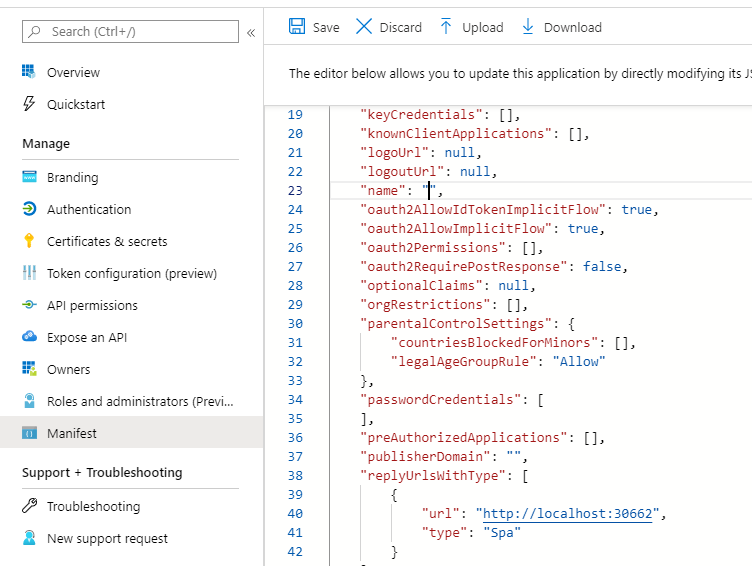
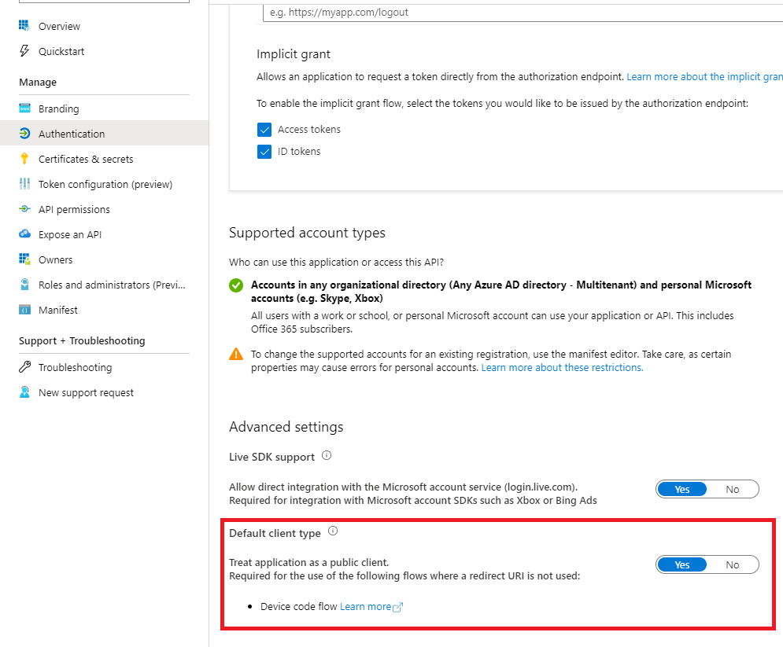

# (Preview) Microsoft Authentication Library for JavaScript (MSAL.js) 2.0 for Browser-Based Single-Page Applications
[](https://www.npmjs.com/package/@azure/msal-browser/)[](https://nodei.co/npm/@azure/msal-browser/)[](https://coveralls.io/github/AzureAD/microsoft-authentication-library-for-js?branch=dev)

| <a href="https://docs.microsoft.com/azure/active-directory/develop/guidedsetups/active-directory-javascriptspa" target="_blank">Getting Started</a> | <a href="https://aka.ms/aaddevv2" target="_blank">AAD Docs</a> | <a href="https://azuread.github.io/microsoft-authentication-library-for-js/ref/msal-browser/" target="_blank">Library Reference</a> |
| --- | --- | --- |

1. [About](#about)
2. [FAQ](./FAQ.md)
3. [Releases](#releases)
4. [Prerequisites](#prerequisites)
5. [Installation](#installation)
6. [Usage](#usage)
    - [Migrating from Previous MSAL Versions](#migrating-from-previous-msal-versions)
    - [MSAL Basics](#msal-basics)
    - [Advanced Topics](#advanced-topics)
7. [Samples](#samples)
8. [Build and Test](#build-and-test)
8. [Authorization Code vs Implicit](#oauth-2.0-and-the-implicit-flow-vs-authorization-code-flow-with-pkce)
9. [Security Reporting](#security-reporting)
10. [License](#license)
11. [Code of Conduct](#we-value-and-adhere-to-the-microsoft-open-source-code-of-conduct)

## About

The MSAL library for JavaScript enables client-side JavaScript applications to authenticate users using [Azure AD](https://docs.microsoft.com/azure/active-directory/develop/v2-overview) work and school accounts (AAD), Microsoft personal accounts (MSA) and social identity providers like Facebook, Google, LinkedIn, Microsoft accounts, etc. through [Azure AD B2C](https://docs.microsoft.com/azure/active-directory-b2c/active-directory-b2c-overview#identity-providers) service. It also enables your app to get tokens to access [Microsoft Cloud](https://www.microsoft.com/enterprise) services such as [Microsoft Graph](https://graph.microsoft.io).

The `@azure/msal-browser` package described by the code in this folder uses the [`@azure/msal-common` package](../msal-common/) as a dependency to enable authentication in Javascript Single-Page Applications without backend servers. This version of the library uses the OAuth 2.0 Authorization Code Flow with PKCE. To read more about this protocol, as well as the differences between implicit flow and authorization code flow, see the section [below](#oauth-2.0-and-the-implicit-flow-vs-authorization-code-flow-with-pkce). If you are looking for the version of the library that uses the implicit flow, please see the [`msal-core` library](https://github.com/AzureAD/microsoft-authentication-library-for-js/tree/dev/lib/msal-core).

This is an improvement upon the current `msal-core` library which will utilize the authorization code flow in the browser. Most features available in the old library will be available in this one, but there are nuances to the authentication flow in both. The `@azure/msal-browser` package does NOT support the implicit flow.

**IMPORTANT:** Please be aware that this is not a production ready library. We are making changes in the [Azure portal](https://azure.microsoft.com/en-us/features/azure-portal/) to ensure we can deliver a polished end-to-end experience.

## FAQ

See [here](./FAQ.md).

## Releases

*Expect us to detail our major and minor releases moving forward, while leaving out our patch releases.  Patch release notes can be found in our change log.*

| Date | Release | Announcement | Main features |
| ------| ------- | ---------| --------- |
|  | @azure/msal-browser v2.0.0-beta | No release notes yet | Beta version of the `@azure/msal-browser` package; relies on `@azure/msal-common` v1.0.0-beta |
| January 17, 2020 | @azure/msal-browser v2.0.0-alpha | No release notes yet | Alpha version of the `@azure/msal-browser` package with authorization code flow for SPAs working in dev; relies on msal-common v1.0.0-alpha |

## Prerequisites

- `@azure/msal-browser` is meant to be used in [Single-Page Application scenarios](https://docs.microsoft.com/azure/active-directory/develop/scenario-spa-overview).

- Before using `@azure/msal-browser` you will need to [register an application in Azure AD](https://docs.microsoft.com/azure/active-directory/develop/quickstart-register-app) to get a valid `clientId` for configuration, and to register the routes that your app will accept redirect traffic on.

- Once you have registered your application, you will need to do two things in order to ensure `@azure/msal-browser` will successfully retrieve tokens:
    1. Change your redirect URI type to enable CORS. You can do this by going to the manifest editor for your app registration in the portal, finding the `replyUrlsWithType` section and changing the type of your redirect URI to `SPA`. This may remove the affected redirect URIs from the Web platform Authentication tab - that's OK! We are working on getting UI set up for this.

    

    2. Ensure your `Default Client Type` settings have "Treat application as public client" set to "Yes". 

    

## Installation
### Via NPM:
```javascript
npm install @azure/msal-browser
```
### Via CDN:

## Usage

### Migrating from Previous MSAL Versions

If you have MSAL v1.x currently running in your application, you can follow the instructions [here](./docs/v1-migration.md) to migrate your application to using the `@azure/msal-browser` package.

### MSAL Basics

1. [Initialization](./docs/initialization.md)
2. [Logging in a User](./docs/login-user.md)
3. [Acquiring and Using an Access Token](./docs/acquire-token.md)
4. [Managing Token Lifetimes](./docs/token-lifetimes.md)
5. [Logging Out a User](./docs/logout.md)

### Advanced Topics

- [Configuration Options](./docs/configuration.md)
- [Request and Response Details](./docs/request-response-object.md)
- [Cache Storage](./docs/caching.md)

## Samples

The [`VanillaJSTestApp2.0` folder](../../samples/VanillaJSTestApp2.0) contains sample applications for our libraries. You can run any sample by changing the `authConfig.js` file in the respective folder to match your app registration and running the `npm` command `npm start -- -s <sample-name> -p <port>`. 

Here is a complete list of samples for the MSAL.js 2.x library:

| Sample | Description | How to Run |
| ------ | ----------- | ---------- |
| [Basic Auth Sample](../../samples/VanillaJSTestApp2.0/default) | A vanilla Javascript sample showing basic usage of the MSAL 2.0 library (`@azure/msal-browser` package) with the Microsoft Graph API. | `npm start -- -s default` |

More instructions to run the sample can be found in the [`README.md` file](../../samples/VanillaJSTestApp2.0/README.md) of the VanillaJSTestApp2.0 folder.

## Build and Test

### Build Library
```javascript
// Change to the root of the msal repo
cd microsoft-authentication-library-for-js/
// Install npm dependencies and bootstrap packages
npm install
// Build library
npm run build
// To run build only for the browser package
npm run build -- --scope @azure/msal-browser
```

#### Alternate Build Instructions
If you are having issues with `lerna`, you can try the following:

```javascript
// Change to the msal-browser package directory
cd lib/msal-browser/
// Ensure you are using the local build of msal-common
npm link @azure/msal-common
// To run build only for browser package
npm run build
// To run build for common and browser package
npm run build:all
```

### Running Tests
`@azure/msal-browser` uses [mocha](https://mochajs.org/) and [chai](https://www.chaijs.com/) to run unit tests, as well as Istanbul's [nyc](https://github.com/istanbuljs/nyc) tool for code coverage.

```javascript
// To run tests
npm test
// To run tests with code coverage
npm run test:coverage:only
```

- If you are having issues with `lerna`, change to the `msal-browser` directory and run the commands directly there.

## OAuth 2.0 and the Implicit Flow vs Authorization Code Flow with PKCE
MSAL.js 1.x implemented the [Implicit Grant Flow](https://docs.microsoft.com/azure/active-directory/develop/v2-oauth2-implicit-grant-flow), as defined by the OAuth 2.0 protocol and [OpenID](https://docs.microsoft.com/azure/active-directory/develop/v2-protocols-oidc).

Our goal is that the library abstracts enough of the protocol away so that you can get plug and play authentication, but it is important to know and understand the implicit flow from a security perspective. The MSAL 1.x client for single-page applications runs in the context of a web browser which cannot manage client secrets securely. It uses the implicit flow, which optimized for single page apps and has one less hop between client and server so tokens are returned directly to the browser. These aspects make it naturally less secure. These security concerns are mitigated per standard practices such as- use of short lived tokens (and so no refresh tokens are returned), the library requiring a registered redirect URI for the app, library matching the request and response with a unique nonce and state parameter. You can read more about the [disadvantages of the implicit flow here](https://tools.ietf.org/html/draft-ietf-oauth-browser-based-apps-04#section-9.8.6).

The MSAL library will now support the Authorization Code Flow with PKCE for Browser-Based Applications without a backend web server. 
We plan to continue support for the implicit flow in the `msal-core` library.

You can learn further details about `@azure/msal-browser` functionality documented in our [docs folder](./docs) and find complete [code samples](#samples).

## Security Reporting

If you find a security issue with our libraries or services please report it to [secure@microsoft.com](mailto:secure@microsoft.com) with as much detail as possible. Your submission may be eligible for a bounty through the [Microsoft Bounty](http://aka.ms/bugbounty) program. Please do not post security issues to GitHub Issues or any other public site. We will contact you shortly upon receiving the information. We encourage you to get notifications of when security incidents occur by visiting [this page](https://technet.microsoft.com/security/dd252948) and subscribing to Security Advisory Alerts.

## License

Copyright (c) Microsoft Corporation.  All rights reserved. Licensed under the MIT License (the "License");

## We Value and Adhere to the Microsoft Open Source Code of Conduct

This project has adopted the [Microsoft Open Source Code of Conduct](https://opensource.microsoft.com/codeofconduct/). For more information see the [Code of Conduct FAQ](https://opensource.microsoft.com/codeofconduct/faq/) or contact [opencode@microsoft.com](mailto:opencode@microsoft.com) with any additional questions or comments.
