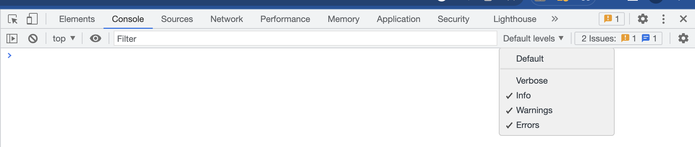

# MSAL JS logging instructions

These are steps needed to enable MSAL JS logging for your applications:

1. In the MSAL [Configuration](./configuration.md) object, you can enable logging to collect msal js logs. We enable different levels of logging and an appropriate level can be chosen as needed.

2. The logger options can be set as below, the example chooses `LogLevel.Trace`

```javascript

import { PublicClientApplication, LogLevel } from "@azure/msal-browser";

const msalConfig = {
    auth: {
        ...
    },
    cache: {
        ...
    },
    system: {
        loggerOptions: {
            logLevel: LogLevel.Trace,
            loggerCallback: (level, message, containsPii) => {
                if (containsPii) {
                    return;
                }
                switch (level) {
                    case LogLevel.Error:
                        console.error(message);
                        return;
                    case LogLevel.Info:
                        console.info(message);
                        return;
                    case LogLevel.Verbose:
                        console.debug(message);
                        return;
                    case LogLevel.Warning:
                        console.warn(message);
                        return;
                    default:
                        console.log(message);
                        return;
                }
            }
        }
    },

    ...
}

const msalInstance = new PublicClientApplication(msalConfig);

```

An example usage in a sample can be accessed [here](https://github.com/AzureAD/microsoft-authentication-library-for-js/blob/dev/samples/msal-browser-samples/VanillaJSTestApp2.0/app/default/authConfig.js#:~:text=logLevel%3A%20msal.LogLevel.Trace%2C).


3. Make sure you have the appropriate log level enabled in your browser console to see these logs, eg: "verbose" may need to be enabled for the browser to load these.

    

## Override log level and PII setting

These are the steps to override MSAL log level and PII settings to troubleshoot errors in non-dev environments:

### Navigate to session storage

1. Open developer tools by pressing F12
2. Navigate to `Application` tab
3. Click `Storage` and expand `Session Storage`
4. Select target domain

Additional details can be found [here](https://learn.microsoft.com/en-us/microsoft-edge/devtools-guide-chromium/storage/sessionstorage).

### Override log level

Add `msal.browser.log.level` key to `Session Storage`, set it's value to the desired log level (`Verbose`, for example) and refresh the page.
Check `LogLevel` enum for the available options [here](../../msal-common/src/logger/Logger.ts).

### Override PII log setting

Add `msal.browser.log.pii` key to `Session Storage`, set it's value to `true` or `false` and refresh the page.
