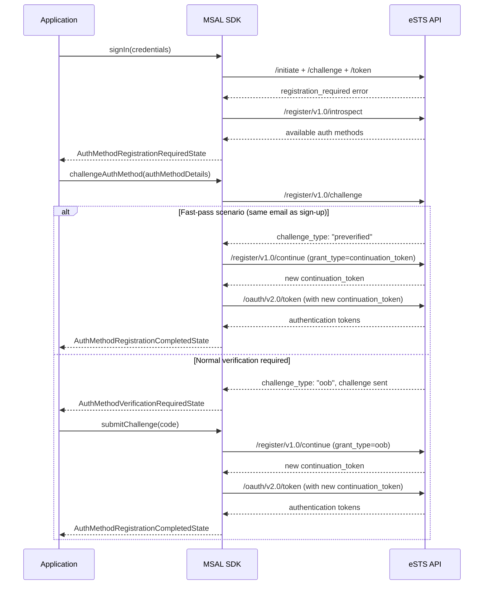

# JIT MFA Design Document

## Overview

The Just-In-Time (JIT) MFA feature enables Native Authentication users to register strong authentication methods on-demand during sign-in when multi-factor authentication is required. This design aligns the Native Authentication experience with web-based CIAM scenarios by removing automatic email registration during sign-up and allowing users to choose their preferred strong authentication method when MFA is triggered.

The JIT flow integrates seamlessly with existing sign-in flows and follows established SDK patterns for state management, error handling, and API interactions. The implementation leverages the existing MFA infrastructure while introducing new registration-specific components.

## Architecture

### High-Level Flow



### Component Architecture

The JIT MFA implementation follows the established MSAL architecture patterns:

1. **Network Layer**: New `RegisterApiClient` for JIT-specific API calls
2. **Interaction Client**: New `JitClient` for orchestrating JIT flows
3. **State Machine**: New JIT states that integrate with existing sign-in flows
4. **Error Handling**: JIT-specific error types with helper methods
5. **Result Objects**: Structured result types following existing patterns

## Components and Interfaces

### Network Client Layer

#### RegisterApiClient

A new API client following the existing `BaseApiClient` pattern for handling JIT registration endpoints.

```typescript
export class RegisterApiClient extends BaseApiClient {
    /**
     * Gets available authentication methods for registration
     */
    async introspect(
        params: RegisterIntrospectRequest
    ): Promise<RegisterIntrospectResponse> {
        const result = await this.request<RegisterIntrospectResponse>(
            CustomAuthApiEndpoint.REGISTER_INTROSPECT,
            {
                continuation_token: params.continuation_token,
            },
            params.telemetryManager,
            params.correlationId
        );

        this.ensureContinuationTokenIsValid(
            result.continuation_token,
            params.correlationId
        );

        return result;
    }

    /**
     * Sends challenge to specified authentication method
     */
    async challenge(
        params: RegisterChallengeRequest
    ): Promise<RegisterChallengeResponse> {
        const result = await this.request<RegisterChallengeResponse>(
            CustomAuthApiEndpoint.REGISTER_CHALLENGE,
            {
                continuation_token: params.continuation_token,
                challenge_type: params.challenge_type,
                challenge_target: params.challenge_target,
                challenge_channel: params.challenge_channel,
            },
            params.telemetryManager,
            params.correlationId
        );

        this.ensureContinuationTokenIsValid(
            result.continuation_token,
            params.correlationId
        );

        return result;
    }

    /**
     * Submits challenge response and completes registration
     */
    async continue(
        params: RegisterContinueRequest
    ): Promise<RegisterContinueResponse> {
        const result = await this.request<RegisterContinueResponse>(
            CustomAuthApiEndpoint.REGISTER_CONTINUE,
            {
                continuation_token: params.continuation_token,
                grant_type: params.grant_type,
                oob: params.oob,
            },
            params.telemetryManager,
            params.correlationId
        );

        this.ensureContinuationTokenIsValid(
            result.continuation_token,
            params.correlationId
        );

        return result;
    }
}
```

#### API Request/Response Types

```typescript
// Request Types
export interface RegisterIntrospectRequest extends ApiRequestBase {
    continuation_token: string;
}

export interface RegisterChallengeRequest extends ApiRequestBase {
    continuation_token: string;
    challenge_type: string;
    challenge_target: string;
    challenge_channel?: string;
}

export interface RegisterContinueRequest extends ApiRequestBase {
    continuation_token: string;
    grant_type: string; // "continuation_token" for fast-pass, "oob" for normal verification
    oob?: string; // Only required when grant_type is "oob"
}

// Response Types
export interface RegisterIntrospectResponse extends ApiResponseBase {
    continuation_token: string;
    methods: AuthenticationMethod[];
}

export interface RegisterChallengeResponse extends ApiResponseBase {
    continuation_token: string;
    challenge_type: string;
    binding_method: string;
    challenge_target: string;
    challenge_channel: string;
    code_length?: number;
    interval?: number;
}

export interface RegisterContinueResponse extends ApiResponseBase {
    continuation_token: string;
}

```

### Interaction Client Layer

#### JitClient

The JIT client orchestrates the registration flow and integrates with the token endpoint for completion.

```typescript
export class JitClient extends CustomAuthInteractionClientBase {
    /**
     * Gets available authentication methods for registration
     */
    async getAuthMethods(
        parameters: JitGetAuthMethodsParams
    ): Promise<JitGetAuthMethodsResult> {
        const apiId = PublicApiId.JIT_GET_AUTH_METHODS;
        const telemetryManager = this.initializeServerTelemetryManager(apiId);

        const request: RegisterIntrospectRequest = {
            continuation_token: parameters.continuationToken,
            correlationId: parameters.correlationId,
            telemetryManager: telemetryManager,
        };

        const introspectResponse =
            await this.customAuthApiClient.registerApi.introspect(request);

        return createJitGetAuthMethodsResult({
            correlationId: introspectResponse.correlation_id,
            continuationToken: introspectResponse.continuation_token,
            authMethods: introspectResponse.methods,
        });
    }

    /**
     * Challenges an authentication method for registration
     */
    async challengeAuthMethod(
        parameters: JitChallengeAuthMethodParams
    ): Promise<JitVerificationRequiredResult | JitCompletedResult> {
        const apiId = PublicApiId.JIT_CHALLENGE_AUTH_METHOD;
        const telemetryManager = this.initializeServerTelemetryManager(apiId);

        const challengeReq: RegisterChallengeRequest = {
            continuation_token: parameters.continuationToken,
            challenge_type: parameters.authMethod.challenge_type,
            challenge_target: parameters.verificationContact,
            challenge_channel: parameters.authMethod.challenge_channel,
            correlationId: parameters.correlationId,
            telemetryManager: telemetryManager,
        };

        const challengeResponse =
            await this.customAuthApiClient.registerApi.challenge(challengeReq);

        // Handle fast-pass scenario (preverified)
        // This occurs when the user selects the same email used during sign-up
        // Since the email was already verified during sign-up, no additional verification is needed
        if (challengeResponse.challenge_type === ChallengeType.PREVERIFIED) {
            this.logger.verbose(
                "Fast-pass scenario detected - completing registration without additional verification.",
                challengeResponse.correlation_id
            );

            // Call /register/v1.0/continue with grant_type=continuation_token for fast-pass
            const continueReq: RegisterContinueRequest = {
                continuation_token: challengeResponse.continuation_token,
                grant_type: GrantType.CONTINUATION_TOKEN,
                correlationId: challengeResponse.correlation_id,
                telemetryManager: telemetryManager,
            };

            const continueResponse =
                await this.customAuthApiClient.registerApi.continue(continueReq);

            // Complete registration immediately and get tokens using new continuation token
            const tokenResponse =
                await this.customAuthApiClient.signInApi.requestTokenWithContinuationToken(
                    {
                        continuation_token:
                            continueResponse.continuation_token,
                        username: parameters.username || "",
                        scope: parameters.scopes.join(" "),
                        correlationId: continueResponse.correlation_id,
                        telemetryManager: telemetryManager,
                    }
                );

            const authResult = await this.handleTokenResponse(
                tokenResponse,
                parameters.scopes,
                continueResponse.correlation_id
            );

            return createJitCompletedResult({
                correlationId: continueResponse.correlation_id,
                authenticationResult: authResult,
            });
        }

        // Verification required
        return createJitVerificationRequiredResult({
            correlationId: challengeResponse.correlation_id,
            continuationToken: challengeResponse.continuation_token,
            challengeChannel: challengeResponse.challenge_channel,
            challengeTargetLabel: challengeResponse.challenge_target,
            codeLength:
                challengeResponse.code_length || DefaultCustomAuthApiCodeLength,
            bindingMethod: challengeResponse.binding_method,
        });
    }

    /**
     * Submits challenge response and completes registration
     */
    async submitChallenge(
        parameters: JitSubmitChallengeParams
    ): Promise<JitCompletedResult> {
        const apiId = PublicApiId.JIT_SUBMIT_CHALLENGE;
        const telemetryManager = this.initializeServerTelemetryManager(apiId);

        // Submit challenge to complete registration
        const continueReq: RegisterContinueRequest = {
            continuation_token: parameters.continuationToken,
            grant_type: GrantType.OOB,
            oob: parameters.challenge,
            correlationId: parameters.correlationId,
            telemetryManager: telemetryManager,
        };

        const continueResponse =
            await this.customAuthApiClient.registerApi.continue(continueReq);

        // Use new continuation token to get authentication tokens
        const tokenResponse =
            await this.customAuthApiClient.signInApi.requestTokenWithContinuationToken(
                {
                    continuation_token: continueResponse.continuation_token,
                    username: parameters.username || "",
                    scope: parameters.scopes.join(" "),
                    correlationId: continueResponse.correlation_id,
                    telemetryManager: telemetryManager,
                }
            );

        const authResult = await this.handleTokenResponse(
            tokenResponse,
            parameters.scopes,
            continueResponse.correlation_id
        );

        return createJitCompletedResult({
            correlationId: continueResponse.correlation_id,
            authenticationResult: authResult,
        });
    }
}
```

### State Machine Layer

#### JIT States

The JIT states follow the established state machine pattern and integrate with existing sign-in flows.

```typescript
/**
 * Base state for JIT authentication method registration
 */
abstract class AuthMethodRegistrationState<
    TParameters extends AuthMethodRegistrationStateParameters
> extends AuthFlowActionRequiredStateBase<TParameters> {
    /**
     * Challenges a specific authentication method for registration
     */
    async challengeAuthMethodInternal(
        authMethodDetails: AuthMethodDetails
    ): Promise<AuthMethodRegistrationChallengeMethodResult> {
        try {
            ensureArgumentIsNotNullOrUndefined(
                "authMethodDetails",
                authMethodDetails,
                this.stateParameters.correlationId
            );

            const challengeParams: JitChallengeAuthMethodParams = {
                correlationId: this.stateParameters.correlationId,
                continuationToken: this.stateParameters.continuationToken ?? "",
                authMethod: authMethodDetails.authMethodType,
                verificationContact: authMethodDetails.verificationContact,
                scopes: this.stateParameters.scopes ?? [],
                username: this.stateParameters.username,
            };

            const result =
                await this.stateParameters.jitClient.challengeAuthMethod(
                    challengeParams
                );

            if (result.type === JIT_VERIFICATION_REQUIRED_RESULT_TYPE) {
                return new AuthMethodRegistrationChallengeMethodResult(
                    new AuthMethodVerificationRequiredState({
                        correlationId: result.correlationId,
                        continuationToken: result.continuationToken,
                        config: this.stateParameters.config,
                        logger: this.stateParameters.logger,
                        jitClient: this.stateParameters.jitClient,
                        cacheClient: this.stateParameters.cacheClient,
                        challengeChannel: result.challengeChannel,
                        challengeTargetLabel: result.challengeTargetLabel,
                        codeLength: result.codeLength,
                        scopes: this.stateParameters.scopes ?? [],
                        username: this.stateParameters.username,
                        authMethods: this.stateParameters.authMethods,
                    })
                );
            } else if (result.type === JIT_COMPLETED_RESULT_TYPE) {
                const accountData = new CustomAuthAccountData(
                    result.authenticationResult.account,
                    this.stateParameters.config,
                    this.stateParameters.cacheClient,
                    this.stateParameters.logger,
                    this.stateParameters.correlationId
                );

                return new AuthMethodRegistrationChallengeMethodResult(
                    new AuthMethodRegistrationCompletedState(),
                    accountData
                );
            }

            return AuthMethodRegistrationChallengeMethodResult.createWithError(
                new UnexpectedError(
                    "Unexpected result type from JIT challenge auth method.",
                    this.stateParameters.correlationId
                )
            );
        } catch (error) {
            return AuthMethodRegistrationChallengeMethodResult.createWithError(
                error
            );
        }
    }
}

/**
 * State indicating that authentication method registration is required
 */
export class AuthMethodRegistrationRequiredState extends AuthMethodRegistrationState<AuthMethodRegistrationRequiredStateParameters> {
    getAuthMethods(): AuthenticationMethod[] {
        return this.stateParameters.authMethods;
    }

    async challengeAuthMethod(
        authMethodDetails: AuthMethodDetails
    ): Promise<AuthMethodRegistrationChallengeMethodResult> {
        return this.challengeAuthMethodInternal(authMethodDetails);
    }
}

/**
 * State indicating that verification is required for the challenged method
 */
export class AuthMethodVerificationRequiredState extends AuthMethodRegistrationState<AuthMethodVerificationRequiredStateParameters> {
    /**
     * Gets the channel through which the challenge was sent
     */
    getChannel(): string {
        return this.stateParameters.challengeChannel;
    }

    /**
     * Gets the target label indicating where the challenge was sent
     */
    getSentTo(): string {
        return this.stateParameters.challengeTargetLabel;
    }

    /**
     * Gets the length of the expected code
     */
    getCodeLength(): number {
        return this.stateParameters.codeLength;
    }

    /**
     * Submits the challenge code to complete registration
     */
    async submitChallenge(
        challenge: string
    ): Promise<AuthMethodRegistrationSubmitChallengeResult> {
        try {
            this.ensureCodeIsValid(challenge, this.getCodeLength());

            const submitParams: JitSubmitChallengeParams = {
                correlationId: this.stateParameters.correlationId,
                continuationToken: this.stateParameters.continuationToken ?? "",
                challenge: challenge,
                scopes: this.stateParameters.scopes ?? [],
                username: this.stateParameters.username,
            };

            const result = await this.stateParameters.jitClient.submitChallenge(
                submitParams
            );

            const accountData = new CustomAuthAccountData(
                result.authenticationResult.account,
                this.stateParameters.config,
                this.stateParameters.cacheClient,
                this.stateParameters.logger,
                this.stateParameters.correlationId
            );

            return new AuthMethodRegistrationSubmitChallengeResult(
                new AuthMethodRegistrationCompletedState(),
                accountData
            );
        } catch (error) {
            return AuthMethodRegistrationSubmitChallengeResult.createWithError(
                error
            );
        }
    }

    /**
     * Challenges a different authentication method
     */
    async challengeAuthMethod(
        authMethodDetails: AuthMethodDetails
    ): Promise<AuthMethodRegistrationChallengeMethodResult> {
        return this.challengeAuthMethodInternal(
            authMethodDetails
        );
    }
}

/**
 * State indicating successful completion of authentication method registration
 */
export class AuthMethodRegistrationCompletedState extends AuthFlowActionRequiredStateBase<AuthFlowActionRequiredStateParameters> {
    // Completion state - no additional methods needed
}

/**
 * State indicating failure in authentication method registration
 */
export class AuthMethodRegistrationFailedState extends AuthFlowActionRequiredStateBase<AuthFlowActionRequiredStateParameters> {
    // Failed state - no additional methods needed
}

export interface AuthMethodDetails {
    authMethodType: AuthenticationMethod;
    verificationContact: string;
}
```

#### State Parameters

```typescript
export interface AuthMethodRegistrationStateParameters
    extends AuthFlowActionRequiredStateParameters {
    jitClient: JitClient;
    cacheClient: CustomAuthSilentCacheClient;
    scopes?: string[];
    username?: string;
}

export interface AuthMethodRegistrationRequiredStateParameters
    extends AuthMethodRegistrationStateParameters {
    authMethods: AuthenticationMethod[];
}

export interface AuthMethodVerificationRequiredStateParameters
    extends AuthMethodRegistrationStateParameters {
    challengeChannel: string;
    challengeTargetLabel: string;
    codeLength: number;
}
```

### Result Objects

#### JIT Result Types

```typescript
// Result objects following existing patterns
export class AuthMethodRegistrationChallengeMethodResult extends AuthFlowResultBase<
    AuthMethodRegistrationChallengeMethodResultState,
    CustomAuthAccountData
> {
    isVerificationRequired(): boolean {
        return this.state instanceof AuthMethodVerificationRequiredState;
    }

    isCompleted(): boolean {
        return this.state instanceof AuthMethodRegistrationCompletedState;
    }

    isFailed(): boolean {
        return this.state instanceof AuthMethodRegistrationFailedState;
    }

    static createWithError(
        error: unknown
    ): AuthMethodRegistrationChallengeMethodResult {
        const errorData = this.prototype.createErrorData(error);
        return new AuthMethodRegistrationChallengeMethodResult(
            new AuthMethodRegistrationFailedState({
                correlationId: errorData.correlationId ?? "",
                logger: {} as Logger,
                config: {} as CustomAuthBrowserConfiguration,
            })
        );
    }
}

export class AuthMethodRegistrationSubmitChallengeResult extends AuthFlowResultBase<
    AuthMethodRegistrationSubmitChallengeResultState,
    CustomAuthAccountData
> {
    isCompleted(): boolean {
        return this.state instanceof AuthMethodRegistrationCompletedState;
    }

    isFailed(): boolean {
        return this.state instanceof AuthMethodRegistrationFailedState;
    }

    static createWithError(
        error: unknown
    ): AuthMethodRegistrationSubmitChallengeResult {
        const errorData = this.prototype.createErrorData(error);
        return new AuthMethodRegistrationSubmitChallengeResult(
            new AuthMethodRegistrationFailedState({
                correlationId: errorData.correlationId ?? "",
                logger: {} as Logger,
                config: {} as CustomAuthBrowserConfiguration,
            })
        );
    }
}
```

### Error Handling

#### JIT Error Types

```typescript
export class AuthMethodRegistrationChallengeMethodError extends AuthFlowErrorBase {
    /**
     * Checks if redirect is required for fallback authentication
     */
    isRedirectRequired(): boolean {
        return this.isRedirectError();
    }

    /**
     * Checks if the verification contact is incorrect
     */
    isIncorrectVerificationContact(): boolean {
        return (
            this.errorData.error === "INVALID_GRANT" &&
            this.errorData.errorCodes?.includes(901001)
        );
    }
}

export class AuthMethodRegistrationSubmitChallengeError extends AuthFlowErrorBase {
    /**
     * Checks if redirect is required for fallback authentication
     */
    isRedirectRequired(): boolean {
        return this.isRedirectError();
    }

    /**
     * Checks if the submitted challenge is incorrect
     */
    isIncorrectChallenge(): boolean {
        return this.isInvalidCodeError();
    }
}
```

## Data Models

### Authentication Method Model

The existing `AuthenticationMethod` interface from the API response types is used:

```typescript
export interface AuthenticationMethod {
    id: string; // "email", "sms", "voice"
    challenge_type: string; // "oob", "preverified"
    challenge_channel: string; // "email", "sms", "voice"
    login_hint: string; // Pre-populated contact info
}
```

## Integration Points

### SignIn Flow Integration

The JIT flow integrates with existing sign-in flows at the token endpoint level:

```typescript
// In SignInClient.submitPassword()
private async performTokenRequest(
    tokenEndpointCaller: () => Promise<SignInTokenResponse>,
    scopes: string[],
    correlationId: string,
    handleMfa: boolean,
    handleJit: boolean,
): Promise<SignInCompletedResult | SignInMfaRequiredResult | SignInJitRequiredResult> {
    try {
        const tokenResponse = await tokenEndpointCaller();
        // ... handle success
    } catch (error) {
        if (error instanceof CustomAuthApiError) {
            if (handleMfa && error.subError === MFA_REQUIRED) {
                return createSignInMfaRequiredResult({...});
            } else if (handleJit && error.subError === REGISTRATION_REQUIRED) {
                // New JIT handling
                const introspectResult = await this.customAuthApiClient.registerApi.introspect(
                    error.continuationToken,
                    correlationId
                );

                return createSignInJitRequiredResult({
                    correlationId: correlationId,
                    continuationToken: error.continuationToken,
                    authMethods: introspectResult.authMethods,
                });
            }
        }
        throw error;
    }
}
```

### Controller Integration

The `CustomAuthStandardController` is updated to handle JIT flows:

```typescript
// In CustomAuthStandardController constructor
constructor(operatingContext: CustomAuthOperatingContext, customAuthApiClient?: ICustomAuthApiClient) {
    // ... existing initialization
    this.jitClient = this.interactionClientFactory.create(JitClient);
}

// In signIn method
async signIn(signInInputs: SignInInputs): Promise<SignInResult> {
    // ... existing logic

    // Handle JIT required result
    if (submitPasswordResult.isJitRequired()) {
        return new SignInResult(
            new AuthMethodRegistrationRequiredState({
                correlationId: submitPasswordResult.state.stateParameters.correlationId,
                continuationToken: submitPasswordResult.state.stateParameters.continuationToken,
                config: this.operatingContext.getCustomAuthConfig(),
                logger: this.logger,
                jitClient: this.jitClient,
                cacheClient: this.cacheClient,
                authMethods: submitPasswordResult.authMethods,
                scopes: signInInputs.scopes,
                username: signInInputs.username,
            })
        );
    }

    // ... rest of existing logic
}
```

## Testing Strategy

### Unit Testing

1. **Interaction Client Tests**

    - Test `JitClient` orchestration logic
    - Test fast-pass scenario handling
    - Test integration with token endpoint

2. **State Machine Tests**

    - Test state transitions for all JIT states
    - Test method availability and parameter validation
    - Test error state handling

3. **Error Handling Tests**
    - Test error helper methods for correct error detection
    - Test error propagation through the state machine

### Integration Testing

1. **End-to-End Flow Tests**

    - Test complete JIT flow from sign-in to completion
    - Test fast-pass scenario with same email as sign-up
    - Test method selection and re-selection scenarios

2. **SignIn Integration Tests**
    - Test JIT integration with password-based sign-in
    - Test JIT integration with continuation token flows
    - Test fallback to existing MFA when JIT is not required

### Error Scenario Testing

2. **User Error Handling**
    - Test invalid verification codes
    - Test incorrect contact information
    - Test expired continuation tokens

## Performance Considerations

### Caching Strategy

-   Continuation tokens are managed in memory during the flow
-   No additional persistent caching is required for JIT-specific data
-   Leverage existing token caching mechanisms for final authentication result

### Network Optimization

-   Minimize API calls by caching authentication methods within the flow
-   Use existing telemetry and correlation ID patterns for request tracking
-   Follow existing retry and timeout patterns from base API client

### Memory Management

-   JIT states follow existing state lifecycle patterns
-   No long-lived objects or memory leaks introduced
-   Proper cleanup of sensitive data (codes, tokens) after use

## Security Considerations

### Data Protection

-   Verification codes are handled in memory only and not persisted
-   Continuation tokens follow existing security patterns
-   Contact information (email/phone) is masked in UI-facing properties

### Input Validation

-   All user inputs are validated using existing validation patterns
-   API responses are validated for required fields and proper formats
-   Error messages do not expose sensitive system information

### Authentication Flow Security

-   JIT flow maintains the same security guarantees as existing MFA flows
-   Fast-pass verification leverages existing email verification from sign-up
-   No reduction in security posture compared to current MFA implementation

## Migration and Compatibility

### Breaking Changes

This is a breaking change for email OTP MFA users as described in the requirements. The impact is:

-   Users with existing email OTP MFA configurations will need to register their authentication method on first sign-in
-   Applications using email OTP MFA will need to handle the new JIT states
-   No changes required for applications not using MFA

### Backward Compatibility

-   Non-MFA flows remain unchanged
-   Existing MFA flows (when strong auth methods are already registered) remain unchanged
-   New JIT flows only activate when `registration_required` error is returned

### Migration Path

1. Update application code to handle new JIT states
2. Test with development/staging environments
3. Deploy to production with user communication about the new flow
4. Monitor for any issues during the transition period

This design provides a comprehensive foundation for implementing JIT MFA while maintaining consistency with existing MSAL patterns and ensuring a smooth developer experience.
