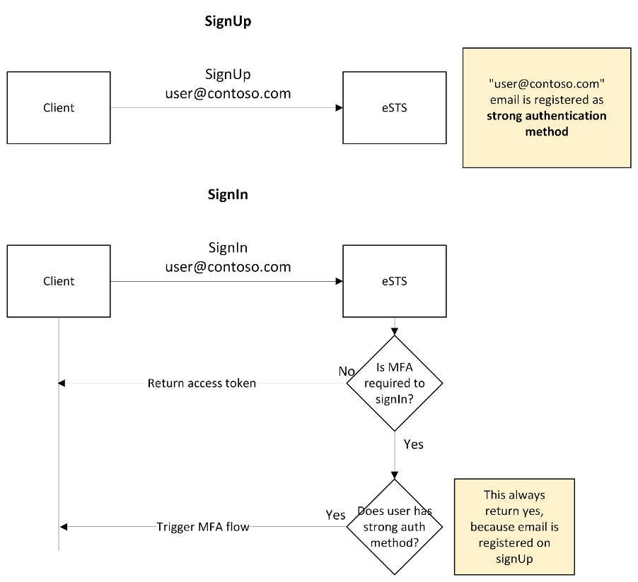
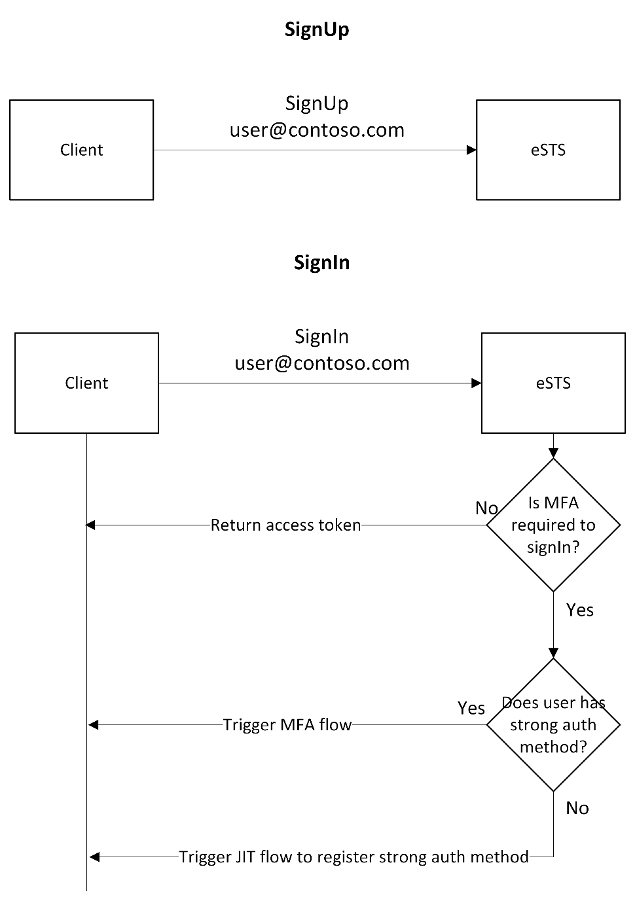
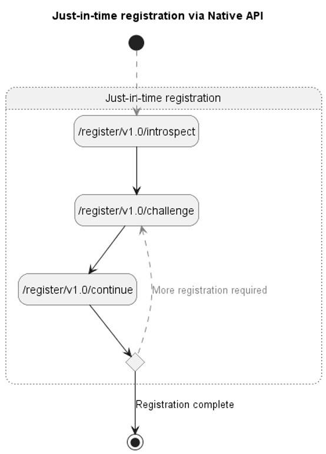
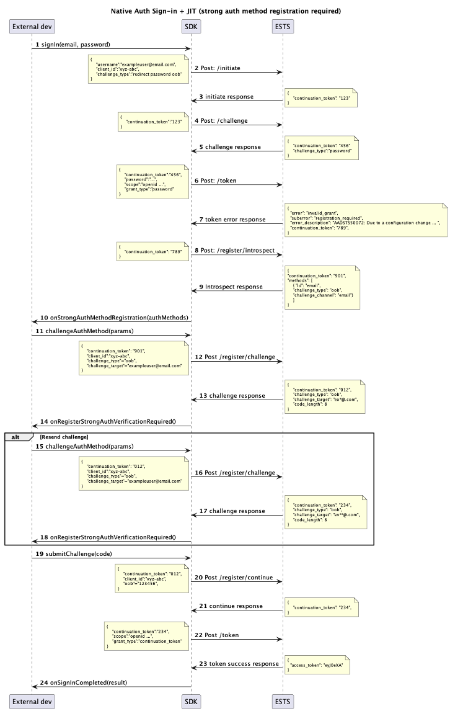

# Native auth SDK - email OTP JIT MFA

## Problem description

Currently, the Native Authentication scenarios do not support Just-In-Time (JIT) registration of strong authentication methods. Without JIT capability, native auth users cannot choose which authentication method they want to use as their strong authentication method. This issue will become even more relevant when multiple authentication methods will be available, such as SMS and email. With strong authentication method we mean an authentication method that can be used in multi-factor authentication (MFA) flow. Instead, the Native Auth APIs automatically register the user’s verified email as their strong auth method during sign-up. CIAM for web-based scenarios works differently:

-   No strong authentication method is registered automatically during sign-up
-   The user needs manually register a strong authentication method during the first sign-in when MFA is triggered.

Native authentication APIs will align with the web-based experience. An overview of the solution on how native auth API will align to web can be found in the next paragraph.

## Server changes description

Before outlining the proposed solution for the native auth SDKs, it's essential to briefly explain how eSTS will change when the JIT flow is introduced. We will compare eSTS behaviour during signUp and signIn both before and after the introduction of JIT.

### Before JIT introduction:


As you can see, the email used during sign-up is automatically registered as a strong authentication method. This ensures that a user will always have strong authentication available when MFA is triggered during sign-in.

### After JIT introduction:


As shown in the image, the email used during sign-up is not automatically registered as a strong authentication method. This allows the user to manually register a new strong authentication method using the JIT flow when MFA is required during sign-in. The JIT flow consists of three new endpoints:

1. `register/v1.0/introspect` Return the list of authentications method available.
2. `register/v1.0/challenge` Trigger the challenge to the authentication method selected.
3. `register/v1.0/continue` Used to submit and validate the challenge.



The error response from these new APIs follow the same patterns as the existing native APIs. The native APIs use OAuth2ErrorResponse structure. Each of the API has individual list of errors that can occur during execution. The specific int value of the error_code is left out of the spec intentionally and will be finalized when implementation starts.

```json
{
    "error": "invalid_grant",
    "error_description": "AADSTS50034: The user account {***} does not exist in the {***} directory...",
    "error_codes": [50034],
    "timestamp": "2023-04-13 15:33:05Z",
    "trace_id": "16a96398-e706-48c7-8733-0a3a63b60400",
    "correlation_id": "c37dce54-4eed-410c-82b4-589bd83af5a5",
    "error_uri": "https://login.microsoftonline.com/error?code=50034"
}
```

#### Endpoint `register/v1.0/introspect`

**API:**
POST /{tenant}/register/v1.0/introspect

**Responsibilities:**
This endpoint is responsible for enumerating the list of authentication methods that the user is allowed to register. It will also transition the continuation_token state to start registering an auth method.

**Request**
|Property|Required|Type|Description|
|---------|-----|-----------|-----------|
|client_id|Yes|String|The client id|
|continuation_token|Yes|String|The opaque state artifact|

**Response**
|Property|Type|Description|
|---------|-----|-----------|
|continuation_token|string|Opaque state artifact that the caller should save for the next request|
|methods|Array<AuthenticationMethod>|The list of authentication methods available to register|

**Type: AuthenticationMethod**
|Property|Type|Description|
|---------|-----|-----------|
|id|string|String key of the method. Current types: sms, voice, email|
|challenge_type|string|The challenge type of the authentication method. Current types: oob|
|challenge_channel|string|The channel to which the auth method should be sent. Current types: sms, voice, email|
|login_hint|string|The hint of authentication method. This can be an email address or phone number. This is utilized by the client applications to pre-populate the email/phone number collection box.|

**Errors**: No unique error codes for this endpoint.

**Request Example**

```
POST /{tenant}/register/v1.0/introspect
Request:
Content-Type: application/x-www-form-urlencoded
continuation_token=...
client_id…
```

**Response Example**

```
Content-Type: application/json
200 - OK
{
  "continuation_token": "...",
  "methods": [
    {
      "id": "email",
      "challenge_type": "oob",
      "challenge_channel": "email",
      "login_hint": "foo@contoso.com"
    },
    {
      "id": "sms",
      "challenge_type": "oob",
      "challenge_channel": "sms",
      "login_hint": "+1 1234567890"
    },
    {
      "id": "voice",
      "challenge_type": "oob",
      "challenge_channel": "voice",
      "login_hint": "+1 1234567890"
    }
}
```

#### Endpoint `register/v1.0/challenge`

**API:** POST /{tenant}/register/v1.0/challenge

**Responsibilities:** This endpoint is responsible for sending the challenge to the user (email one-time code, SMS, phone call) and tell the client UX what to prompt/collect from the user.

**Request**
|Property|Required|Type|Description|
|---------|-----|-----------|-----------|
|client_id|Yes|String|The client id|
|continuation_token|Yes|String|The opaque state artifact|
|challenge_type|Yes|string|The challenge type. Current types: oob|
|challenge_target|Yes|string|The phone number or email that the user wants to register.|
|challenge_channel|No|string|The channel to send the challenge on. The challenge channel |

**Response**
|Property|Type|Description|
|---------|-----|-----------|
|continuation_token|string|Opaque state artifact that the caller should save for the next request|
|challenge_type|string|The challenge type for the auth method. Current types: oob, preverified|
|binding_method|string|The binding method as defined in the RFC. prompt - The end user should be prompted to enter a code received during out-of-band authorization via the secondary channel into the client. For example, the end user receives a code on their mobile phone (typically a 6-digit code) and types it into the client. none - No binding is performed between the client on the primary channel and the out-of-band authorization operation via the secondary channel.|
|challenge_target|string|The target the challenge was sent to. This is the same as the input provided in the request.|
|challenge_channel|string|The channel the challenge was sent over. Current types: sms, voice, email|
|code_length|int|The length of the code if binding_method is prompt. |
|interval|int|The interval (in seconds) the client should wait between polling of /register/continue. Only returned when prompt=none. Clients should double the interval every time they receive a 429 from the native API.|

**Errors**: No unique error codes for this endpoint.

**Request Example**

```
POST /{tenant}/register/v1.0/challenge
Request:
Content-Type: application/x-www-form-urlencoded
client_id…
continuation_token=...
challenge_type=oob
challenge_target=bar@contoso.com
challenge_channel=email
```

**Response Example**

```
Content-Type: application/json
200 - OK
{
  "continuation_token": "...",
  "challenge_type": "oob",
  "binding_method": "prompt",
  "challenge_target": "bar@contoso.com",
  "challenge_channel": "email",
  "code_length": 8
}
```

#### Endpoint `register/v1.0/continue`

**API:** POST /{tenant}/register/v1.0/continue

**Responsibilities:** This endpoint is responsible for collecting and asserting the user supplied proof (a onetime code or completion of the phone call. Upon successful verification, the endpoint will register the new authentication method on the user.

-   In the case of email, SMS, and OneWay Voice this endpoint will collect a one time code and verify it against the one that was sent to the user.
-   In the case of TwoWay Voice this endpoint will verify that the phone call was completed.

**Request**
|Property|Required|Type|Description|
|--------|--------|----|-----------|
|client_id|Yes|String|The client id. (Optional for Auth UX)|
|continuation_token|Yes|string|The opaque state artifact.|
|grant_type|Yes|string|The grant type. Current types: `oob`, `continuation_token`|
|oob|No|string|The one time code as entered by the user in the client app.|

**Response**
|Property|Type|Description|
|---------|-----|-----------|
|continuation_token|string|The updated state artifact.|

**Errors**

In addition to the common errors, this endpoint will have the following errors:
|Scenario|Error|Status code|Message|
|--------|-----|------------|-------|
|The caller provided the wrong oob.|invalid_grant|400|The provided oob credential is invalid.|

**Request Example**

```
POST /{tenant}/register/v1.0/continue
Request:
Content-Type: application/x-www-form-urlencoded
client_id=…
continuation_token=...
grant_type=oob
oob=123456
```

**Response Example**

```
Content-Type: application/json
400 - BadRequest
{
  "error": "invalid_grant",
  "error_description": "AADSTSXXXXX: The out-of-band authentication is incorrect.",
  "error_codes": [XXXX],
  "timestamp": "2023-04-13 15:33:05Z",
  "trace_id": "16a96398-e706-48c7-8733-0a3a63b60400",
  "correlation_id": "c37dce54-4eed-410c-82b4-589bd83af5a5"
}

200 - OK
{
  "continuation_token": "..."
}

```

## Solution for SDK

As described in the previous paragraph, eSTS will not automatically register any strong authentication method during signUp, so users must do it manually. Solution main points:

-   We will introduce a new flow in the native auth SDKs for registering a new strong authentication method using three new endpoints. This flow will be triggered only during sign-in when MFA is required, and no strong authentication method is currently registered for the user.
-   Only email will be supported initially, but the SDK will be designed in an extensible way to allow adding new methods like SMS without causing breaking changes. Sample applications and documentation will be updated accordingly.
-   This solution will be a breaking change for email OTP MFA users. This means that email OTP MFA users will need to update their application to continue using email OTP MFA feature. Since email OTP MFA is in private preview, this behaviour is considered acceptable. More details can be found in the dedicated paragraph here.

In scope for this document:

-   MSAL JS SDKs native authentication code changes

Not in scope for this document:

-   Sample application changes details.
-   Public preview readiness details.

## Design for SDK

### Flow Diagram



-   (1-6) External developer starts signIn calling SDK function. The SDK then call /initiate, /challenge and /token endpoint
-   (7) /token endpoint return a new registration_required error. A strong authentication method needs to be registered.
-   (8-9) The SDK retrieves the list of authentication methods available using the new register/introspect endpoint.
-   (10) SDK presents the list of authentication methods to the external developer.
-   (11) External developer choose the authentication method to register.
-   (12-13) SDK send the request to eSTS using the new register/challenge endpoint. ESTS send the challenge to the authentication method specified by external developer
-   (14) SDK notifies the external developer that a challenge has been sent.
-   (15-18) The external developer asks to resend a new challenge. SDK send a new request to the new register/challenge endpoint.
-   (19) The external developer submit to the SDK the challenge provided by the final users.
-   (20-21) SDK submit the challenge to the new register/continue endpoint. A successful response containing a continuation_token is then received.
-   (22-23) The continuation_token received is then used by the SDK to obtain access, refresh and ID token.
-   (24) The external developer is notified of the completion of the signIn flow.

### SDK changes key points

-   A new state machine flow will be introduced to manage the JIT flow. More details about this can be found in the upcoming section of this document. The JIT flow will be managed in the following SDK flows:
    -   SignIn
    -   SignIn with continuation token after signUp
    -   SignIn with continuation token after SSPR
-   JIT flow cannot be triggered during the "getAccessToken" function because it is not an interactive flow. If a strong authentication method needs to be registered during "getAccessToken", the user will need to sign in again. This error needs to be handled in the SDK similarly to the "50076" error. A custom error message will be returned to inform the user to call the signIn method.
-   When JIT is triggered during signIn after signUp and the email used during signUp is also used as strong authentication method, there is no need to verify the email because it was verified during signUp. This special flow is called fast-pass, and it will be supported in the native auth SDKs. In this case, the `/register/v1.0/challenge` endpoint will return `preverified` `challenge_type` in the response. Anyway, users can choose a different email address for strong authentication than the one used for sign-up.
-   Although fast-pass is currently only available during sign-in after sign-up, we will also incorporate this flow into sign-in and sign-in after SSPR. This is because the result class used in Android is shared among sign-in, sign-in after SSPR, and sign-in after sign-up, and to align iOS with Android and simplify the state machine design.

## JS SDK Updates

This paragraph details the updates to the MSAL JS native authentication public interface. The changes are categorized based on the public classes impacted.

### Add a new network client `RegisterApiClient`

-   Follow the existing network client pattern (e.g., SignInApiClient) to support the new endpoints `/{tenant}/register/v1.0/introspect`, `/{tenant}/register/v1.0/challenge` and `/{tenant}/register/v1.0/continue`.
-   Expose the `RegisterApiClient` in the `CustomAuthApiClient`

### Add a new interaction client `JitClient`

-   The client should have a method `challengeAuthMethod`. This method is calling endpoint `/{tenant}/register/v1.0/challenge` by using `RegisterApiClient` and return the a union type with `JitCompletedResult` and `JitVerificationRequiredResult`.
    -   `JitVerificationRequiredResult` will be returned if oob code is sent and verification is required.
    -   `JitCompletedResult` will be returned if no challenge submission is required (`/register/v1.0/challenge` endpoint returns `preverified` `challenge_type` in the response). Then, this method should call 'oauth/v2.0/token' endpoint with continuation token to complete the sign-in flow and return a type `JitCompletedResult` with `AuthenticationResult`.
    -   This method should accept the parameters `authMethod` (the type is `AuthenticationMethod`) and `verificationContact` (the target email address and type is string) as input.
-   The client should have another method `submitChallenge`. This method is calling endpoint `/{tenant}/register/v1.0/continue` by using `RegisterApiClient` and endpoint `/oauth/v2.0/token` by using `SignInApiClient`, and then return a type `JitCompletedResult`.
    -   The method first calls the endpoint `/{tenant}/register/v1.0/continue` to submit the challenge, then use the continuation token in the response to call the endpoint `/oauth/v2.0/token` to complete the sign-in flow and return a type `JitCompletedResult` with `AuthenticationResult`.
    -   This method should accept the parameter `challenge` (the type is string) as input.

### Add the new Authentiation method registration related states and action results

-   Four states should be created.
    -   `AuthMethodRegistrationRequiredState` - this state includes a public method `challengeAuthMethod(authMethodDetails: AuthMethodDetails): AuthMethodRegistrationChallengeMethodResult` for the SDK users to allow them to submit the authentication method.
        -   It should call `JitClient.challengeAuthMethod` to submit the auth method.
        -   The `AuthMethodDetails` should have two properties `authMethodType: AuthenticationMethod` and `verificationContact: string`.
    -   `AuthMethodVerificationRequiredState` - this state includes two public methods `submitChallenge(challenge: string): AuthMethodRegistrationSubmitChallengeResult` and `challengeAuthMethod(authMethodDetails: AuthMethodDetails): AuthMethodRegistrationChallengeMethodResult`.
        -   The `submitChallenge` method is used to allow SDK users to submit the challenge (oob code) and complete the verification. It should call `JitClient.submitChallenge` to submit the challenge.
            The `challengeAuthMethod` is the same with the method in the `AuthMethodRegistrationRequiredState`.
    -   `AuthMethodRegistrationCompletedState` - this state is used to present the registration is successfully state.
    -   `AuthMethodRegistrationFailedState` - this state is used to present the registration is failed state.
-   Two results should be created.
    -   `AuthMethodRegistrationChallengeMethodResult`
        -   Its possible state can be `AuthMethodVerificationRequiredState`, `AuthMethodRegistrationCompletedState`, or `AuthMethodRegistrationFailedState`.
    -   `AuthMethodRegistrationSubmitChallengeResult`
        -   Its possible state can be `AuthMethodRegistrationCompletedState` or `AuthMethodRegistrationFailedState`.
-   Two error types should be created.
    -   `AuthMethodRegistrationChallengeMethodError` - it should have two helper methods to check the error `isRedirectRequired` and `isIncorrectVerificationContact`.
        -   isIncorrectVerificationContact method checks the `errorData.error` is `INVALID_GRANT` and `errorData.errorCodes` has `901001` to determine this type of error.
    -   `AuthMethodRegistrationSubmitChallengeError` - it should have two helper methods to check the error `isRedirectRequired` and `isIncorrectChallenge`.

### Changes to `SignInClient.submitPassword()` and `SignInClient.signInWithContinuationToken()`

-   These methods should return a new result type `SignInJitRequiredResult` when calling `/token` endpoint in the methods `this.customAuthApiClient.signInApi.requestTokensWithPassword()` and `this.customAuthApiClient.signInApi.requestTokenWithContinuationToken()` and getting error `registration_required`.
-   If the `registration_required` error is caught, the endpoint `/{tenant}/register/v1.0/introspect` should be called by using `AuthMethodRegistrationClient` and return the available auth methods in the `SignInJitRequiredResult`.

### Changes to `SignInResult`

-   Add the new possible State `AuthMethodRegistrationRequiredState`.

### Changes to `SignInSubmitPasswordResult`

-   The change is same with `SignInResult`.

### Changes to `CustomAuthStarndardController`

-   The controller needs to initialize the JitClient in its constructor.
-   The method `signIn` needs to check the `SignInJitRequiredResult` after submitting the password and return the result with state `AuthMethodRegistrationRequiredState`.

### Changes to `SignInPasswordRequiredState.submitPassword()`

-   The method `submitPassword` needs to check the `SignInJitRequiredResult` after submitting the password and return the result with state `AuthMethodRegistrationRequiredState`.

### Changes to `SignInContinuationState.signIn()`

-   The method `signIn` needs to check the `SignInJitRequiredResult` after submitting the password and return the result with state `AuthMethodRegistrationRequiredState`.

### Changes to `SignInStateParameters`

-   Inject the JitClient.
