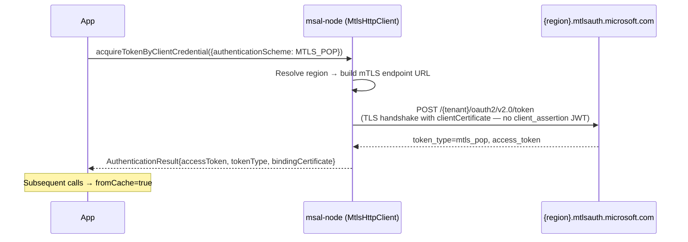
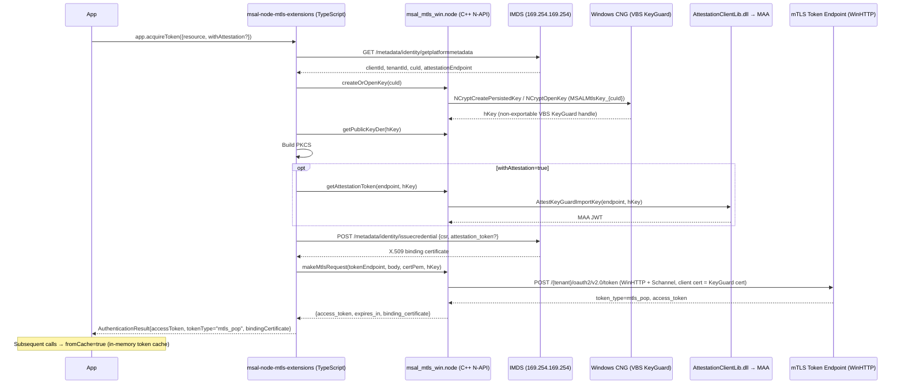

# mTLS Proof-of-Possession (mTLS PoP) — Developer Guide

> **Status**: Minimum POC / Experimental. The backend Entra STS feature is currently in public preview.
>
> **Related docs**: [certificate-credentials.md](./certificate-credentials.md) · [sni.md](./sni.md) · [regional-authorities.md](./regional-authorities.md) · [mtls-pop-manual-testing.md](./mtls-pop-manual-testing.md) · [mtls-pop-architecture.md](./mtls-pop-architecture.md)

---

## What problem does this solve?

A standard **Bearer token** is like a physical key: if someone steals it, they can use it until it expires. Bearer tokens travel as plain strings in HTTP headers and can be replayed by an attacker who intercepts them.

**mTLS Proof-of-Possession (mTLS PoP)** binds the access token to an X.509 certificate. The token is only valid when presented over a **mutual TLS (mTLS)** connection that uses the same certificate. A stolen `mtls_pop` token is useless without the matching private key.

This satisfies [RFC 8705 — OAuth 2.0 Mutual-TLS Client Authentication and Certificate-Bound Access Tokens](https://datatracker.ietf.org/doc/html/rfc8705).

---

## What is implemented

### Path 1 — Confidential Client / SNI Certificate (`@azure/msal-node`)

This package covers the **Confidential Client Application (CCA) SNI certificate path**, where:

1. The app developer provides their own certificate (an SNI certificate registered in Azure AD).
2. MSAL sends the token request to the **`mtlsauth.microsoft.com` endpoint** over a mutual-TLS connection, using the certificate for the TLS handshake (not a `client_assertion` JWT).
3. Entra STS validates the TLS certificate and **binds the issued token to that certificate**.
4. The response contains an access token with `token_type=mtls_pop`.
5. MSAL returns the token plus the `bindingCertificate` (the public certificate PEM from `clientCertificate.x5c`) so the app can configure downstream mTLS calls. The private key reference is **not** included in the result — you already have it.

### Path 2 — Managed Identity (`@azure/msal-node-mtls-extensions`)

The [`@azure/msal-node-mtls-extensions`](../../../extensions/msal-node-mtls-extensions/README.md) package implements the **Managed Identity path** using a C++ N-API native addon (`msal_mtls_win.node`) that runs entirely in-process — no subprocess or .NET runtime required:

1. Node.js calls the native addon (`msal_mtls_win.node`) which creates/opens a VBS KeyGuard RSA key via Windows CNG (`ncrypt.dll`)
2. TypeScript builds the PKCS#10 CSR and calls IMDS `/issuecredential` to get the binding certificate
3. Optionally: MAA attestation via `AttestationClientLib.dll` (when `withAttestation: true`)
4. The addon makes the mTLS token request using **WinHTTP** — WinHTTP uses Schannel, which natively supports CNG key handles for client certificate presentation

See the [quick-start example](#quick-start-example) below for usage.

---

## Cross-SDK Implementation Comparison

| Library | TLS Stack | CNG Support | Approach |
|---------|-----------|-------------|----------|
| **msal-go** | `crypto/tls` (pure Go) | ✅ Via `crypto.Signer` | In-process |
| **msal-dotnet** | Schannel (.NET) | ✅ Native | In-process |
| **msal-java** | JSSE + custom `SSLSocketFactory` (Path 1); JNA → `ncrypt.dll` (Path 2) | ✅ Via JNA | In-process |
| **msal-node** | OpenSSL (Path 1) / WinHTTP via N-API addon (Path 2) | ✅ Via N-API C++ addon (WinHTTP+Schannel) | In-process |

msal-go, msal-dotnet, msal-java, and now msal-node all perform the full KeyGuard key creation, CSR signing, and mTLS handshake in-process. msal-node's N-API addon uses **WinHTTP** (which uses Schannel) for HTTP requests that require the client certificate — WinHTTP natively supports CNG key handles, unlike Node.js's OpenSSL-based `https` module. See [mtls-pop-architecture.md](./mtls-pop-architecture.md) for the technical details.

---

## Flow Diagrams

### Path 1 — Confidential Client / SNI Certificate



### Path 2 — Managed Identity (N-API native addon)



---

## Quick-start example

### Path 1 — Confidential Client / SNI Certificate

```typescript
import * as https from "https";
import { ConfidentialClientApplication, AuthenticationScheme } from "@azure/msal-node";
import * as fs from "fs";

// Load your SNI certificate and private key
const cert = fs.readFileSync("path/to/cert.pem", "utf8");
const key = fs.readFileSync("path/to/private-key.pem", "utf8");

const cca = new ConfidentialClientApplication({
    auth: {
        clientId: "your-client-id",
        authority: "https://login.microsoftonline.com/your-tenant-id",
        clientCertificate: {
            thumbprintSha256: "your-cert-sha256-thumbprint",
            privateKey: key,
            x5c: cert,          // ← required for mTLS PoP
        },
    },
});

const result = await cca.acquireTokenByClientCredential({
    scopes: ["https://graph.microsoft.com/.default"],
    azureRegion: "eastus",                              // optional: use regional mTLS endpoint
    authenticationScheme: AuthenticationScheme.MTLS_POP,
});

if (!result) throw new Error("No token returned");

console.log("Token type:", result.tokenType);           // "mtls_pop"

// Downstream mTLS call — private key is in-process, so https.Agent works directly
// Note: Node.js's global fetch() does not support mTLS — use https.request() instead.
const agent = new https.Agent({ cert: result.bindingCertificate, key });
https.request(
    {
        hostname: "graph.microsoft.com",
        path: "/v1.0/me",
        method: "GET",
        headers: { Authorization: `mtls_pop ${result.accessToken}` },
        agent,
    },
    (res) => { /* handle response */ }
).end();
```

### Path 2 — Managed Identity (Windows Azure VM, x64)

```typescript
import { MtlsManagedIdentityApplication } from "@azure/msal-node-mtls-extensions";

const app = new MtlsManagedIdentityApplication({
    // withAttestation: true,  // add if VM requires VBS attestation
});

// Step 1: acquire the mTLS PoP token
// The KeyGuard private key never leaves Windows CNG
const tokenResult = await app.acquireToken({
    resource: "https://graph.microsoft.com/",
});

console.log("Token type:", tokenResult.tokenType);  // "mtls_pop"
console.log("From cache:", tokenResult.fromCache);  // false on first call

// Step 2: call the downstream resource over mTLS
// The native addon (WinHTTP + Schannel) presents the client cert using the
// non-exportable KeyGuard key — no https.Agent needed from Node.js
const response = await app.sendGetRequestAsync(
    "https://mtlstb.graph.microsoft.com/v1.0/applications?$top=5",
    {
        headers: {
            Authorization: `mtls_pop ${tokenResult.accessToken}`,
        },
    }
);

console.log("Status:", response.status);  // 200 or 403 (auth succeeded, permissions expected)
```

---

## Requirements

### Confidential Client / SNI cert path (`@azure/msal-node`)

| Requirement | Details |
|---|---|
| **Authority must be tenanted** | Use `https://login.microsoftonline.com/{tenantId}`. `/common` and `/organizations` are not supported and will throw an error. |
| **`azureRegion` is optional** | If provided, uses the regional mTLS endpoint: `https://{region}.mtlsauth.microsoft.com/{tenantId}/...`. If omitted, uses the non-regional endpoint (`https://mtlsauth.microsoft.com/{tenantId}/...`) — the STS infers the region from the SNI certificate. |
| **`clientCertificate.x5c` is required** | The public certificate PEM. This is what MSAL uses for the TLS handshake. |
| **`clientCertificate.privateKey` is required** | The private key corresponding to the certificate. Accepts a PEM string (`string`) or a `KeyObject` from `node:crypto` — see [Hardware-backed private keys](#hardware-backed-private-keys) below. |
| **SNI certificate (for production)** | In production the certificate must be issued by a Microsoft-trusted CA (OneCert / MSFT PKI) and registered with your Azure AD app registration. See [SNI documentation](./sni.md). |

#### Hardware-backed private keys (Path 1)

`clientCertificate.privateKey` accepts a `KeyObject` (from Node.js's built-in `crypto` module) in addition to a PEM string. This lets you use non-exportable hardware-backed keys via a PKCS#11 native addon (e.g. an HSM or smart card) — MSAL has no dependency on those addons; it simply passes the `KeyObject` to Node.js's `https.Agent`.

> **Important**: `KeyObject` is only supported with `authenticationScheme: AuthenticationScheme.MTLS_POP`. Standard certificate-based flows use JWT signing, which requires a PEM string. Do not use the same `ConfidentialClientApplication` instance for both mTLS and non-mTLS flows when passing a `KeyObject`.

```typescript
// --- Hardware key via a PKCS#11 addon (example with pkcs11js) ---
// msal-node has NO dependency on pkcs11js or any HSM addon.
// You produce the KeyObject using your chosen addon, then pass it to MSAL.
//
// import pkcs11js from "pkcs11js";
// const keyObject = myPkcs11Addon.getPrivateKeyObject(slotId, keyId);
//   ↑ returns a node:crypto KeyObject backed by the hardware key

const cca = new ConfidentialClientApplication({
    auth: {
        clientId: "your-client-id",
        authority: "https://login.microsoftonline.com/your-tenant-id",
        clientCertificate: {
            thumbprintSha256: "your-cert-sha256-thumbprint",
            privateKey: keyObject,   // ← KeyObject accepted here
            x5c: cert,
        },
    },
});
```

### Managed Identity path (`@azure/msal-node-mtls-extensions`)

| Requirement | Details |
|---|---|
| **Windows only** | KeyGuard RSA keys and WinHTTP require Windows. |
| **`x64` only** | The prebuilt addon is compiled for `win-x64`. arm64 is not yet validated. |
| **Azure VM with Managed Identity configured** | System-assigned or user-assigned. |
| **Node.js 20+** | The N-API addon requires N-API version 8 (Node.js 18+ recommended). |
| **`AttestationClientLib.dll`** | Required only when `withAttestation: true`. Place in `bin/win-x64/` alongside `msal_mtls_win.node`. |

> No .NET runtime is required. `msal_mtls_win.node` is a compiled C++ binary loaded directly by Node.js.

---

## How token caching works

mTLS PoP tokens are cached separately from Bearer tokens for the same scope. The `authenticationScheme` is part of the cache key, so calling `acquireTokenByClientCredential` with `authenticationScheme: AuthenticationScheme.MTLS_POP` will never return a cached Bearer token (and vice versa).

Token caching behaves identically to other client credential flows — cache hits return the existing token, background refresh occurs when `refreshOn` is exceeded, and `skipCache: true` forces a fresh token.

---

## Known limitations and gotchas

### Downstream mTLS calls (MSI path)

For the **Managed Identity path**, the `bindingCertificate` in `AuthenticationResult` is the public X.509 certificate (PEM) that Entra STS bound to the access token.

**Node.js's `https.Agent` cannot directly use this certificate for downstream mTLS.** The KeyGuard private key is non-exportable from Windows CNG — raw key bytes are never available in-process.

Instead, use `app.sendGetRequestAsync()` / `app.sendPostRequestAsync()` — these route the call through the native addon (WinHTTP + Schannel), which can use the non-exportable key for the TLS client handshake.

> **Requirement:** The downstream server **must** use required mutual TLS — it must send a TLS `CertificateRequest` during the handshake. Most standard Azure services (`graph.microsoft.com`, Key Vault) use *optional* mTLS and will not trigger client certificate presentation. `mtlstb.graph.microsoft.com` is Microsoft Graph's dedicated required-mTLS test endpoint.

For the **Confidential Client / SNI cert path**, you hold the private key directly, so `https.Agent({ cert: result.bindingCertificate, key })` works as expected.

### `global fetch()` does not support mTLS

Node.js's built-in `fetch()` (backed by `undici`) does not support providing a client certificate. MSAL's `MtlsHttpClient` uses `node:https` directly for the token request to `mtlsauth.microsoft.com`. For downstream calls in Path 1, use `https.request()` with an `https.Agent` as shown in the quick-start.

### One `MtlsHttpClient` instance per certificate

`MtlsHttpClient` creates a single `https.Agent` bound to one certificate at construction time. This is appropriate for the Confidential Client path where the certificate is stable for the lifetime of the application. For the Managed Identity path, certificate rotation is handled inside the C++ N-API addon (`msal_mtls_win.node`) — the addon re-opens the KeyGuard cert context on every WinHTTP call, so Node.js never holds the certificate and rotation is transparent.

---

## Production readiness

The code is designed to be production-quality. Whether it successfully obtains tokens depends on the following backend prerequisites:

### SNI certificate

The certificate must be issued by a Microsoft-trusted CA and registered with the Entra app registration. The public certificate PEM must be provided via `clientCertificate.x5c`. Arbitrary or self-signed certificates will be rejected by Entra STS. See the [SNI guide](./sni.md) and [certificate credentials guide](./certificate-credentials.md) for setup details.

### Feature preview status

The mTLS PoP feature in Entra STS is currently in **public preview**. The integration tests in msal-dotnet use a test-slice parameter:

```typescript
// If the feature requires a test slice in your environment, pass it via extraQueryParameters:
const result = await cca.acquireTokenByClientCredential({
    scopes: ["https://management.azure.com/.default"],
    azureRegion: "eastus",
    authenticationScheme: AuthenticationScheme.MTLS_POP,
    extraQueryParameters: {
        dc: "ESTSR-PUB-WUS3-AZ1-TEST1",
        slice: "TestSlice",
    },
});
```

---

## What is NOT implemented — and why

The Confidential Client / SNI cert path (this package) is complete. The table below covers features from msal-dotnet that were deliberately excluded from **this package**.

### Why Node.js's `https` module cannot use the KeyGuard key

The KeyGuard RSA private key is flagged `NCRYPT_ALLOW_EXPORT_NONE` by Windows VBS — raw key bytes can never leave the hardware. Node.js's `https` module uses **OpenSSL** on all platforms, which requires in-process exportable key bytes. There is no bridge between OpenSSL and CNG key handles.

The solution in `@azure/msal-node-mtls-extensions` is to bypass Node.js's `https` module entirely for HTTP calls that require the client certificate: the C++ N-API addon uses **WinHTTP** instead. WinHTTP uses **Schannel** (the Windows-native TLS provider), which natively understands CNG key handles and can perform the mTLS handshake without ever exporting the key.

This means:
- **Token acquisition** (POST to `mtlsauth.microsoft.com`): done via addon's `makeMtlsRequest()` → WinHTTP
- **Downstream calls** (`sendGetRequestAsync`/`sendPostRequestAsync`): done via addon's `makeMtlsRequest()` → WinHTTP
- **IMDS calls** (metadata, issuecredential): done via Node.js `https` — these don't need the client cert

**`https.Agent({ cert, key })` from Node.js still cannot be used** — `key` would need to be in-process bytes. This limitation remains for any caller who wants to use Node.js's built-in TLS stack directly with the KeyGuard key.

### Deferred until MSI path matures

| Feature | Notes |
|---|---|
| **Two-tier certificate cache (memory + Windows store)** | The in-memory tier is used today. Windows certificate store persistence would require additional CNG calls from the addon and is deferred until the MSI path matures. |

### Feasible in Node.js, deferred for simplicity

| Feature | Notes |
|---|---|
| **Auto-region discovery from IMDS** | Node.js can make an HTTP GET to `http://169.254.169.254/metadata/instance/compute/location` to discover the Azure region automatically. Excluded for simplicity; provide `azureRegion` explicitly in the request. |
| **Full sovereign cloud endpoint mapping** | The mTLS endpoint formula for sovereign clouds (e.g., `mtlsauth.microsoftonline.us` for Azure Government, `mtlsauth.partner.microsoftonline.cn` for Azure China) is pure string logic and fully feasible. Deferred so the POC stays focused on the public cloud happy path. |

---

## Error reference

| Error | Meaning | Fix |
|---|---|---|
| `mtls_pop_certificate_required` | `authenticationScheme: MTLS_POP` was requested but `clientCertificate.x5c` and/or `clientCertificate.privateKey` are not configured. | Ensure both `x5c` (PEM cert) and `privateKey` are set in `clientCertificate` in the application configuration. |
| `missing_tenant_id_error` | The authority uses `/common` or `/organizations` instead of a specific tenant ID. | Update `authority` to `https://login.microsoftonline.com/{your-tenant-id}`. |
| `ECONNREFUSED` / `CERT_INVALID` | Certificate not trusted by Entra STS. | Path 1: certificate must be an SNI cert issued by a Microsoft-trusted CA and registered with the app registration. Self-signed certs will be rejected. |
| `only supported on Windows` (Path 2) | `MtlsManagedIdentityApplication` was used on Linux/macOS. | Path 2 requires a Windows Azure VM. |
| `Unsupported architecture` (Path 2) | VM is not x64. | Path 2 only supports `x64` — verify with `node -e "console.log(process.arch)"`. |
| `Cannot find module 'msal_mtls_win.node'` | Native addon missing from package. | Verify `bin/win-x64/msal_mtls_win.node` is present. Rebuild if needed (see README). |
| `"You must be running within an Azure VM"` | IMDS is not reachable — Managed Identity not enabled on the VM. | Enable System-Assigned Managed Identity in Azure Portal → VM → Identity. |
| `"KeyGuard key creation failed"` | VBS is not enabled on the VM. | Use a VBS-enabled VM SKU (e.g., Ddsv5-series with nested virtualization). |
| `"Attestation Token is missing / empty in the issue credential request"` | The VM requires VBS attestation but `withAttestation` was `false`. | Re-run with `withAttestation: true`. Requires `AttestationClientLib.dll` in `bin/win-x64/`. |
| `AADSTS392196: resource does not support certificate-bound token` | Target resource is not enrolled for mTLS PoP on this tenant. | Use `https://graph.microsoft.com/` or `https://vault.azure.net/` instead. `management.azure.com` is not supported in all subscriptions. |
| `MtlsMissingClientCertificate` from Graph/Key Vault (`sendGetRequestAsync`) | Downstream resource uses *optional* mTLS — the TLS layer did not request a client cert. | Expected for `graph.microsoft.com`. Use `mtlstb.graph.microsoft.com` (the required-mTLS Graph endpoint) or another required-mTLS server for real end-to-end testing. |
| `managed_identity_unreachable_network` | IMDS endpoint unreachable. | Verify Managed Identity is configured and IMDS is accessible from the VM. |

> **Note:** The `apps/errors` package defines short error code constants (e.g. `mtls_pop_certificate_required`) for use in programmatic checks. Path 2 errors are returned as JSON from `MsalMtlsMsiHelper.exe` via stderr and surface as thrown errors in Node.js with an `errorCode` property.

---

## References

- [RFC 8705 — OAuth 2.0 Mutual-TLS Client Authentication](https://datatracker.ietf.org/doc/html/rfc8705)
- [msal-dotnet SNI mTLS PoP design doc](https://github.com/AzureAD/microsoft-authentication-library-for-dotnet/blob/main/docs/sni_mtls_pop_token_design.md)
- [msal-dotnet mTLS PoP managed identity guide](https://github.com/AzureAD/microsoft-authentication-library-for-dotnet/blob/main/docs/mtlspop_managed_identity.md)
- [mtls-pop-architecture.md](./mtls-pop-architecture.md) — Deep dive: MtlsHttpClient internals, N-API addon architecture, TLS stack analysis, msal-dotnet parity
- [SNI certificate setup in msal-node](./sni.md)
- [Certificate credentials guide](./certificate-credentials.md)
