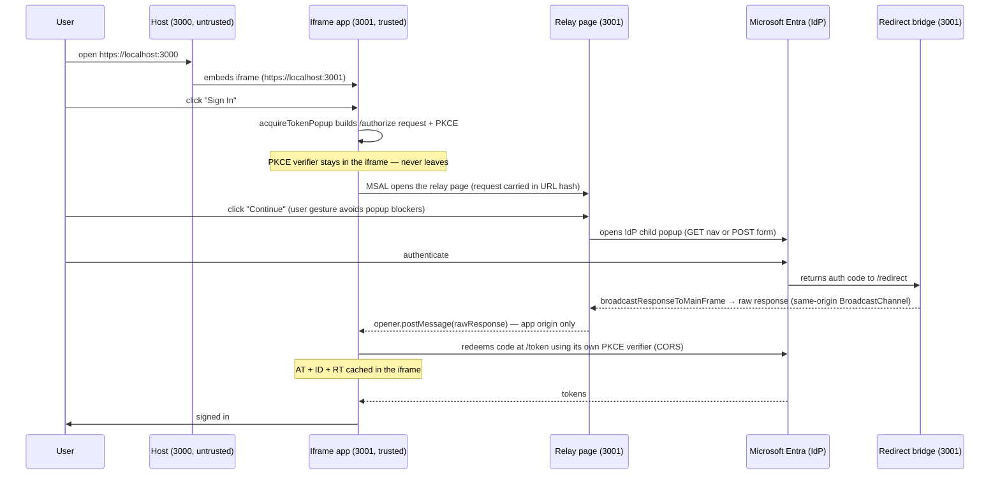

# Untrusted Top Frame Sample

Acquire tokens with a plain `acquireTokenPopup` call from an MSAL.js app that's embedded via a cross-origin iframe inside an untrusted host. Normally interactive auth can't complete in that context, so this app sets one config option — `auth.popupRelayUri` — and MSAL relays the interactive step through a top-level same-origin page for you. The app writes no PKCE, no popup plumbing, and no postMessage relay. **Both sign-in (`acquireTokenPopup`) and sign-out (`logoutPopup`) are relayed the same way.**

See [Cross-Origin-Opener-Policy and popup responses](../../../lib/msal-browser/docs/configuration.md#cross-origin-opener-policy-and-popup-responses) for how `auth.popupRelayUri` compares with the default redirect bridge and `system.enableLegacyPolling`.

## Why interactive auth fails in a partitioned iframe

A cross-site iframe inside a third-party host can't complete interactive auth on its own:

-   The IdP sign-in UI sends `X-Frame-Options: DENY`, so you can't frame it.
-   Third-party storage partitioning (Chromium 115+) partitions `localStorage` and `BroadcastChannel` by the top-level site, so a popup's auth response can't reach the iframe's partition.
-   COOP (`Cross-Origin-Opener-Policy: same-origin` from ESTS) severs `window.opener` once a window navigates to the IdP.

## The pattern — a config flag, relayed by MSAL

Set `auth.popupRelayUri` to a same-origin page that calls `runPopupRelay()`, and point your redirect URI page at `broadcastResponseToMainFrame()`. Then call `acquireTokenPopup` like any other SPA:

1. `acquireTokenPopup` (in the iframe) generates PKCE and builds the `/authorize` request as usual, but because `popupRelayUri` is set it opens that top-level relay page (same first-party origin) instead of navigating the popup straight to the IdP. The verifier stays in the iframe; only the request to perform travels in the relay page's hash.
2. The relay page (`runPopupRelay`) opens a child popup to the IdP and performs the navigation (a GET for the auth-code flow, or a POST form for `form_post`/EAR). The relay page never navigates itself to the IdP, so its `opener` link back to the iframe survives COOP.
3. The IdP returns to `/redirect` (the registered SPA redirect URI), which runs the MSAL redirect bridge (`broadcastResponseToMainFrame`). The bridge parses the response, scrubs it from the URL, and broadcasts the raw payload to the relay page over a same-origin `BroadcastChannel`.
4. The relay page relays that payload to the iframe via `opener.postMessage` (own-origin only).
5. Back in the iframe, `acquireTokenPopup` exchanges the response with its own verifier, validates, and caches it. `acquireTokenSilent` then works normally.

All of steps 1–5 are inside `@azure/msal-browser`. The app's only code is the config plus two one-line pages.

```
Untrusted host (localhost:3000, top-level)
└─ Embedded iframe (localhost:3001)   — partitioned under the host
   • acquireTokenPopup()  — PKCE verifier stays here; exchanges + caches
   ▲ opener.postMessage(rawResponse)   (own origin only)
   │ window.open("/relay#req")   (opened by MSAL)
   ▼
Relay page (localhost:3001, TOP-LEVEL, first-party)  — runPopupRelay()
   • opens CHILD popup to the IdP (GET url or POST form)
   • receives the response from /redirect via same-origin BroadcastChannel
   │ window.open(/authorize…)
   ▼
IdP child popup (login.microsoftonline.com) → redirects to /redirect
   • /redirect runs broadcastResponseToMainFrame(), then closes
```

### Sequence



> Sign-out (`logoutPopup`) follows the same path — the relay carries the IdP
> `end_session_endpoint` URL instead of an `/authorize` request, and `/redirect`
> relays completion back the same way.

## Why this is safe

-   The PKCE verifier (and, for EAR, the private key) never leaves the iframe. Only a single-use, PKCE-bound code — or an encrypted EAR response — crosses the window boundary, and it's useless without the secret the iframe kept.
-   No token ever transits a window. MSAL mints and caches the tokens inside the iframe.
-   The redirect bridge scrubs the response from `/redirect`'s URL (via `history.replaceState`) the moment it reads it, so a live code isn't left in the address bar or browser history where it could leak (referrer headers, shoulder-surfing, or a phishing page luring the user back to a URL that still carries a usable code).
-   The relay page posts the response only to its own origin, and the iframe accepts it only from the popup it opened, on its own origin, matching the per-request library-state id. Because `popupRelayUri` is resolved against the app origin, the relay page and iframe are always same-origin.
-   The untrusted host is never a redirect target and never sees any auth material.

## What the app actually writes

The whole integration:

```js
// authConfig.js — the only MSAL change
import { LogLevel } from "@azure/msal-browser";
export const msalConfig = {
    auth: { clientId: CLIENT_ID, popupRelayUri: "/relay" },
};

// embedded.js — instantiate MSAL and call acquireTokenPopup / logoutPopup
import { PublicClientApplication } from "@azure/msal-browser";
const msalInstance = new PublicClientApplication(msalConfig);
await msalInstance.acquireTokenPopup({ scopes: ["User.Read"] });
// Sign-out ends the IdP session too; it is relayed through the same page.
await msalInstance.logoutPopup({ account });

// relay.js — the popupRelayUri page (open child on a click to dodge popup blockers)
import { runPopupRelay } from "@azure/msal-browser/popup-relay";
continueBtn.addEventListener("click", () => runPopupRelay());

// redirect.js — the registered SPA redirect URI AND post-logout redirect URI
import { broadcastResponseToMainFrame } from "@azure/msal-browser/redirect-bridge";
broadcastResponseToMainFrame();
```

`runPopupRelay` ships in the `@azure/msal-browser/popup-relay` sub-export and `broadcastResponseToMainFrame` in `@azure/msal-browser/redirect-bridge` — both stay out of the main package surface. This sample is built with **Vite**, so each page imports only the export it needs and Vite tree-shakes a clear separation: the iframe app (`index.html`) bundles the full `PublicClientApplication`, while the relay (`relay.html`) and redirect (`redirect.html`) pages bundle only the small popup-relay / redirect-bridge helpers and never pull the main MSAL surface in. The auth-code (GET), `form_post`, and EAR response modes are all supported — the relay page forwards whatever raw response the redirect bridge captured.

**Sign-out works the same way.** `logoutPopup` clears the local cache, then carries the end-session URL into the relay page exactly like sign-in. The relay's child popup hits the IdP `end_session_endpoint`, the IdP redirects to the post-logout redirect URI (`/redirect`, the same redirect bridge), and completion is relayed back to the iframe. So the embedded app can end the IdP session even though it can't drive a top-level navigation itself.

## App Registration

Register these URIs on the app (`CLIENT_ID` in `app/constants.js`):

-   **Single-page application** redirect URI: `https://localhost:3001/redirect`
-   **Front-channel logout / post-logout redirect URI**: `https://localhost:3001/redirect`

The SPA redirect URI lets the iframe complete the token exchange via CORS with PKCE; the post-logout redirect URI lets the relay page receive logout completion through the same redirect bridge. The untrusted host origin (`https://localhost:3000`) is not registered — it's never a redirect target.

## Running the Sample

The sample serves over HTTPS, so it needs a local TLS cert. `npm run generate:certs` creates a gitignored, self-signed cert/key for `localhost` using `openssl`.

```bash
# From the repository root
npm install

# Build msal-common + msal-browser (includes popup-relay support)
cd samples/msal-browser-samples/UntrustedTopFrameSample
npm run build:package

# Generate a gitignored self-signed TLS cert for localhost (run once)
npm run generate:certs

# Build the app with Vite and start both servers over HTTPS
npm run start:https
```

`npm start` / `npm run start:https` run `vite build` first (emitting the per-page bundles to `dist/`) and then launch the two Express servers, which serve the built app from `dist/`. `npm run build` runs just the Vite build.

Open `https://localhost:3000`. Because the cert is self-signed, you'll also need to trust the iframe origin: either visit `https://localhost:3001` directly once and accept the warning, or enable `edge://flags/#allow-insecure-localhost` (`chrome://flags/#allow-insecure-localhost`). Click "Sign In" inside the iframe, then "Continue" in the relay popup, and authenticate.

> For a quick non-secure run, `npm start` serves the same ports over HTTP (the iframe `src` is protocol-relative). HTTPS is recommended because it matches production.

## Project Structure

```
UntrustedTopFrameSample/
├── server.js                  Two Express servers: untrusted host (3000) + trusted app (3001, serves dist/)
├── vite.config.js             Vite multi-page build (index/relay/redirect) → dist/
├── host/
│   └── index.html             Untrusted host page — embeds the iframe, no MSAL
└── app/                       Trusted-origin source (Vite root), built to dist/
    ├── index.html             Embedded iframe app UI
    ├── constants.js           Shared constants (client id, authority, redirect uri)
    ├── authConfig.js          MSAL config for the iframe (imports @azure/msal-browser, sets popupRelayUri)
    ├── embedded.js            Iframe: imports PublicClientApplication, calls acquireTokenPopup
    ├── relay.html / relay.js   popupRelayUri page: imports runPopupRelay from @azure/msal-browser/popup-relay
    └── redirect.html / redirect.js  Redirect URI + post-logout redirect URI: imports broadcastResponseToMainFrame from @azure/msal-browser/redirect-bridge
```

## Authorize request method (`?httpMethod=`)

The relay carries whatever `/authorize` request MSAL builds, so both request shapes work through the same relay + redirect bridge. The sample selects the shape from a `?httpMethod=` query parameter (the host forwards it to the iframe):

| `?httpMethod=`  | Request shape                            | How it's configured                         |
| --------------- | ---------------------------------------- | ------------------------------------------- |
| `GET` (default) | Auth code + PKCE as a **GET** navigation | default                                     |
| `POST`          | Auth code + PKCE as a **POST** form      | `acquireTokenPopup({ httpMethod: "POST" })` |

Open `https://localhost:3000/?httpMethod=POST` (or `GET`) to exercise each. Both return to `/redirect` in the fragment, so `relay.js` and `redirect.js` are identical across methods — only the iframe's request config differs.

> **EAR (Encrypted Authorize Response)** — a POST form that also encrypts the response (`system: { protocolMode: "EAR" }`) — needs first-party app support. To turn it on once provisioned, open `https://localhost:3000/?ear=true`.

## Running E2E Tests

```bash
cd samples/msal-browser-samples/UntrustedTopFrameSample
npm run test:e2e
```

The Puppeteer/Jest suite ([test/untrustedTopFrameLogin.spec.ts](test/untrustedTopFrameLogin.spec.ts)) drives the full flow against the lab tenant: load the host, click "Sign In" in the iframe, "Continue" in the relay popup, authenticate in the IdP child popup, then assert the iframe acquired and cached tokens and renders the signed-in UI, and finally that `acquireTokenSilent` reads from the native cache. The sign-in test is parameterized over both request methods (`GET`, `POST`) via `?httpMethod=`, asserting the relay carried the expected request method. It launches with `acceptInsecureCerts` and starts the server via `start:https`, so it needs the lab cert (`microsoft-authentication-library-for-js/LabCert.pem`) and the SPA redirect URI `https://localhost:3001/redirect` registered on the app.
