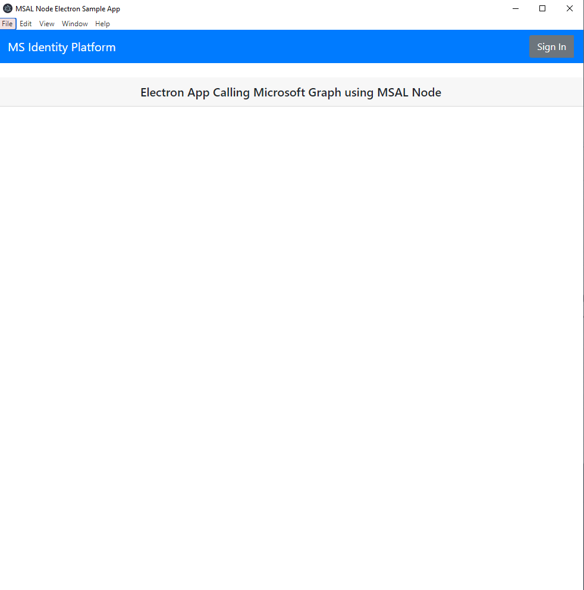
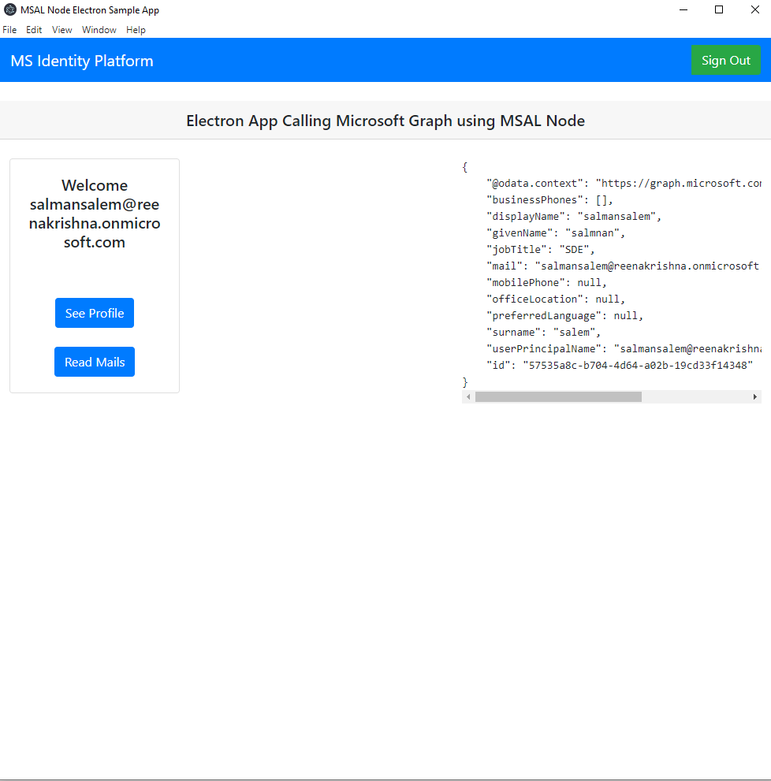

# MSAL Node Electron Sample Using System browser and Custom URL Scheme

An Electron application built with TypeScript that uses the MSAL Node library to acquire and store access tokens to authenticate with the Microsoft Graph API.

## Should I use this sample

Understanding the way MSAL Node is used in this sample will help you if you're interested in building an Electron.js application to authenticate and acquire tokens using the system browser and custom URL scheme. Native apps that use the browser for authorization are more secure and can take advantage of the user's authentication session in the browser to enable single sign-on.

## How to run the samples

### Clone this repository

First, clone the MSAL directory:

SSH:

```bash
 git clone git@github.com:AzureAD/microsoft-authentication-library-for-js.git
```

HTTP:

```bash
 git clone https://github.com/AzureAD/microsoft-authentication-library-for-js.git
```

You can also download the repository as a zip file by selecting "Download ZIP" from the root repository's dropdown "Code" menu. Once you've downloaded the ZIP file, you can decompress it locally and explore the code.

### Pre-requisites

- By using MSAL Node, you are working with the Microsoft Identity ecosystem. Read about [App Registrations](https://docs.microsoft.com/en-us/graph/auth-register-app-v2) and register one for use with this code.
- Install [Node.js](https://nodejs.org/en/), [Electron.js](https://www.electronjs.org/) and [TypeScript](https://www.typescriptlang.org/) if needed.
- Install the MSAL Node package:  
  
```bash
npm install @azure/msal-node
```

- If you are customizing or building locally, navigate to the `lib/msal-node` directory and build it using the following command:
  
```bash
npm run build:package
```

- From the repository's root directory, navigate to the Electron sample application:

```bash
cd samples/msal-node-samples/standalone-samples/ElectronSystemBrowserApp
```

### Configure the application

The MSAL configuration object in the `ElectronSystemBrowserApp` is defined in the `AuthProvider.ts` file. However, the configuration values used to build the object are defined in and imported from JSON files in the `config/` directory. The `ElectronSystemBrowserApp` loads the `config/customConfig.json` configuration by default. You can update the configuration attributes to match your [App Registration](https://docs.microsoft.com/graph/auth-register-app-v2) directly in the `config/customConfg.json` file, or you can add your own configuration file and change the import path like so:

AuthProvider.ts

```javascript
// Change this to load the desired MSAL Client Configuration
import * as APP_CONFIG from "./config/customConfig.json"; // Change this

import  * as APP_CONFIG from "./config/YOUR_CUSTOM_CONFIG_FILE.json"; // To this
```

This application uses the `User.Read` and `Mail.Read` Microsoft Graph Scopes, so make sure they are enabled in your App Registration.

**Note: If you'd like to configure custom scopes for this sample application, you'll need to modify the request scopes used in the `setRequestObjects()` method within `AuthProvider.ts`.**

#### Registering the application

Whether or not you decide to customize these values, you must register the `redirectUri` in the Azure Portal as a Mobile or Desktop Redirect URI.

1. Go to the App Registration in the Azure Portal.
2. Click the `Authentication` tab in the side menu.
3. Under "Platform configurations", click the "Add a platform" link.
4. Select "Mobile and desktop applications".
5. In the Redirect URI section,  enter the following redirect URI `http://localhost:8080/`.
6. Copy the exact `redirectUri` value (`msal4b0db8c2-9f26-4417-8bde-3f0e3656f8e0://auth` is the default if you don't want to change the configuration) into the input box.
7. Click "Configure"

### Executing the application

Once you are in the sample application directory and you've configured the sample application to match your App Registration and registered Redirect URI, you can install all of the dependencies by running:

```bash
npm install
```

When the dependencies have been installed, you can run the sample application by using the following command, after which the Electron application should start.

```bash
cd samples/msal-node-samples/standalone-samples/ElectronSystemBrowserApp/redirect
$ npm start
```

```bash
cd samples/msal-node-samples/standalone-samples/ElectronSystemBrowserApp
npm start
```

## About the code

### Custom URL Scheme

To demonstrate best security practices, this Electron sample uses a custom URL scheme `msal4b0db8c2-9f26-4417-8bde-3f0e3656f8e0://auth` that will launch the app when the URL with that scheme is visited.

Using this method, the desktop application starts the [Authorization code flow with PKCE flow](https://docs.microsoft.com/en-us/azure/active-directory/develop/v2-oauth2-auth-code-flow) as normal by launching the system browser, authenticating the user, and redirecting with the authorization code in the browser.

On receiving the authorization code from the **AzureAD**, the browser will launch the application with the custom URL scheme and the code as query parameters. The desktop will parse the authorization code to authenticate the user with **MSAL**.

#### Redirect page

We used a node server to host a static web page [index.html](./redirect/public/index.html) to serve as a redirect page. The page will receive the authorization code as query parameter from **AzureAD** and on button click will trigger the Custom URL Scheme `msal4b0db8c2-9f26-4417-8bde-3f0e3656f8e0://auth` in the [authConfig.js](./redirect/public/config/authConfig.json) to forward the authorization code to the electron application. Deploying the static web page and using it as a redirect page for the electron app is recommended. For more information on hosting a static website on **Azure Storage**, please see [Host a static website on Blob Storage](https://docs.microsoft.com/en-us/azure/storage/blobs/storage-blob-static-website-host)

```javascript
 "use static";

import auth from "../config/auth.json" assert { type: "json" };

window.addEventListener("DOMContentLoaded", function () {
    let redirectUri = `${auth.customURLScheme}`;

    if (window.location.search) {
        redirectUri += window.location.search;
        window.history.pushState({}, document.title, "/");
    }

    document.getElementById("SignIn").onclick = function () {
        window.location.href = redirectUri;
    };
});

```

### Deep linking

To register the custom URL scheme and to link to the electron app instance. we will utilize the `setAsDefaultProtocolClient()` API provided by electron. For more information about using deep linking with electron, check [electron documentation](https://www.electronjs.org/docs/latest/tutorial/launch-app-from-url-in-another-ap)

```typescript
private static setDefaultProtocol(): void {
        if (process.defaultApp) {
            if (process.argv.length >= 2) {
                Main.application.setAsDefaultProtocolClient(
                    authConfig.customProtocol.name, // e.g msal4b0db8c2-9f26-4417-8bde-3f0e3656f8e
                    process.execPath,
                    [path.resolve(process.argv[1])]
                );
            } else {
                Main.application.setAsDefaultProtocolClient(
                    authConfig.customProtocol.name // e.g msal4b0db8c2-9f26-4417-8bde-3f0e3656f8e
                );
            }
        }
    }
```

Next, we tell the application how to handle events that invoke the application instance (such as navigation to the custom url scheme in browser). This code will differ between OSs.

#### In Windows

When the external custom URL scheme is clicked it will trigger the event `Main.application.on("second-instance", Main.onSecondInstance);` where we can fetch the authorization code from custom URL scheme:

```typescript
 private static onSecondInstance(
        event: any,
        commandLine: any,
        workingDirectory: any
    ): void {
        // Someone tried to run a second instance, we should focus our window.
        if (Main.mainWindow) {
            if (Main.mainWindow.isMinimized()) Main.mainWindow.restore();
            Main.mainWindow.focus();
        }

        //get the deep linked from command line params
        const url = Main.getDeepLinkUrl(commandLine);

        if (url) {
            Main.getCodeFromDeepLinkUrl(url);
        }
    }
```

#### MacOS and Linux

When the external custom URL scheme is clicked it will trigger the event `Main.application.on("open-url", Main.onOpenUrl);` where we can fetch the authorization code from custom URL scheme:

```typescript
 private static onOpenUrl(event: any, schemeData: string) {
        event.preventDefault();
        // Someone tried to run a second instance, we should focus our window.
        if(Main.mainWindow){
            if (Main.mainWindow.isMinimized()) Main.mainWindow.restore();
            Main.mainWindow.focus();
        }

        //get the deep linked from command line params
        const url = Main.getDeepLinkUrl(schemeData);

         if (url) {
             Main.getCodeFromDeepLinkUrl(url);
         }

    }
```

**Note: On macOS and Linux, this feature will only work when your app is packaged. It will not work when you're launching it in development from the command-line. For more information on how to pack an electron application please check the [electron documentation](https://www.electronjs.org/docs/latest/tutorial/launch-app-from-url-in-another-app#packaging>).**

## Explore the sample

1. After running the sample, the desktop app window will appear automatically
1. Select the **Sign In** button in the top right.

1. The browser will open on port `http://localhost:8080/` click continue to finish the authentication process.

1. Select the **Profile** button on the navigation bar. This will make a call to the Microsoft Graph API.
1. Select the **Mail** button on the navigation bar. This will make a call to the Microsoft Graph API.

