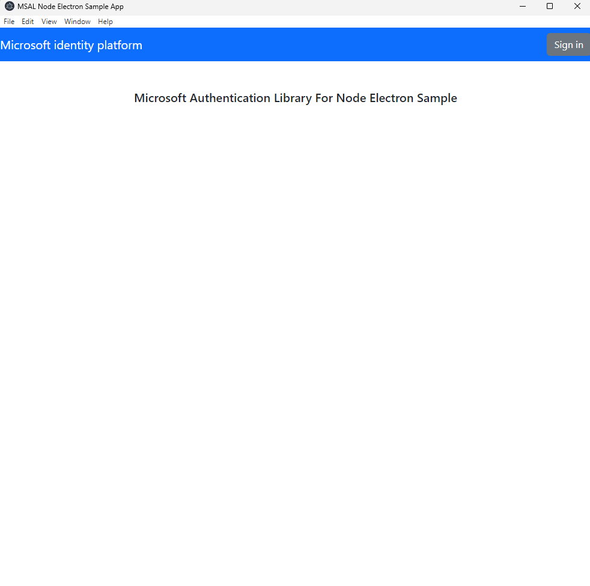
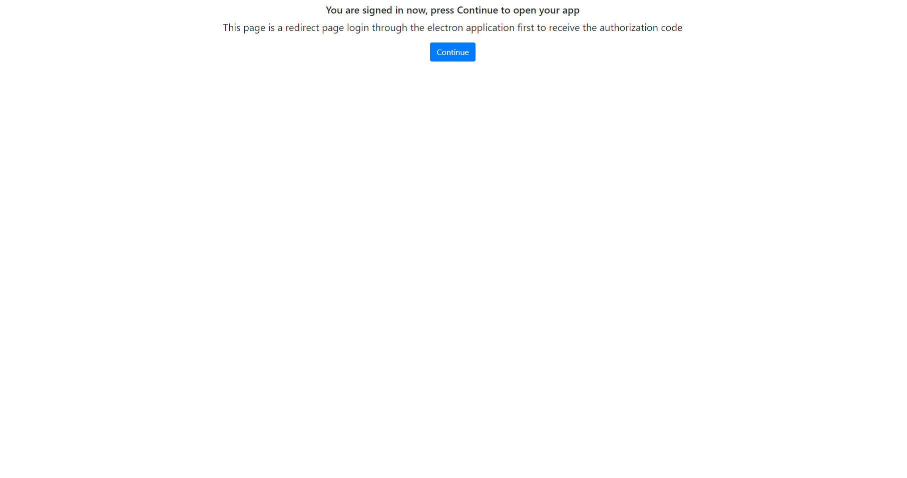
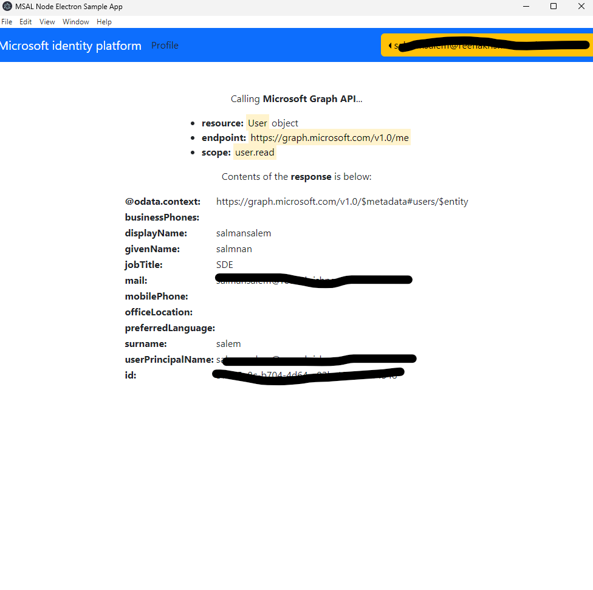

# MSAL Node Electron Sample Using System browser and Custom URL Scheme

An Electron application built with TypeScript that uses MSAL Node to acquire and store access tokens to authenticate with the Microsoft Graph API.

## Should I use this sample

This sample demonstrates how to use **MSAL Node** to sign in a user and acquire an access token for a protected resource such as **Microsoft Graph** in an Electron desktop application using the system browser and [the authorization code grant with PKCE flow](https://docs.microsoft.com/azure/active-directory/develop/v2-oauth2-auth-code-flow). Native apps that use the browser for authorization are more secure and can take advantage of the user's authentication session in the browser to enable single sign-on.

## How to run the samples

### Clone this repository

First, clone the MSAL directory:

SSH:

```bash
 git clone git@github.com:AzureAD/microsoft-authentication-library-for-js.git
```

HTTP:

```bash
 git clone https://github.com/AzureAD/microsoft-authentication-library-for-js.git
```

You can also download the repository as a zip file by selecting "Download ZIP" from the root repository's dropdown "Code" menu. Once you've downloaded the ZIP file, you can decompress it locally and explore the code.

### Pre-requisites

- By using MSAL Node, you are working with the Microsoft Identity ecosystem. Read about [App Registrations](https://docs.microsoft.com/graph/auth-register-app-v2) and register one for use with this code.
- Install [Node.js](https://nodejs.org/en/), [Electron.js](https://www.electronjs.org/) and [TypeScript](https://www.typescriptlang.org/) if needed.
- Import [Electron forge CLI](https://www.electronforge.io/import-existing-project)
- Install the MSAL Node package:  
  
```bash
npm install @azure/msal-node
```

- If you are customizing or building locally, navigate to the `lib/msal-node` directory and build it using the following command:
  
```bash
npm run build:package
```

- From the repository's root directory, navigate to the Electron sample application:

```bash
cd samples/msal-node-samples/standalone-samples/ElectronSystemBrowserTestApp
```

### Register the application

1. Navigate to the [Microsoft Entra admin center](https://entra.microsoft.com) and select the **Microsoft Entra ID** service.
1. Select the **App Registrations** blade on the left, then select **New registration**.
     - In the **Name** section, enter a meaningful application name that will be displayed to users of the app, for example `msal-node-desktop`.
     - In the **Supported account types** section, select **Accounts in any organizational directory and personal Microsoft accounts (e.g. Skype, Xbox, Outlook.com)**.
     - Select **Register** to create the application.
1. In the list of pages for the app, select **Authentication**.
1. Select **Add a platform**, select **Mobile and desktop applications**.
1. In the **Redirect URIs** list, under **Suggested Redirect URIs for (mobile, desktop)** be sure to add `http://localhost` to the list of **Redirect URIs**.
1. Select **Configure**.

### Configure the application

1. Open the [.customConfig.js](./src/config/customConfig.json) file and provide the required configuration values.
   1. Replace the string `Enter_the_Application_Id_Here` with your app/client ID on Microsoft Entra admin center for both the `clientId` and the `customProtocol` keys.
   1. Replace the string `Enter_the_Tenant_Info_Here` with your tenant ID on Microsoft Entra admin center.

1. To enable deep linking in the application, open the [successTemplate.html](./public/successTemplate.html) file and provide the required configuration value:
   1. Fill in your application/client ID in the string `msal{Your_Application/Client_Id}://auth`. We are using the ClientID to assign a unique protocol to the application as a deep link. If you like, you can replace this value with any unique string e.g. `your-unique-protocol-name://`. This is to ensure that this deep link only matches to your own application and does not coincide with other application deep links that might be registered on your system. For more information, please check the [Electron documentation on deep linking](https://www.electronjs.org/docs/latest/tutorial/launch-app-from-url-in-another-app).

> :information_source: *note*: This is for multi-tenant applications located on the Global Azure cloud. For more information, see: [Use MSAL in a national cloud environment](https://docs.microsoft.com/azure/active-directory/develop/authentication-national-cloud)

> :information_source: *note*: This is for MS Graph instance located on the Global Azure cloud. For more information, see: [Use Microsoft Graph in a national cloud environment](https://docs.microsoft.com/graph/deployments)

### Executing the application

Once you are in the sample application directory and you've configured the sample application to match your App Registration and registered Redirect URI, you can install all of the dependencies by running:

```bash
npm install
```

When the dependencies have been installed, you can run the sample application by using the following command, after which the Electron application should start.

```bash
cd samples/msal-node-samples/standalone-samples/ElectronSystemBrowserTestApp/redirect
$ npm start
```

```bash
cd samples/msal-node-samples/ElectronSystemBrowserTestApp
npm start
```

## About the code

### Custom URL Scheme

This Electron sample uses a custom URL scheme `msal{Your_Application/Client_Id}://auth` that will launch the app when the URL with that scheme is visited.

Using the [acquireTokenInteractive](https://azuread.github.io/microsoft-authentication-library-for-js/ref/modules/_azure_msal_node.html#authorizationcoderequest) API, the desktop application starts the [Authorization code flow with PKCE flow](https://docs.microsoft.com/azure/active-directory/develop/v2-oauth2-auth-code-flow) by launching and navigating the system browser to authorization code URL and listens for the authorization code response via loopback server. Once the code is received successfully, `acquireTokenInteractive` will load the assigned **successTemplate**.

```typescript
 async getTokenInteractive(
        tokenRequest: SilentFlowRequest
    ): Promise<AuthenticationResult> {
        try {
            const openBrowser = async (url: any) => {
                await shell.openExternal(url);
            };
            const interactiveRequest: InteractiveRequest = {
                ...tokenRequest,
                openBrowser,
                successTemplate: fs
                    .readFileSync("./public/successTemplate.html", "utf8")
                    .toString(),
                errorTemplate: fs
                    .readFileSync("./public/errorTemplate.html", "utf8")
                    .toString(),
            };

            const authResponse =
                await this.clientApplication.acquireTokenInteractive(
                    interactiveRequest
                );
            return authResponse;
        } catch (error) {
            throw error;
        }
    }
```

### Deep linking

To register the custom URL scheme and to link to the electron app instance, we will utilize the `setAsDefaultProtocolClient()` API provided by electron. For more information about using deep linking with electron, check [electron documentation](https://www.electronjs.org/docs/latest/tutorial/launch-app-from-url-in-another-app)

```typescript
private static setDefaultProtocol(): void {
        if (process.defaultApp) {
            if (process.argv.length >= 2) {
                Main.application.setAsDefaultProtocolClient(
                    authConfig.customProtocol.name, // e.g msal4b0db8c2-9f26-4417-8bde-3f0e3656f8e
                    process.execPath,
                    [path.resolve(process.argv[1])]
                );
            } else {
                Main.application.setAsDefaultProtocolClient(
                    authConfig.customProtocol.name // e.g msal4b0db8c2-9f26-4417-8bde-3f0e3656f8e
                );
            }
        }
    }
```

Next, we tell the application how to handle events that invoke the application instance (such as navigation to the custom url scheme in browser). This code will differ between OSs.

#### In Windows

When the external custom URL scheme is clicked it will trigger the event `Main.application.on("second-instance", Main.onSecondInstance);` where we can fetch the authorization code from custom URL scheme:

```typescript
/**
* On Windows and Linux, this is where we receive login responses
*/
private static onSecondInstance(event: any): void {
    event.preventDefault();
    Main.handleWindowState();
}
```

#### MacOS and Linux

When the external custom URL scheme is clicked it will trigger the event `Main.application.on("open-url", Main.onOpenUrl);` where we can fetch the authorization code from custom URL scheme:

```typescript
/**
* On MacOS, this is where we receive login responses
*/
private static onOpenUrl(event: any): void {
    event.preventDefault();
    Main.handleWindowState();
}
```

**Note: You may have to package the app for this feature to work on macOS and Linux. It might not work when launching it in development from the command-line. For more information on how to pack an electron application, please check the [electron documentation](https://www.electronjs.org/docs/latest/tutorial/launch-app-from-url-in-another-app#packaging).**

## Explore the sample

1. After running the sample, the desktop app window will appear automatically
1. Select the **Sign In** button in the top right.

1. The app will open a browser to Microsoft Entra ID for the user to sign-in.

1. Select the **Profile** button on the navigation bar. This will make a call to the Microsoft Graph API.

